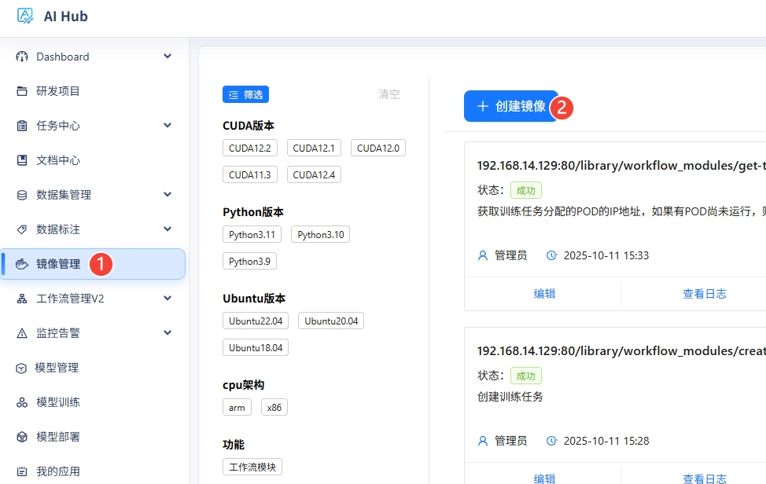
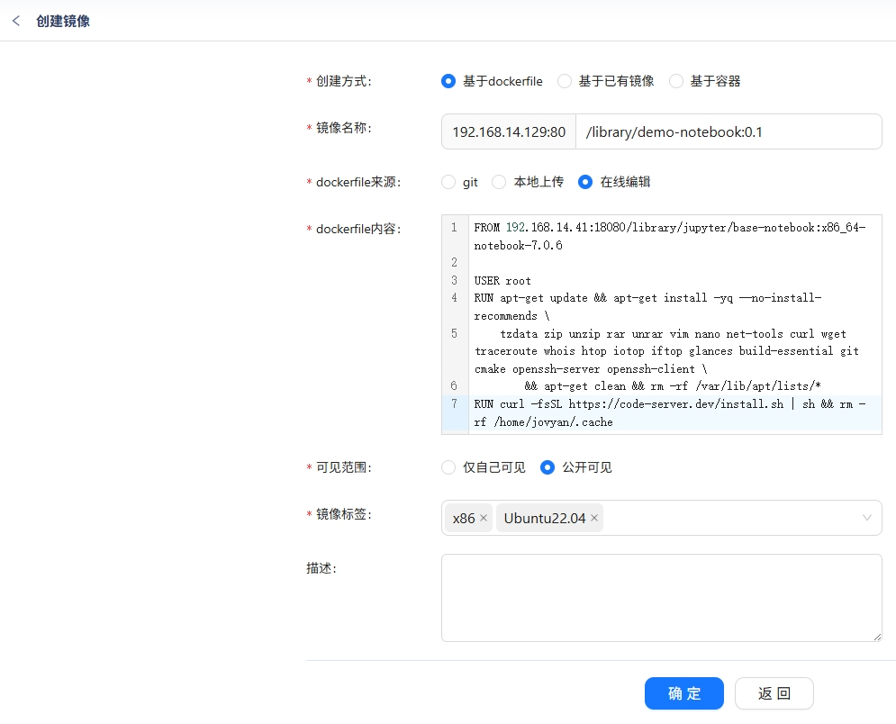
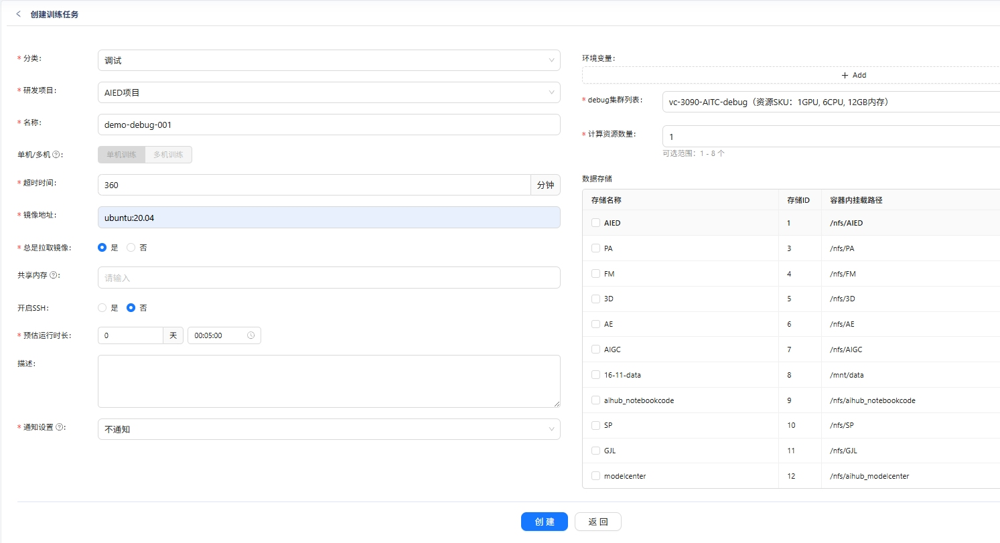
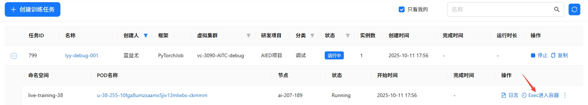
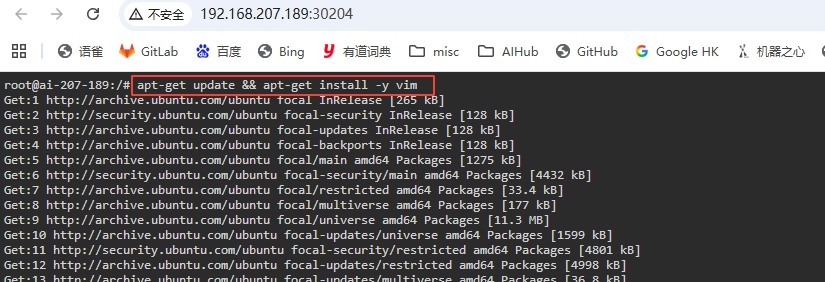
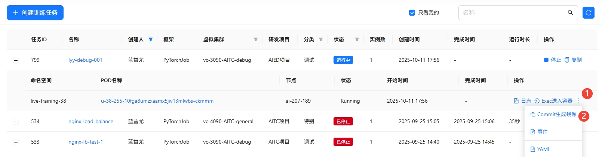
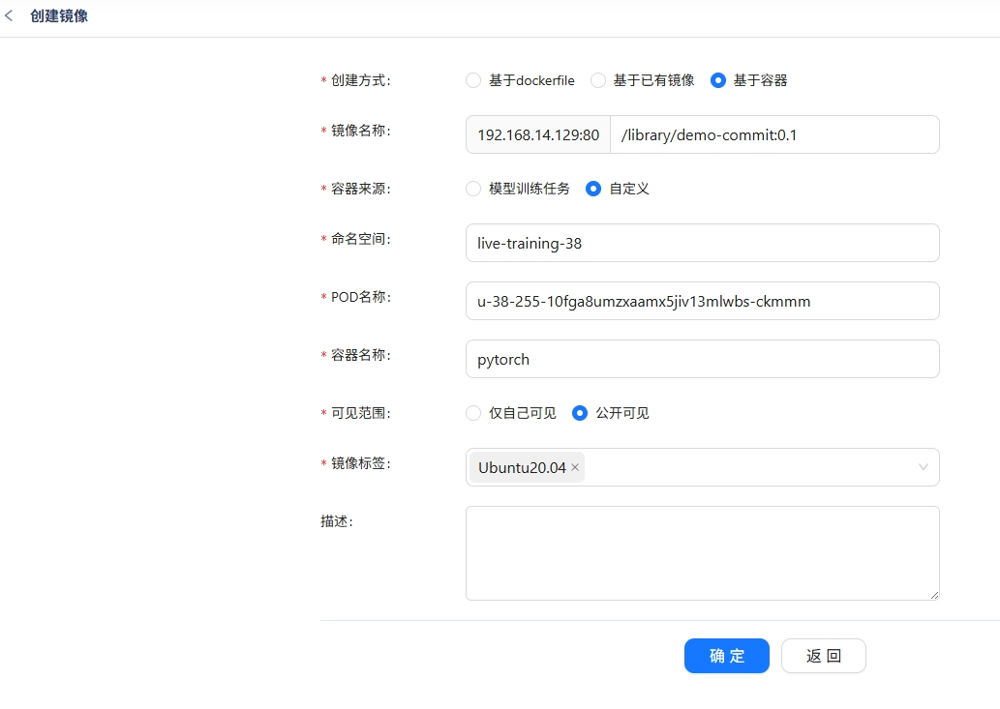
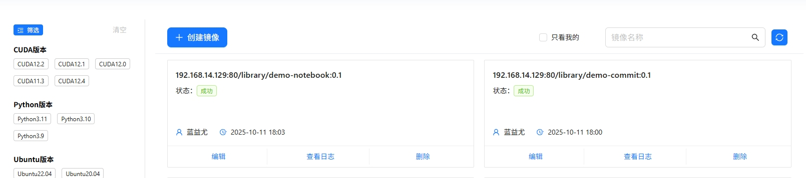
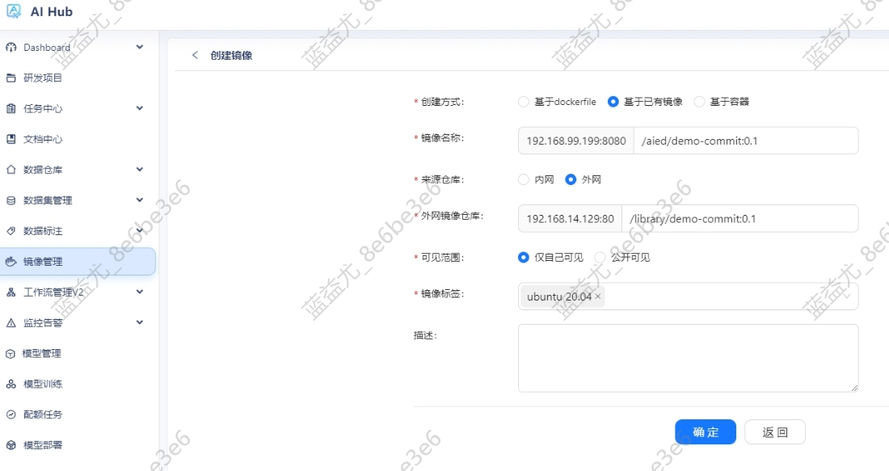
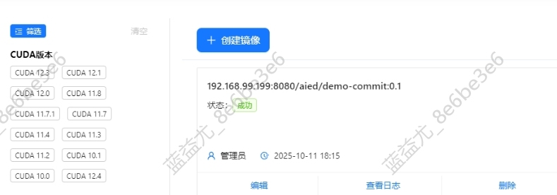

# 构建和传输docker镜像

### 🎯 场景说明

* 通过Dockerfile构建镜像，并传输到内网环境。
* 通过commit的方式构建镜像，并传输到内网环境。

## ✅ 关键点

* 编写`Dockerfile`，通过AiHub的`镜像管理`进行镜像构建。
* 通过模型训练创建调试环境，通过commit的方式构建镜像。

## 📖 详细步骤

### 使用Dockerfile的方式构建镜像
在`镜像管理`中，点击`镜像构建`按钮。



选择`基于dockerfile`，`dockerfile来源`选择`在线编辑`，输入Dockerfile内容，点击`确定`。



Notebook镜像的`Dockerfile`示例：
```
FROM 192.168.14.41:18080/library/jupyter/base-notebook:x86_64-notebook-7.0.6

USER root
RUN apt-get update && apt-get install -yq --no-install-recommends \
    tzdata zip unzip rar unrar vim nano net-tools curl wget traceroute whois htop iotop iftop glances build-essential git cmake openssh-server openssh-client \
        && apt-get clean && rm -rf /var/lib/apt/lists/*
RUN curl -fsSL https://code-server.dev/install.sh | sh && rm -rf /home/jovyan/.cache
RUN printf "set -ex\nmkdir -m 0777 -p \$NOTEBOOK_ROOT_DIR\n" > /usr/local/bin/start-notebook.d/init_root_dir.sh

USER $NB_UID
ENV TZ=Asia/Shanghai
ENV PATH="$PATH:/home/jovyan/.local/bin"
ENV CODE_DISABLE_PASSWORD=true
RUN pip install --user pexpect==4.9.0 jupyterlab-language-pack-zh-CN jupyterlab-git jupyter-server-proxy jupyter_code_server jupyterlab-lsp python-lsp-server -i https://pypi.tuna.tsinghua.edu.cn/simple
RUN code-server --install-extension ms-python.python
RUN code-server --install-extension kevinrose.vsc-python-indent
RUN code-server --install-extension golang.go
RUN code-server --install-extension ms-toolsai.jupyter-renderers
RUN code-server --install-extension redhat.vscode-yaml
RUN code-server --install-extension redhat.vscode-xml
RUN code-server --install-extension ms-vscode.cmake-tools
RUN code-server --install-extension yzhang.markdown-all-in-one
RUN code-server --install-extension esbenp.prettier-vscode
RUN code-server --install-extension aminer.codegeex
RUN code-server --install-extension saoudrizwan.claude-dev
```

### 使用commit的方式构建镜像
在`模型训练`中，创建`调试`类型的任务。



在任务处于`运行中`的状态时，在pod列表点击`Exec进入容器`。



进入容器后，执行命令安装需要的软件包。



安装完成后，在pod列表点击`Commit生成镜像`。



在镜像创建页面补充镜像名称等信息，点击`确定`。



等待镜像构建完成。



### 传输镜像到内网环境
在内网的AiHub中，点击`镜像管理`，点击`创建镜像`，创建方式选择`基于已有镜像`，仓库来源选择`外网`，填上外网镜像的地址。



等待镜像构建完成。

