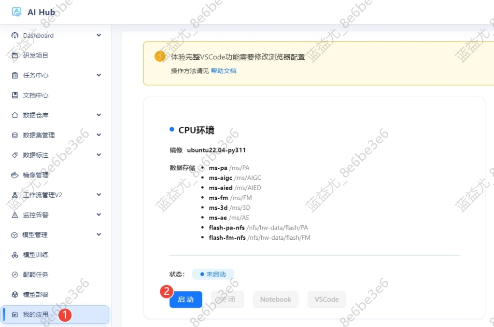
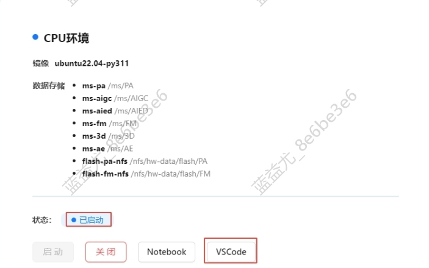
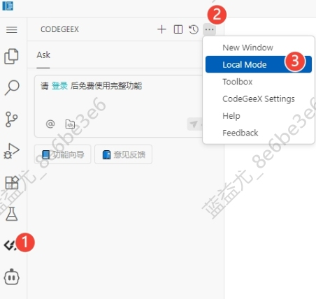
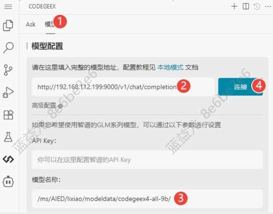
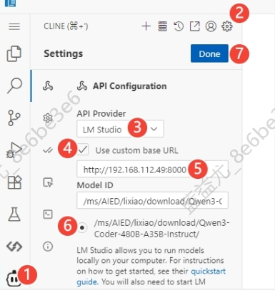
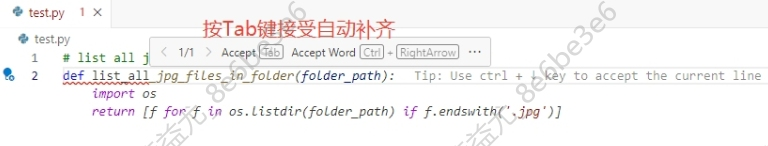
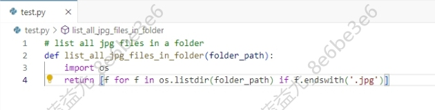
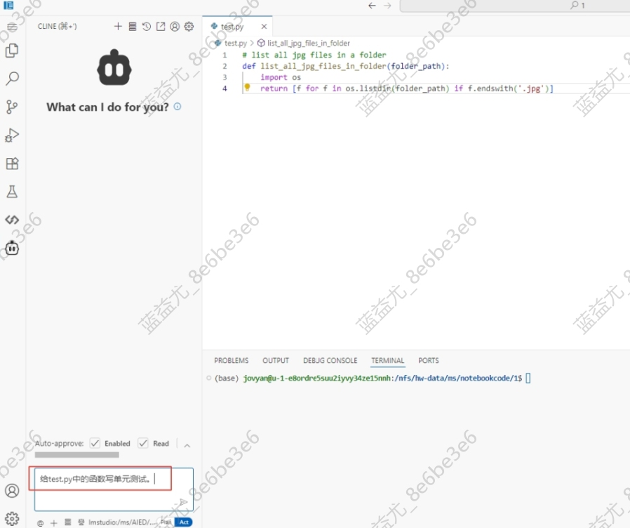
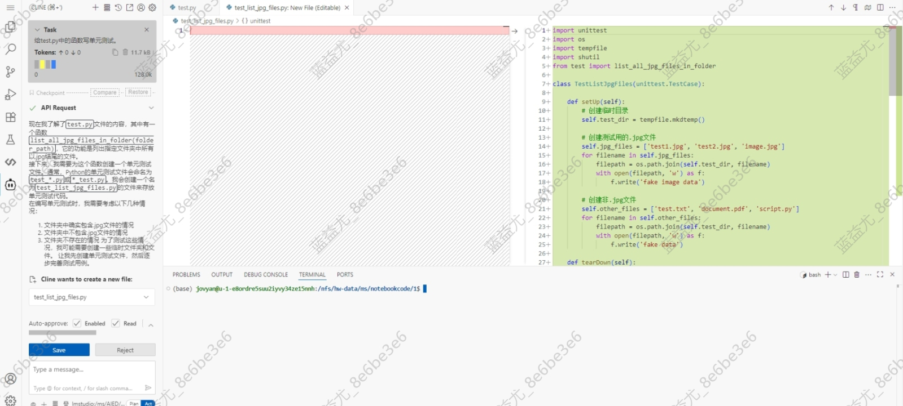
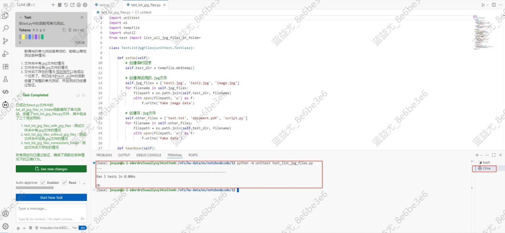

# 通过 Vscode 进行AI编程

### 🎯 场景说明

* 通过AiHub`我的应用`的`VSCode`进行AI编程，包括自动代码补全和对话式代码生成。

## ✅ 关键点

* 在AiHub`我的应用`启动`CPU环境`或`GPU环境`，通过`VSCode`进行在线编程，通过插件连接大语言模型进行AI编程。

## 📖 详细步骤

### 1.在AiHub`我的应用`启动`CPU环境`或`GPU环境`。

### 2.等待状态变成`已启动`，点击`VSCode`进入。

### 3.在VSCode中配置`AiHub`插件，连接大语言模型。

#### 1.配置CodeGeeX插件（用于代码自动补全）

1. 选择`Local Mode`。

2. 设置模型地址和模型名称，点击`连接`按钮完成设置。

- 模型地址填：`http://192.168.112.199:9000/v1/chat/completions`

- 模型名称填：`/ms/AIED/lixiao/modeldata/codegeex4-all-9b/`

#### 2.配置Cline插件（用于对话式编程）

1. 选择`Cline`的插件图标，点击齿轮图标进入设置界面。

2. API Provider选择：`LM Studio`

3. 勾选`Use custom base URL`

4. 填写模型地址：`http://192.168.112.48:8000`

5. 选择出现的Model ID: `/ms/AIED/lixiao/download/Qwen3-Coder-480B-A35B-Instruct/`

6. 点击`Done`按钮完成设置。

### 4.利用AI编程的自动代码补全功能示例。

编写注释，AI编程插件会自动补全代码，按Tab键可以接受补全的代码。

### 5.利用AI编程的对话式编程功能示例。

在`Cline`插件的对话框中，输入任务要求，AI编程插件会自动读取当前项目的代码，创建或编辑代码文件，提供交互式的按钮指令选项，还会自动运行代码并检查代码输出结果。

