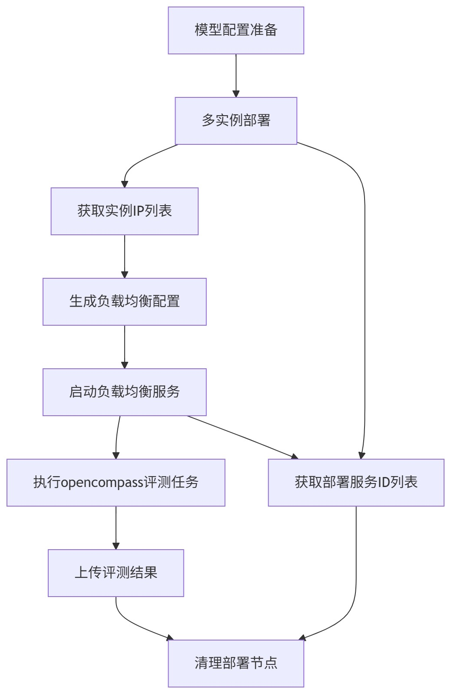

# 大模型多实例部署 + 负载均衡推理

### 🎯 场景说明

在用户并发请求量大或单实例无法满足响应速度的场景下需部署多个大模型实例，并通过负载均衡将请求均匀分发，实现推理能力的线性扩展与可用性保障。

## ✅ 关键点

* 通过**batch-create-training-task** module批量创建训练任务后，通过**batch-get-training-task-ips** module收集服务IP后，再启动负载均衡服务。

## ✅ 工作流案例结构（步骤划分）

### 🧱 1. 模型配置准备

* 校验模型文件

* 准备部署配置文件

### 🚀 2. 多实例部署

* **动作：调用算力调度平台 API**

  * 同步启动多个模型服务实例

* **监控：通过算力平台回调或轮询接口**

  * 等待服务启动

  * 获取模型IP列表

### 🌐 3. 启动负载均衡服务

* **动作：调用算力调度平台 API**

  * 生成负载均衡（NGINX）配置

  * 部署负载均衡服务

  * 将前端请求按策略（轮询、最小负载、权重等）分发给各实例

* **监控：通过算力平台回调或轮询接口**

  * 等待服务启动

  * 获取负载均衡服务IP

### 🧪 4. 执行opencompass评测任务

* 生成opencompass配置

* 访问负载均衡服务，执行opencompass评测

* 生成opencompass评测结果

### 📤 5. 上传评测结果

* 将opencompass评测结果转换为AIhub支持的格式

* 上传评测数据到AIhub

### 🧹  6. 清理部署节点

* 通过API结束部署任务，回收算力资源。

## ✅ 工作流结构图

***

## ✅ 使用工作流实现的价值

| 类别           | 优势                               |
| :------------- | :--------------------------------- |
| **自动化部署** | 一键部署多实例，替代手工脚本操作   |
| **灵活扩展** | 按需调整实例数量，适配流量波动     |
| **高可用** | 负载均衡请求自动分发，避免某一实例过载 |
| **算力高效利用** | K8s + GPU亲和调度，资源不浪费      |