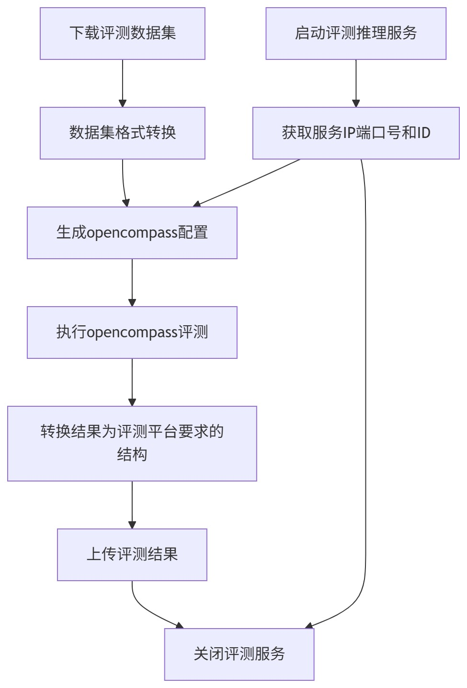

# 在线部署评测流程

### ✅ 场景说明

**业务背景：**
大模型部门需对各种大模型，主要是量化后的模型，在平台部署上线，在标准测试集上运行评测流程，输出指标用于回归比对与发布决策。

## ✅ 关键点

* 通过 **create-training-task** module, 来调用模型训练平台的API，部署在线推理服务；

* 通过 **get-training-task-ip** module获取在线推理服务IP；

* 通过 **stop-training-task** module主动关闭服务；

* 通过 **download-dataset** module下载评测数据集；

* 通过 **eval-upload** module上传评测结果；

***

## ✅ 工作流案例结构（步骤划分）

### 🧠 1. 模型部署

* **动作：调用算力调度平台 API**

    * 创建部署任务

* **监控：通过AIHub回调或轮询接口**

    * 等待服务启动

    * 获取服务IP和端口

### 📚 2.下载数据集

* 下载评测数据集

* 转换为opencompass所需格式

### 🧪 3. 执行opencompass评测任务

* 生成opencompass配置

* 访问第1步的服务IP和端口，执行opencompass评测

* 生成opencompass评测结果

### 📤 4. 上传评测结果

* 将opencompass评测结果转换为AIhub支持的格式

* 上传评测数据到AIhub

### 🧹  5. 清理部署节点

* 通过API结束部署任务，回收算力资源。

## ✅ 工作流图结构描述

## ✅ 使用工作流带来的好处

| 类别 | 好处 |
|------|------|
| ⏱ 自动化 | 全流程无人值守，从部署到评测再到清理 |
| 🧩 解耦 | 每个步骤独立、可复用、可版本管理 |
| 🔄 高可控 | 出现异常自动重试、终止流程 |
| 📈 结果透明 | 评测结果统一输出，便于审查与对比 |
| 🎯 标准化 | 保证评测一致性，提升模型质量控制水平 |
| 💻 可扩展 | 支持多模型并发评测、多数据集评估 |