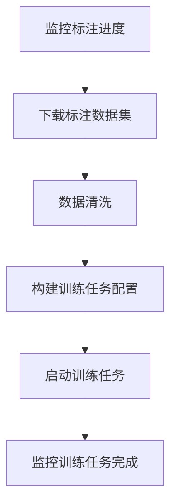

# 标注完成触发训练任务

### 🎯 场景说明

在AI项目中，模型效果依赖高质量数据。标注通常由标注员人工完成，耗时较长。如果平台能自动监控标注进度，一旦项目完成就**自动启动模型训练任务**，可以大大缩短数据-模型闭环周期，提高研发效率。

## ✅ 关键点

* 通过**lable-checker** module监控标注任务进度，标注完成后自动触发数据处理和模型训练。

## ✅ 工作流案例结构（步骤划分）

### 📝 1. 标注项目监听

* 定期轮询检测标注任务状态，根据组合条件判断触发时机

    * 如：「标注完成=100%」+ 「质检完成>=30%」+ 「导出数据次数>=1」触发后续流程

* 获取最新导出数据集名称

### 🧹 2. 数据预处理

* 下载标注结果数据集

* 数据校验

* 转换标注数据格式（如 JSON → TFRecord）

* 数据清洗

### 🧠 3. 模型训练任务启动节点

* 构建训练任务配置（虚拟集群，SKU，数据挂载，环境变量等）

* 通过模型训练API启动训练任务

### 📈 4. 训练监控

* 监控训练任务完成

## ✅ 工作流结构图

***

## ✅ 使用工作流的优势
| 类别       | 说明                               |
| :--------- | :--------------------------------- |
| **节省时间** | 标注完成即刻触发训练，无需人工盯盘   |
| **自动闭环** | 从数据采集 → 标注 → 训练自动闭环     |
| **减少人为操作** | 避免忘记训练或多次重复手工操作     |
| **易于追踪** | 工作流节点可记录每一步输入/输出    |