# 通过 VNC+SSH环境 传输和查看数据

### 🎯 场景说明

* 在内网环境通过浏览器或VNC客户端访问VNC服务器。
* 在外网环境使用堡垒机，通过VNC协议访问内网环境。
* 在内网环境通过SSH协议进行登录和文件传输。

## ✅ 关键点

* 在AiHub`我的应用`启动`VNC+SSH环境`，获取`VNC服务地址`和`SSH登录命令`。
* 通过浏览器、VNC客户端或堡垒机VNC协议连接VNC服务器。
* 通过SSH协议进行登录或文件传输。

## 📖 详细步骤

### 启动VNC+SSH环境
1. 在AiHub`我的应用`启动`VNC+SSH环境`。

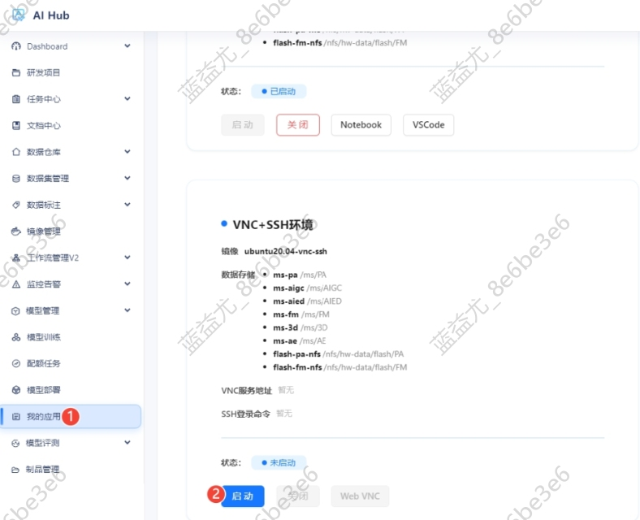

2. 等待状态变成`已启动`，应用卡片出现`VNC服务地址`和`SSH登录命令`的具体内容。

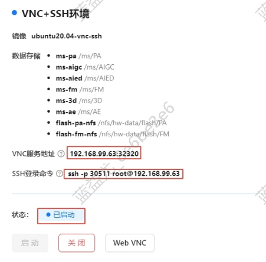

### 连接VNC服务器

#### 通过浏览器访问VNC服务器
1. 点击`Web VNC`按钮，在浏览器中打开VNC页面。

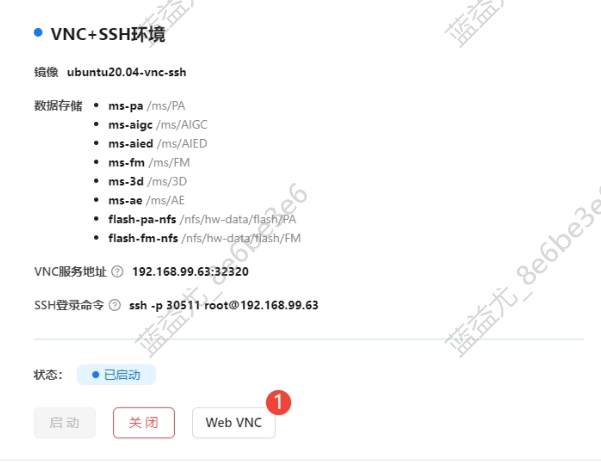

2. 等页面加载完毕后即可看到VNC界面。

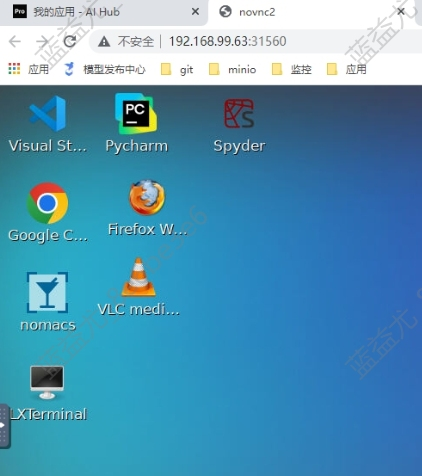

#### 通过VNC客户端访问VNC服务器
1. 以VNC Viewer为例，点击菜单栏的`File`->`New connection`。

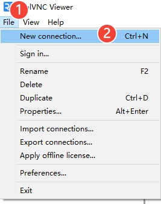

2. 在`VNC Server`处输入VNC服务地址，在`Name`处给VNC连接取个名字，点击`OK`。

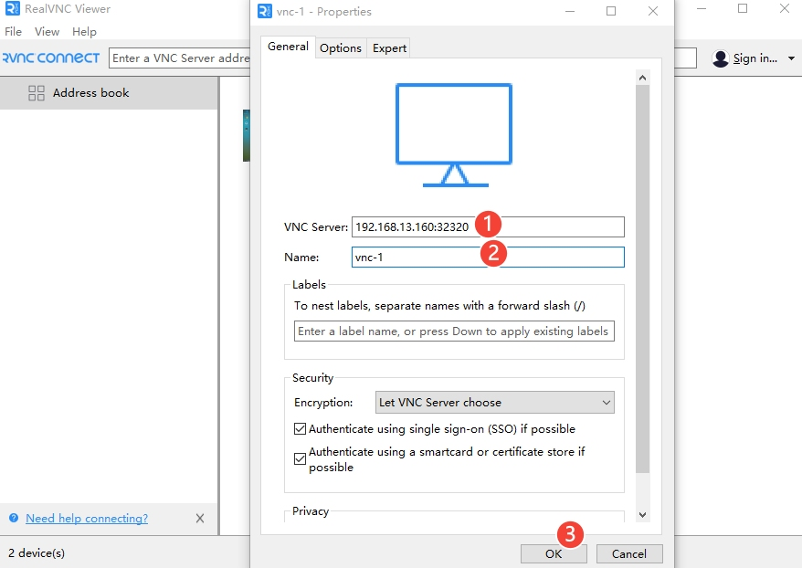

3. 双击生成的VNC卡片打开VNC界面。

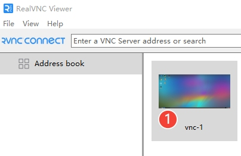

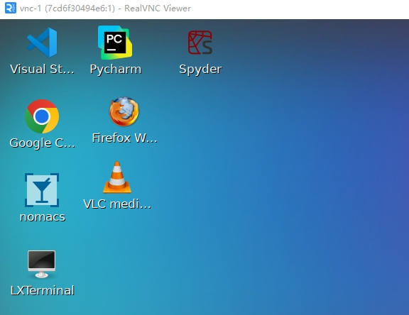

#### 通过堡垒机VNC协议访问VNC服务器

1. 在堡垒机的主机列表中找到`192.168.99.63`服务器，点击`快速访问（Web桌面）`链接，在弹出的对话框中选择VNC协议，输入VNC服务地址中的端口号，密码随便填写（因为无需密码），点击`打开会话`，即可打开VNC界面。

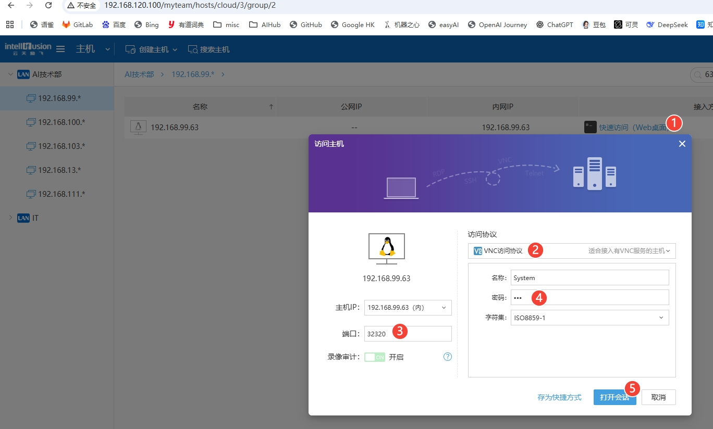

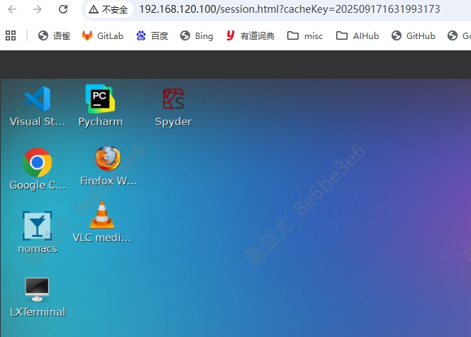

### 连接SSH服务器

#### 通过SSH登录命令连接SSH服务器
1. 复制`VNC+SSH环境`卡片中的`SSH登录命令`，在本地终端中执行，输入默认密码root，即可登录到SSH服务器。

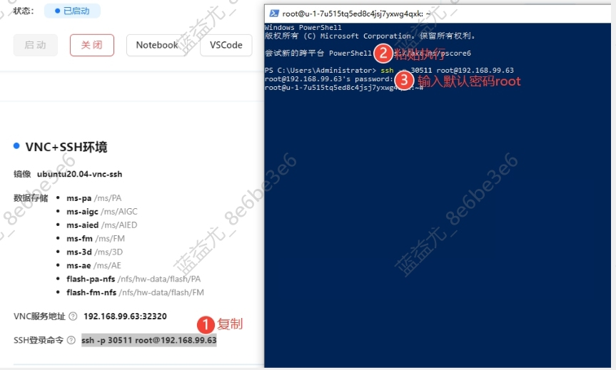

#### 通过SCP进行文件上传和下载

通过`scp`命令的`-P`选项可以指定端口号，指定本地和服务器的文件路径即可进行上传和下载。

上传文件到服务器：

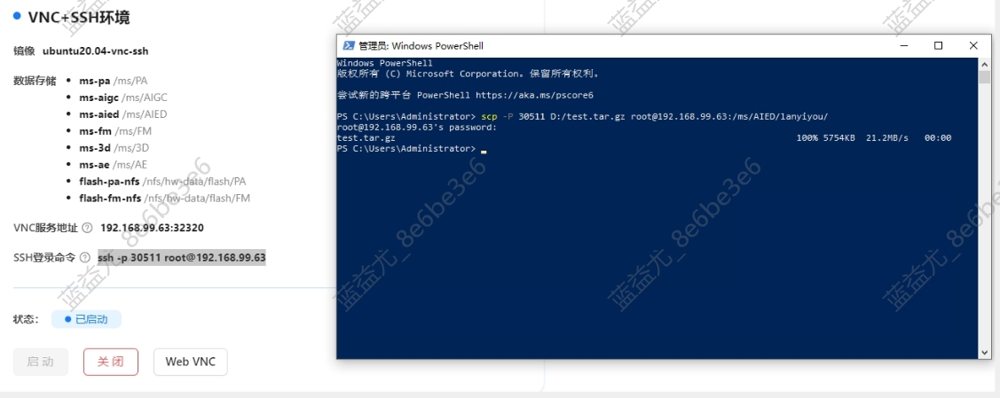

从服务器下载文件：

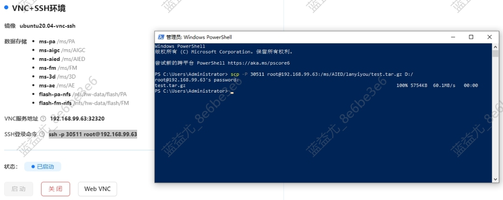
