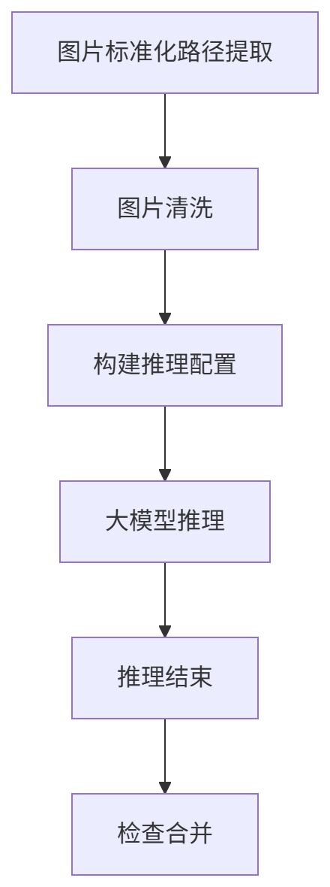

# 回流数据自动清洗

## ✅ 场景说明

**业务背景：**
&#x20;拍学机项目定期会产生回流数据，回流数据通过清洗，并抽样部分低错误风险样本，用于人工标注。

## ✅ 关键点

通过 **batch-create-training-task** module, 来调用模型训练平台的API，触发模型训练任务。并通&#x8FC7;**&#x20;batch-monitor-training-task** 监控任务的结束。

## ✅ 工作流案例结构（步骤划分）

### 🧩 1. 数据导入节点

* 提取生成图片路径

### 🧹 2. 图片清洗（Preprocessing）

* 过滤掉损坏图片

### 🧠 3. 模型推理节点（LLM Inference）

* **动作：调用算力调度平台 API**

  * 申请算力

  * 上传待推理数据

  * 启动模型服务（如分类/摘要/NER）

* **监控：通过算力平台回调或轮询接口**

  * 等待任务完成

  * 获取推理结果（支持失败重试）

### 🗃️ 4. 推理结果处理节点（Postprocess）

* 提取关键信息

* 标准化字段格式

* 合并清洗字段与推理字段

## ✅ 使用工作流平台带来的优势

| 类别  | 好处                       |
|-----|--------------------------|
| 自动化 | 一键触发，流程全自动，无需人工值守        |
| 可视化 | 节点状态图清晰可见，失败点快速定位        |
| 可扩展 | 模型服务节点可动态扩容支持并发推理        |
| 灵活性 | 每个环节可独立维护与更新，模块化强        |
| 稳定性 | 调用失败支持重试，监控机制健全          |
| 易集成 | 原生支持与算力平台 / 云资源打通，API 友好 |

## ✅ 示例流程图（结构描述）

1. 提取参数

   * task \ date：数据批次

   * cleaner \ processor \ num：图像清洗进程数量

   * back \ root \ path：回流数据路径

   * infer \ global \ size：推理任务并行数量

   * code \ root \ path：推理任务代码位置

   * docker \ image \ name：推理任务镜像

   * sample \ rate：vlm判别错误的图像抽检比例

   * num \ corr \ sample：vlm判别正确的图像抽检数量

   * save \ root \ path 和 nfs \ save \ root \ path：推理结果存储路径

   * cluster \ id：虚拟集群id

| 工作流节点                                   | 说明                                                                          | 输入参数                                                                                                                 | 输出参数                                    |
| --------------------------------------- | --------------------------------------------------------------------------- | -------------------------------------------------------------------------------------------------------------------- | --------------------------------------- |
| smart-camera-xlsx-image-format-transfer | 图像标准化路径提取：提取每个图片的绝对路径                                                       | task \ dateback \ root \ path                                                                                           | image \ listimage \ list \ res \ save \ path |
| image-file-cleaner                      | 图像清洗：过滤掉以下图片                                                                | image \ listcleaner \ processor \ numinfer \ global \ sizeimage \ list \ res \ save \ path                                    | clean \ image \ list                      |
| smart-camera-infer-config-builder       | 构建推理config文件：使用推理任务要运行的代码位置、镜像环境、所使用的虚拟集群id、数据的输入输出路径等关键信息生成每个推理任务的config文件 | task \ datecluster \ idimage \ list \ res \ save \ pathback \ root \ pathcode \ root \ pathsave \ root \ pathdocker \ image \ name | task \ configs                           |
| batch-create-training-task              | 批量创建训练任务：在AI Hub的`模型训练`自动创建多个任务                                             | task \ configs                                                                                                        | training \ ids                           |
| batch-monitor-training-task             | 批量监控训练任务：监控AI Hub中该工作流所有训练任务的状态                                             | training \ ids                                                                                                        | /                                       |
| smart-camera-final-check-v2             | 抽取指定比例（sample \ rate）的错误样例和指定数量（num \ corr \ sample）的正确样例进行合并                  | task \ dateimage \ list \ res \ save \ pathnum \ corr \ sampleback \ root \ pathnfs \ save \ root \ pathsample \ rate             |                                         |

***

