仪表盘旨在提供一个清晰、全面的统计界面，帮助用户快速了解系统总体概况。目前已实现任务模块相关统计。

## 标注人力

支持查看标注任务的工时排行榜、风险状态分布和一致性测试分布

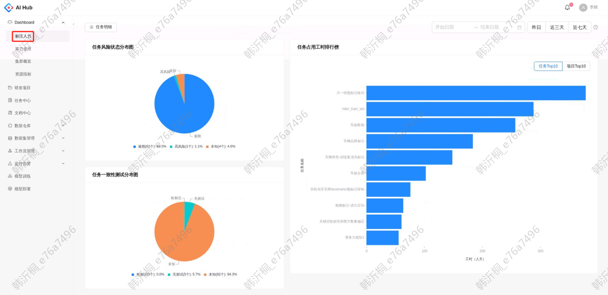

### 任务明细

点击任务明细的按钮，跳转到任务列表页查看任务的详细信息

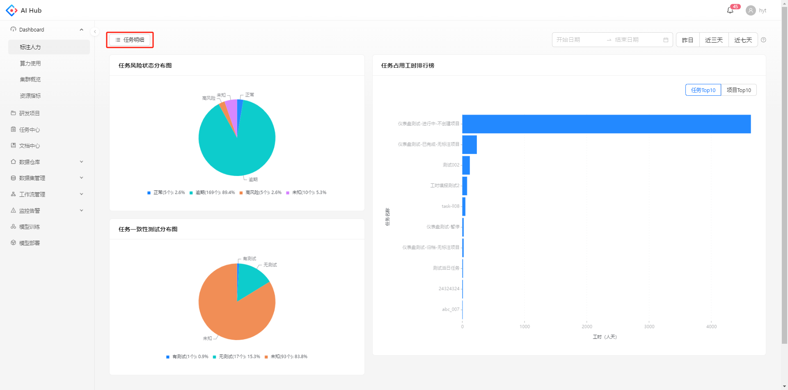

在时间未做筛选时，展示所有的已完成任务数量、所有的暂停任务数量、任务总数量和所有的在标任务数量，数据统计截止到今日0时

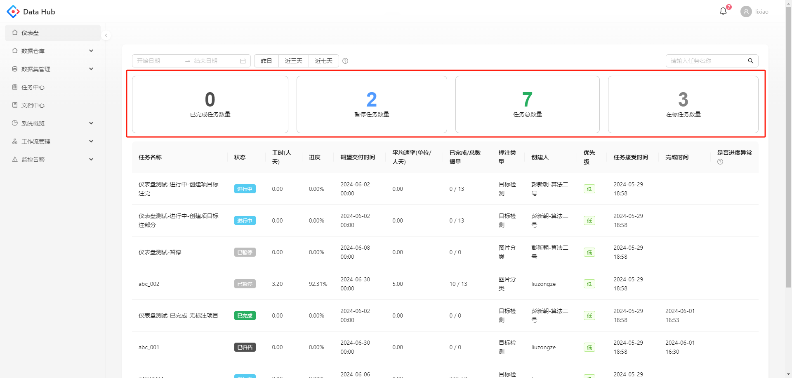

任务列表展示在所选时间段内进行中，暂停，完成或归档的任务。其中，与labelfree关联的任务（即在任务中心-任务详情界面点击“创建项目”创建了项目的任务）自动统计工时，其他任务统计标注管理员手动填报的工时。主要统计字段和计算方法如下：

* **工时**：所选时间段内的标注工时和质检工时之和。工时数据统计：与labelfree关联的任务由labelfree自动统计，其他任务由标注管理员统计后填写每日工时。

* **进度**：已完成数据量/总数据量，仅支持关联labelfree的任务。

* **平均速率**：已完成单位数/工时，仅支持关联labelfree的任务。

* **已完成数据量**：labelfree自动计算的已完成标注数据量，仅支持关联labelfree的任务。

* **总数据量**：labelfree自动计算的总标注数据量，仅支持关联labelfree的任务。

* **是否进度异常**：包含正常，可能提前，可能逾期，逾期几种状态。其中正常，可能提前和可能逾期是由系统根据最近一个有效标注日期（标注量大于0的日期）的标注量预测的，且未排除节假日，调休，加班等特别情况，仅供参考。没有关联labelfree的任务暂不支持进度预测。

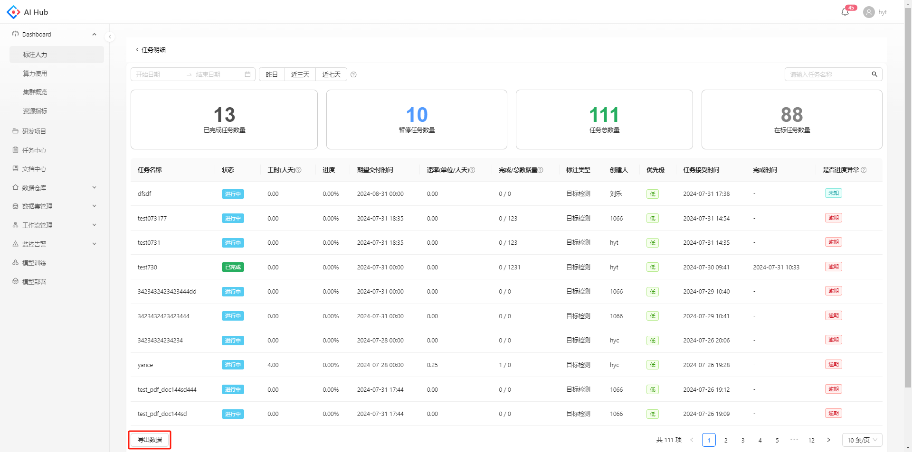

搜索：任务支持关键字模糊搜索

导出数据：点击导出所选时段的csv文件

## 算力使用

支持查看在选定时间段内某个虚拟集群上不同用户的GPU用时和GPU利用率

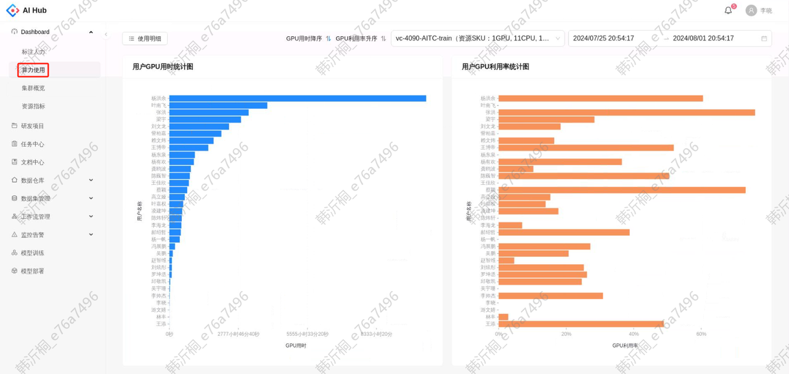

### 使用明细

点击使用明细的按钮，可以查看按照用户或任务维度统计的GPU用时和平均GPU利用率

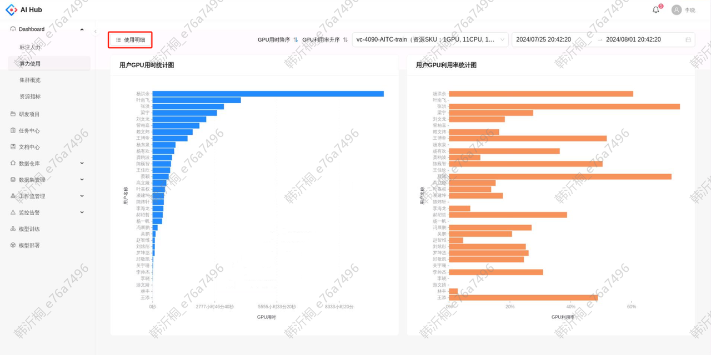

支持按照时间筛选，查看每个虚拟集群上任务/用户的GPU用时和平均GPU利用率

  

    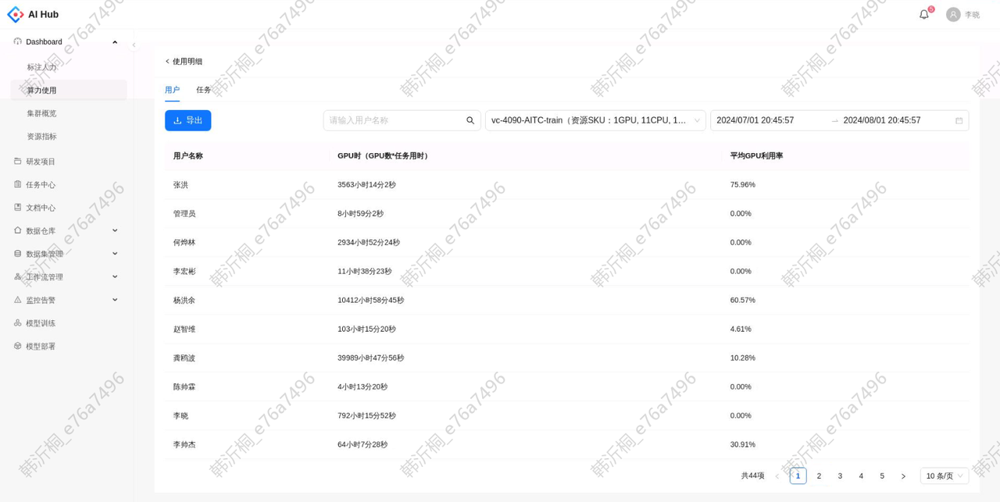
    
用户统计

  

  

    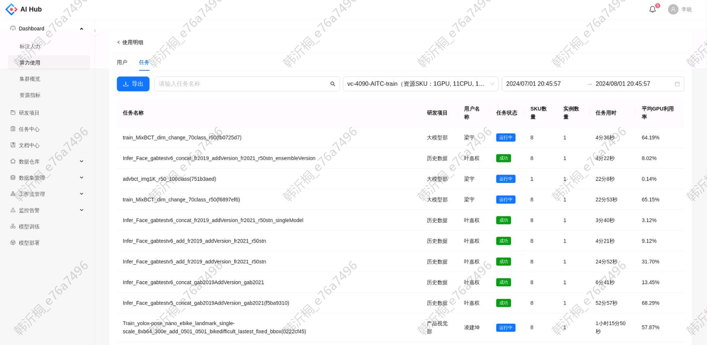
    
任务统计

  

## 集群概览

### 全局总览

支持查看每个虚拟集群上GPU的详细使用情况，包括GPU已用比例、不同可用GPU数量的节点数量

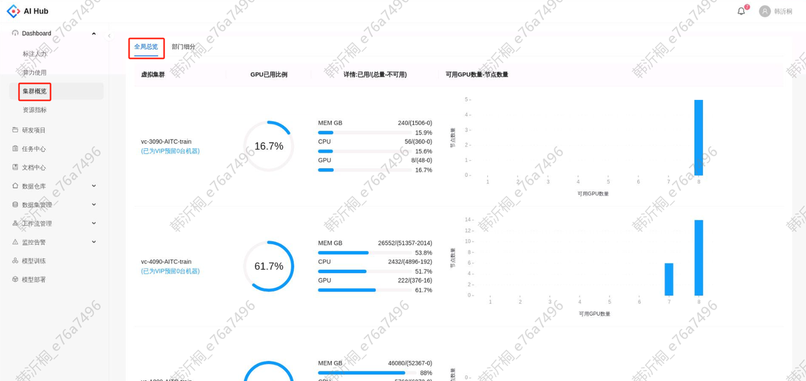

如果看到虚拟集群有机器满足任务申请的GPU，但是选择该虚拟集群的任务却一直在等待中，可能是因为该虚拟集群为VIP任务预留了机器

### 部门细分

支持按部门或项目维度查看虚拟集群的GPU使用情况，包括GPU占用数量、不同GPU占用数量的实例数量

  

    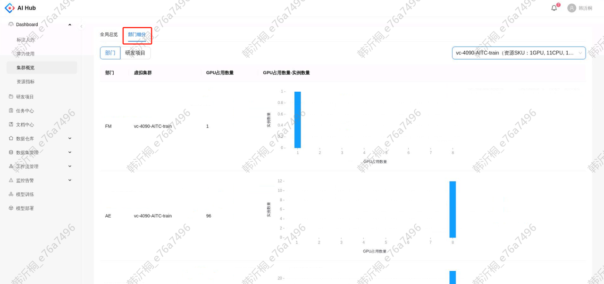
    
部门维度

  

  

    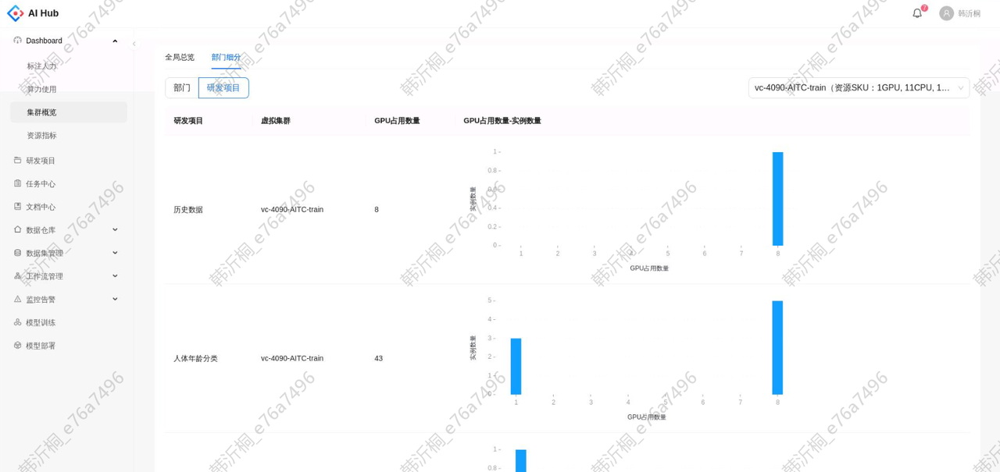
    
项目维度

  

## 资源指标

支持查看选定时间段内节点、任务、Pod三个维度的不同资源指标，包括CPU利用率、GPU利用率、显存占用率等

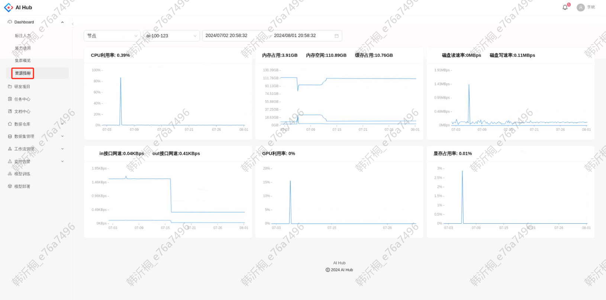

