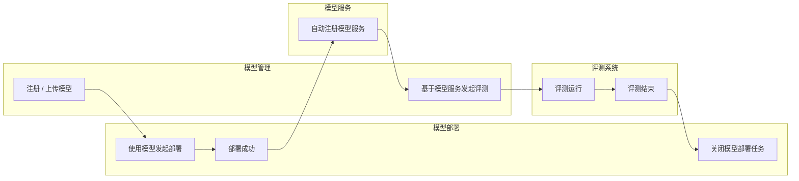
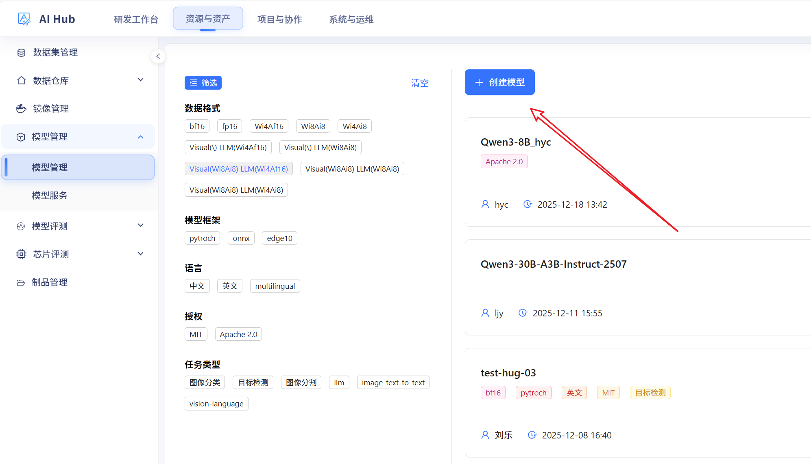
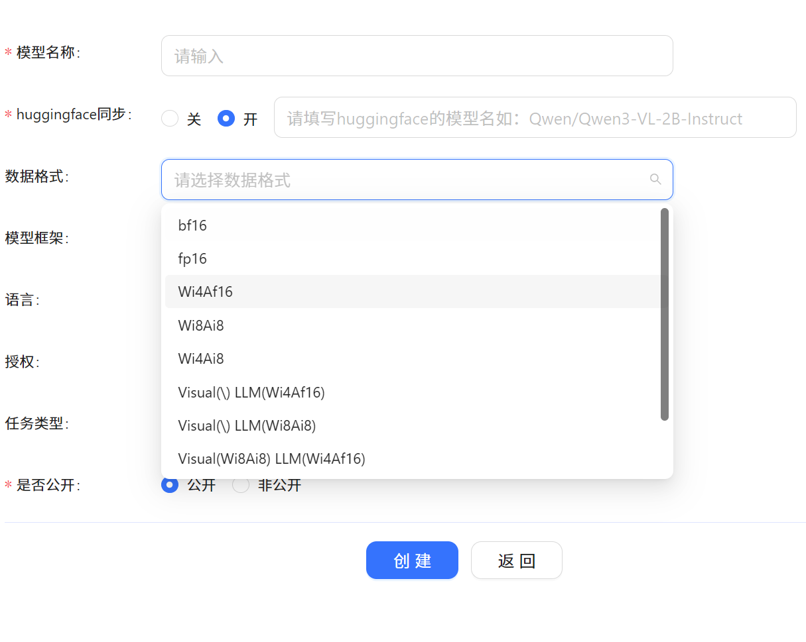
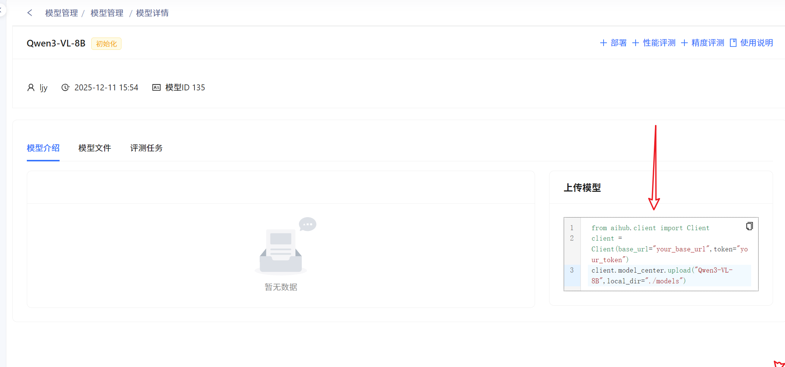
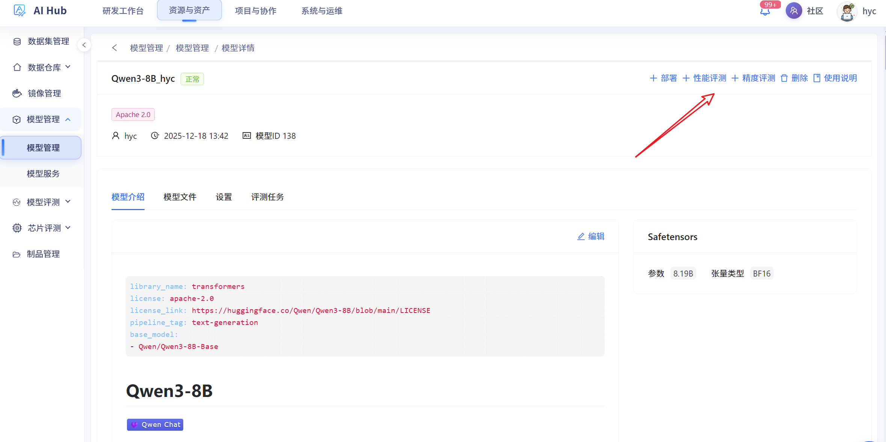

# 模型管理使用指南

欢迎使用模型管理功能。本指南将帮助您快速掌握模型的导入、上传及后续管理流程。

  - 统一管理线上/线下模型资产
  - 为训练、推理、评测任务提供**标准化的模型挂载路径**
  - 同时管理外部开源模型与内部私有模型

!!! info "快速上手：三步完成模型引入"
    1. 选择模型来源（外部模型仓库同步 / SDK 本地上传）
    2. 等待模型状态变为「可用」
    3. 在模型详情页复制挂载路径，用于训练 / 推理 / 评测任务

## 一、 创建模型

!!! abstract "模型引入方式概览"
    平台支持两种方式将模型引入系统：
    
    - 从 **外部模型仓库** 同步开源模型
    - 使用 **SDK 本地上传** 自研或私有模型

### 1. 从外部模型仓库同步

!!! tip "适用场景"
    - 模型已托管在 ModelScope 或 Hugging Face 等主流开源社区
    - 希望复用社区维护的版本与权重，减少本地存储开销

!!! example "操作步骤"
    1. 在「模型来源」中选择 **外部模型仓库同步**。
    2. 在「模型路径」中填写模型在仓库中的**完整路径**（例如：`Qwen/Qwen3-8B`）。
    3. 提交创建后，系统将优先从 **ModelScope（魔搭社区）** 拉取模型；若失败，将自动切换至 **Hugging Face** 重试。
    4. 等待导入完成并确认模型状态为「可用」。

### 2. 通过 SDK 本地上传

对于自有模型或私有微调模型，您可以选择本地上传。

!!! tip "适用场景"
    - 企业内部私有模型或包含敏感数据的模型
    - 需要上传尚未在开源社区发布的微调模型

!!! example "操作步骤"
    1. 根据页面提示下载并安装平台提供的 **SDK**。
    2. 使用 SDK 在本地打包模型文件（权重、配置、分词器等）。
    3. 通过 SDK 将模型上传到平台，并在页面中查看上传进度。
    4. 上传完成后，进入模型详情页，确认文件列表是否完整。

------

## 二、 模型验证与路径获取

模型上传或同步完成后，您可以进入 **模型详情页** 进行以下操作：

1. **文件校验：** 在详情页确认模型文件列表是否完整。
2. **获取挂载路径：** 在「使用说明」栏目中，您可以获取该模型在容器环境中的**挂载路径**。这是后续进行模型推理或训练任务的关键参数。

------

## 三、 进阶功能

模型管理中心不仅是存储仓库，更是各项 AI 任务的起点。您可以直接在此处发起：

- **模型评测：** 验证模型在特定数据集上的性能表现。
- **模型部署：** 一键将模型转化为可调用的在线 API 服务