# 模型部署使用指南

## 快速开始

!!! tip "适用场景"
    - 将已在模型管理中注册的模型对外暴露为在线推理 API
    - 支持统一管理 vLLM、sglang 及自定义推理服务
    - 为模型评测、业务系统调用提供稳定的服务入口

点击创建任务，创建完成会提示是否直接启动部署。

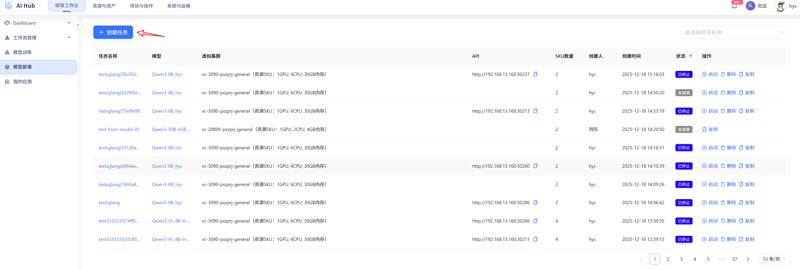

目前模型管理支持 **vLLM、sglang、自定义** 三种部署模版。

!!! warning "重要前置条件"
    - 当前版本模型部署的前提是：模型已经在「模型管理」中注册完成。
    - 选择部署模版时，系统会按需自动填入模型路径、名称等信息。

!!! note "镜像选择说明"
    - 使用 vLLM / sglang 模版时，只能选择 AIHub 镜像管理中推理引擎 `tag` 为对应值的镜像。
    - 如需新的镜像，请先在「镜像管理」中完成镜像注册，再回到部署页面选择。

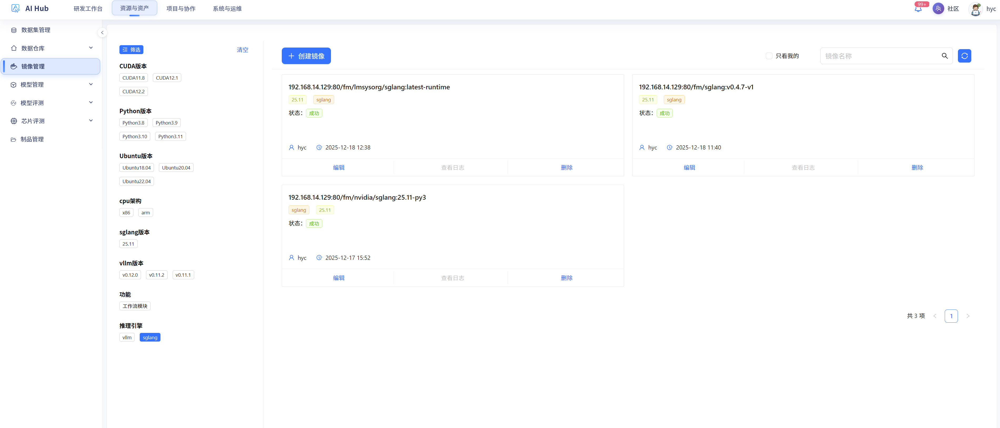

### vLLM 模版

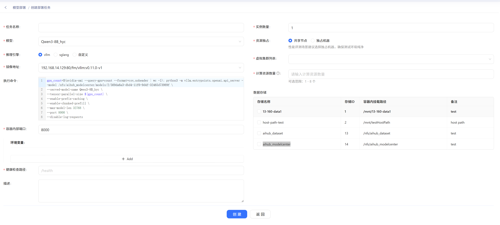

### sglang 模版

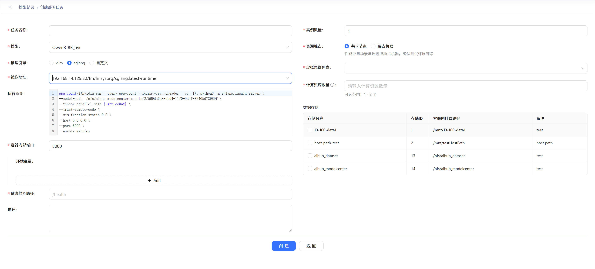

!!! tip "关于模版提供的示例命令"
    - vLLM / sglang 模版均会提供**示例运行命令**，方便快速启动。
    - 建议根据实际需求调整 **并发数、最大长度、端口等参数**。
    - **不建议修改模型路径**，避免与模型管理中的注册信息不一致，导致服务启动失败或加载错误模型。

在启动成功后任务状态会变为 `运行中`，系统会分配一个 API 以供调用，只有任务状态为 `运行中` 时 API 可用。

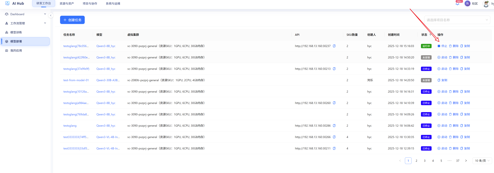

在初次成功部署时，系统会自动将当前部署的服务注册到「模型服务」模块，后续在评测时可以直接选择对应模型服务进行评测。

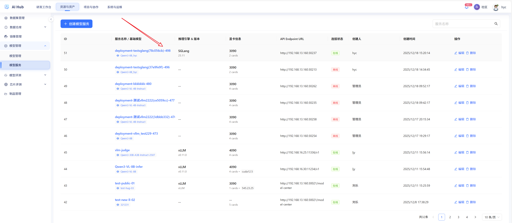

## 任务管理

### 任务列表

!!! info "可以在任务列表中看到什么？"
    - 当前所有部署任务的状态（排队中、部署中、运行中等）
    - 每个任务的基础信息（名称、创建时间、使用的模版/镜像）
    - 快速进入任务详情进行排查或停止 / 启动操作

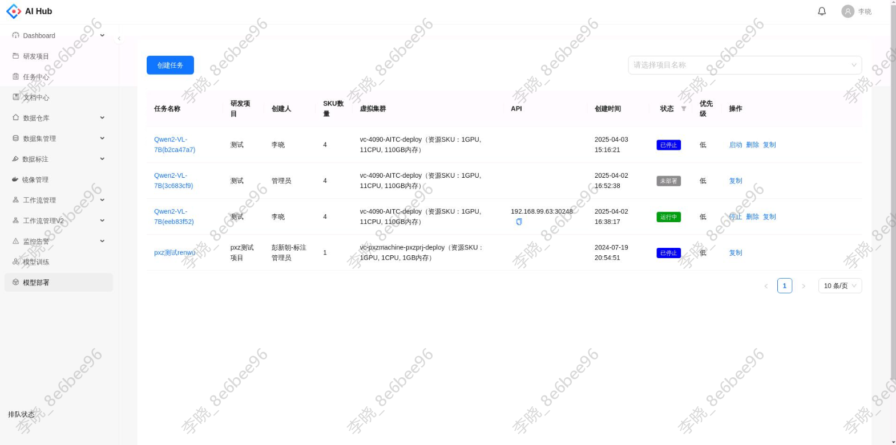

1. 任务状态

   - **所有状态**：未部署、排队中、部署中、运行中、运行失败、已停止、已杀死。
   - **排队中**：当检测到 GPU 资源不足时，任务状态会转为排队中，系统会在资源释放后自动继续部署。
   - **已停止**：用户手动停止后任务的状态，API 将不可用。
   - **已杀死**：由于其他任务强制启动导致该任务被杀死，可在详情页排查原因并视情况重新部署。

## 任务详情

点击任务名称，跳转至该任务的详情页。通过上部的导航可以切换查看 **任务详情** 和 **实例详情**。

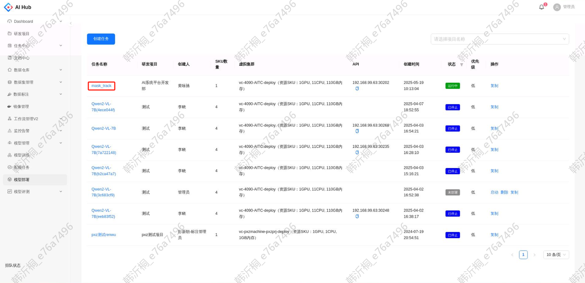

### 任务详情

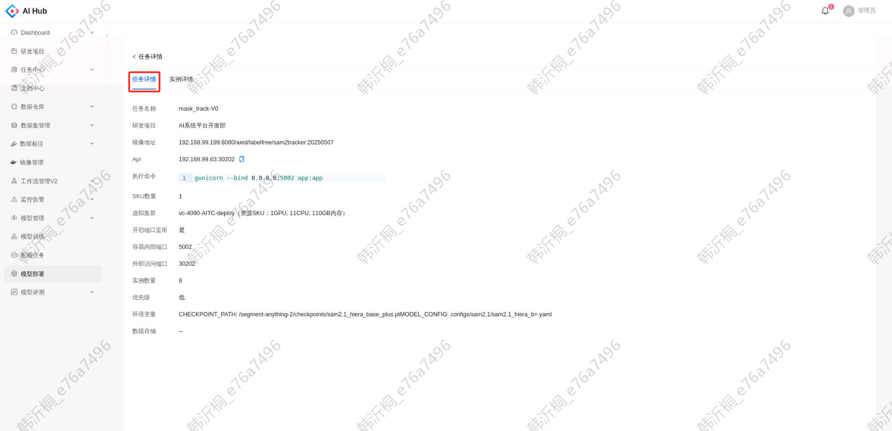

!!! tip "任务详情常见用途"
    - 确认当前部署使用的模型、镜像、启动参数等关键信息
    - 查看部署过程中的事件与配置，排查启动失败原因

### 实例详情

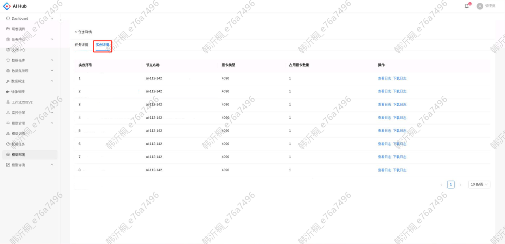

- 支持查看每个实例所部署的节点名称、显卡类型和占用显卡数量。
- 支持下载和查看日志信息，用于排查服务异常或性能问题。

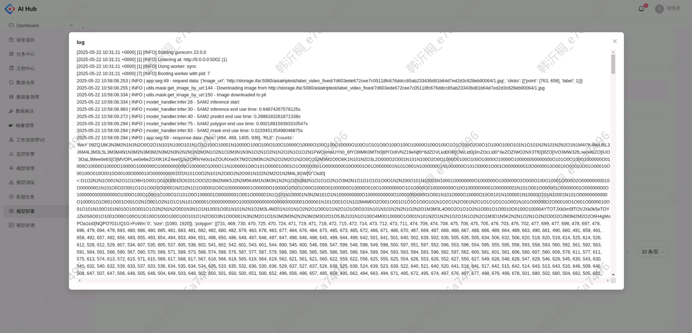
