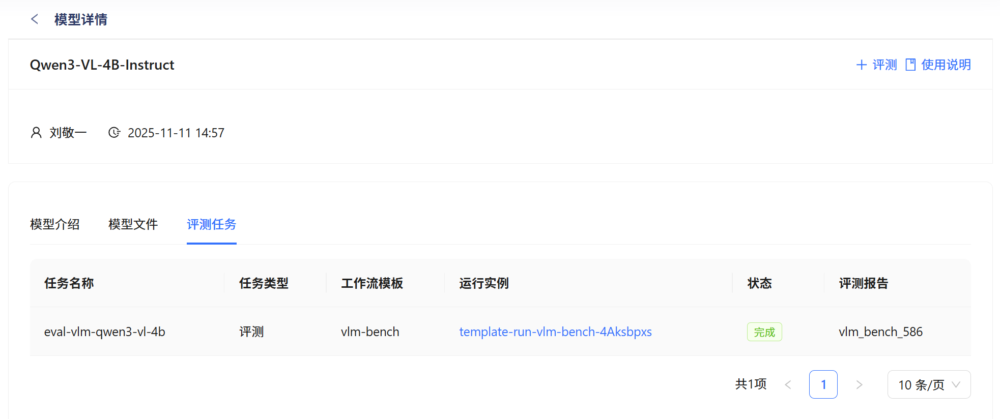
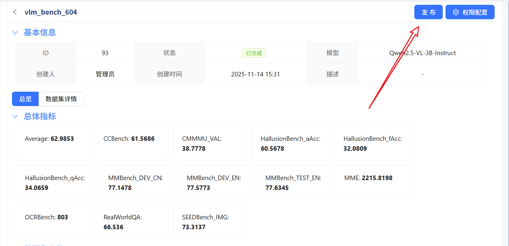

# 性能评测使用指南

本指南将帮助您快速上手评测系统，完成模型性能评估，并将结果发布至 Leaderboard。

- 性能评测基于 [evalscope](https://github.com/modelscope/evalscope) 实现
- 支持 LLM、VLM 模型服务

------

## 快速开始

评测系统提供**基线测试**能力，助您高效评估模型表现，并与社区其他模型横向对比。整个流程包括：

1. **创建模型服务**
2. **创建评测任务**
3. **监控任务执行**
4. **查看评测报告**
5. **申请发布到 Leaderboard**

> 💡 **建议**：首次使用前，请确保您已登录并拥有模型管理权限。

------

## 1. 创建模型服务

在开始评测前，需要先创建模型服务。

!!! warning "重要提示" 在性能评测场景下，推理环境的信息是重要的参考依据，请确保信息的准确性。

------

## 2. 创建评测任务

### 2.1 进入模型详情页

在模型管理页面中，点击目标模型进入其详情页，然后点击右上角 **「性能评测」** 按钮，即可发起评测任务。

### 2.2 选择基线测试类型

在「创建评测任务」页面，首先选择适合您模型的**基线测试类型**。

!!! tip "如何选择测试类型？" 不同测试类型面向不同场景（如通用语言理解、代码生成、多模态等）。请根据模型能力与目标选择最匹配的类型。

### 2.3 配置评测参数

配置评测任务的基本信息：

1. **输入任务名称**（建议包含模型名与测试目的）
2. **配置模型参数**：性能评测现阶段使用内置参数（并发数，输出输出长度等）进行评测，无需额外配置
3. **确认配置无误后提交**

!!! warning "重要注意事项" - 模型名称必须与注册名称完全一致 - 部分测试对资源消耗较大，执行时间可能较长（最长可达数小时） - 提交后不可修改，请仔细核对

------

## 3. 监控任务执行

提交任务后，系统将自动触发工作流引擎执行评测。

### 3.1 执行流程概览

### 3.2 实时查看任务状态

您可在 **任务列表** 中查看当前状态：

| 状态   | 图标 | 说明                     |
| ------ | ---- | ------------------------ |
| 等待中 | 🟡    | 任务已排队，等待资源分配 |
| 执行中 | 🔵    | 正在运行评测流程         |
| 已完成 | 🟢    | 成功生成评测报告         |
| 失败   | 🔴    | 执行异常，请查看日志     |

<figure markdown="span">      <figcaption>任务执行状态面板</figcaption> </figure>

------

## 4. 查看评测报告

### 4.1 报告内容

评测完成后，系统自动生成结构化报告，包含：

- **总体性能指标**（如准确率、F1、BLEU 等）
- **分数据集/子任务指标**
- **可视化对比图表**（部分测试支持）

具体指标解释见[evalscope文档](https://evalscope.readthedocs.io/zh-cn/latest/user_guides/stress_test/quick_start.html)

### 4.2 申请发布到 Leaderboard

若结果符合预期，可申请将其公开至 Leaderboard。

点击 **「申请发布」** 按钮提交审核。

<figure markdown="span">      <figcaption>点击"申请发布"提交审核</figcaption> </figure>

------

## 5. 审核与发布流程

### 5.1 审核结果通知

管理员将对您的申请进行审核：

- **通过**：结果自动同步至 Leaderboard
- **拒绝**：您将收到具体反馈，可修正后重新提交

!!! success "发布成功！" 您的模型已成功上榜！可在 Leaderboard 中查看排名与对比数据。

### 5.2 查看 Leaderboard

访问 `Leaderboard` 页面，按测试类型筛选，查看您的模型位置及历史趋势。

------

## 常见问题

**Q: 评测任务失败了怎么办？**
 A: 请查看任务日志，检查模型服务状态、参数配置是否正确，或联系技术支持。

**Q: 可以重新评测吗？**
 A: 可以，您可以创建新的评测任务重新测试。

**Q: Leaderboard 多久更新一次？**
 A: 审核通过后即时更新。
