我们现已将 Jupyter Notebook 和 VSCode 无缝集成至 Aihub 平台，用户可在平台上快速启动 Notebook 实例或VSCode，进行模型调试、推理测试、可视化分析等任务。

其中vscode集成了AICoding能力，支持对话式编程和代码补全。

## 使用前准备

### 配置浏览器

vscode server限制所有插件都必须在HTTPS加密的网站环境下运行，AICoding能力依赖vscode插件，因此第一次启动VSCode使用AICoding时，需将我们的网站地址临时设置为“视为安全来源”，操作方式如下：

1. 获取VSCode服务网页地址：

      启动一次CPU环境和GPU环境的服务，并分别点击VSCode进入vscode页面，记住两个环境地址栏的IP和端口号。不同用户的服务端口号不同，同一用户多次启停，服务端口号不变。
    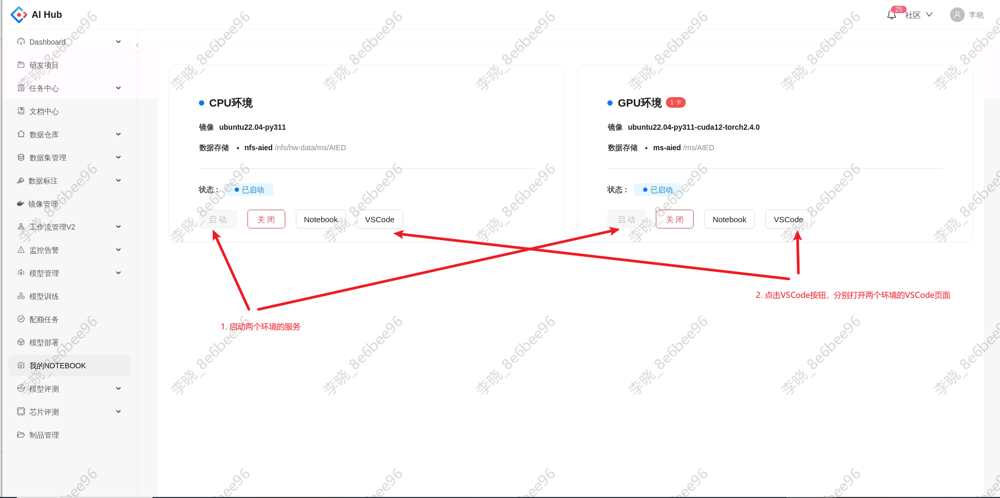
    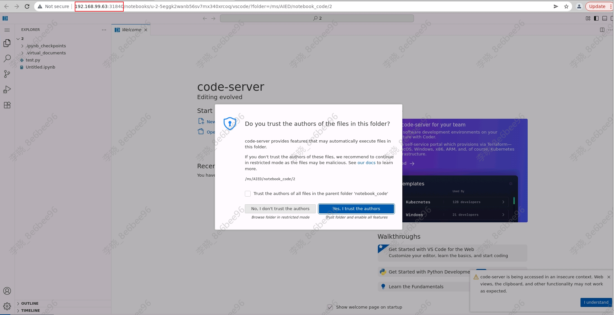

2. 将VSCode服务网页地址设置为“视为安全来源”:
      1. 在Chrome浏览器地址栏中访问：chrome://flags/#unsafely-treat-insecure-origins-as-secure  

      3. 在“Insecure origins treated as secure”的右侧的下拉菜单中选择“已启用”或“Enable”。

      4. 在下面的文本框中输入你的CPU和GPU环境的VSCode的访问IP和端口号，多个地址用逗号分隔，如：
            ```
            http://192.168.99.63:30497,http://192.168.99.63:31840
            ```

      5. 点击页面右下角的“重新启动”或“Relaunch”按钮重启浏览器。
      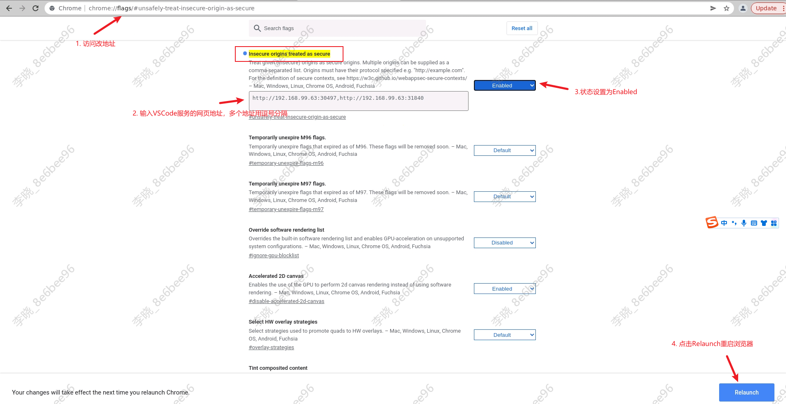

3. 如果你的浏览器版本过低，不支持该设置，请下载安装[最新浏览器版本](http://storage.ifai:5080/statics-live/chrome_packages/ChromeStandaloneSetup64-139.exe)后重试。

## 启动和关闭容器

点击我的notebook菜单进入notebook启动页面，我们支持CPU和GPU两种环境的notebook,并默认挂载华为存储。notebookCPU环境为ubuntu22.04-py311，资源规格为2核10G内存； GPU环境镜像为ubuntu22.04-py311-cuda12-torch2.4.0，资源规格为2核10G内存和1个4090GPU。

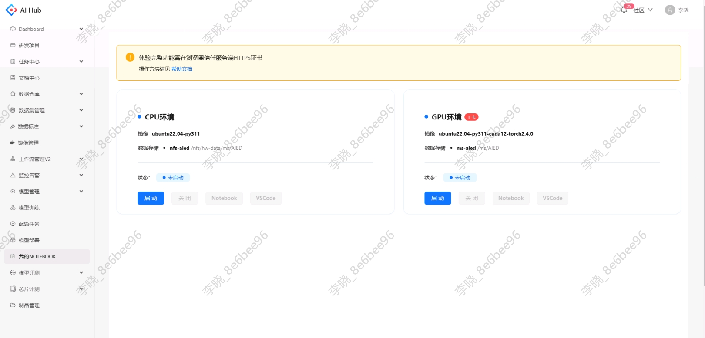

容器启动成功后，Notebook和VSCode按钮变为可点击状态，点击即可进入原生notebook页面或vscode页面

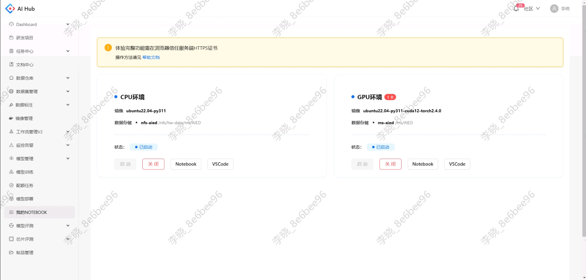

可以在notebook页面编写代码，访问挂载存储。

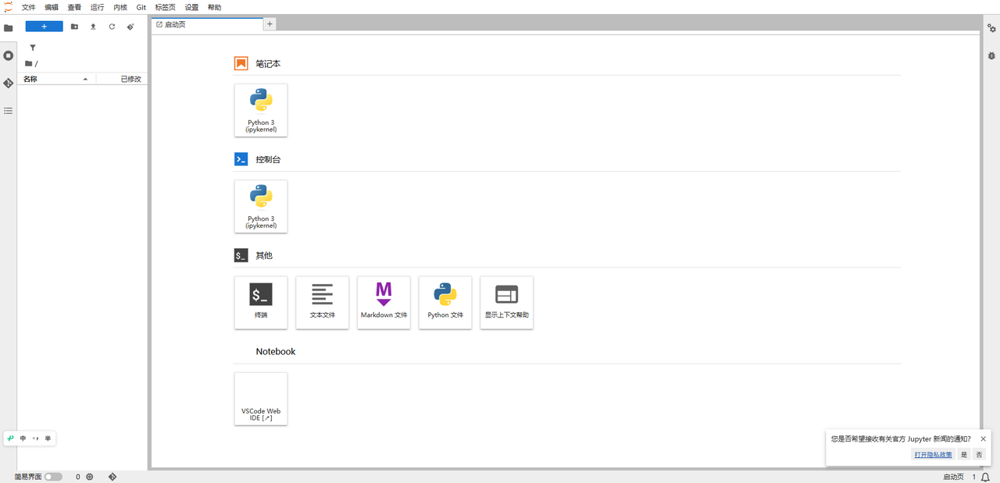

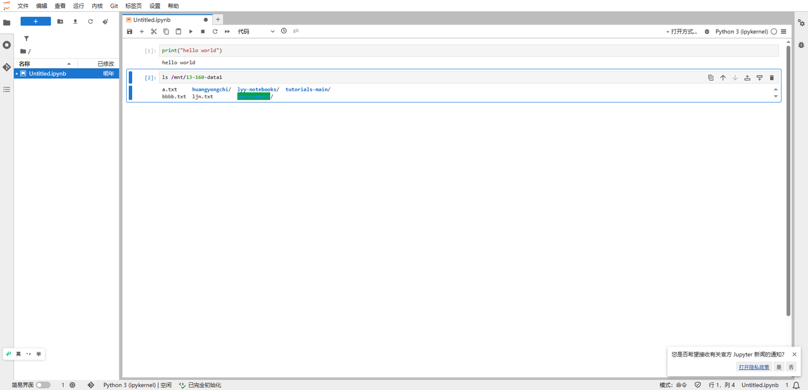

或者在vscode页面编写和运行代码，vscode已预先安装了python，yaml，json等常用插件。

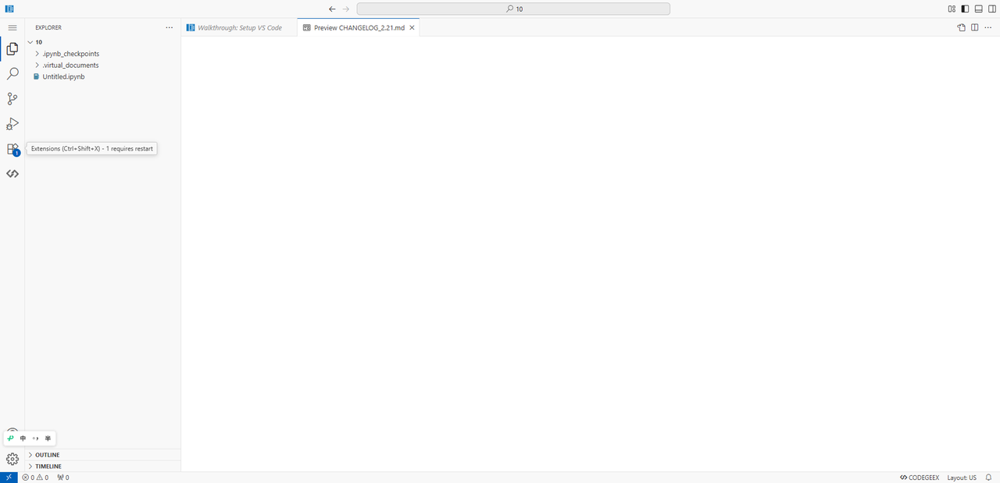

notebook使用完成后，可以点击关闭按钮手动关闭容器，如果GPU环境notebook超过60分钟没有活动，系统会自动关闭容器，vscode不支持活动检测，但关闭调试web页面60分钟后，系统也会自动关闭容器。

notebook使用单独的GPU集群，请记得使用完成后及时关闭容器，避免资源浪费。

## 使用AI编程

### 代码补全

代码补全通过codegeex插件实现，相关模型信息已经预装在镜像里，每次新启动镜像时，需设置插件工作方式为本地模式： 左边导航栏 - codegeex插件 - 设置 - 点击Local Mode, 可以看到界面显示“您已进入CodeGeeX本地模式”，此时可使用代码补全。

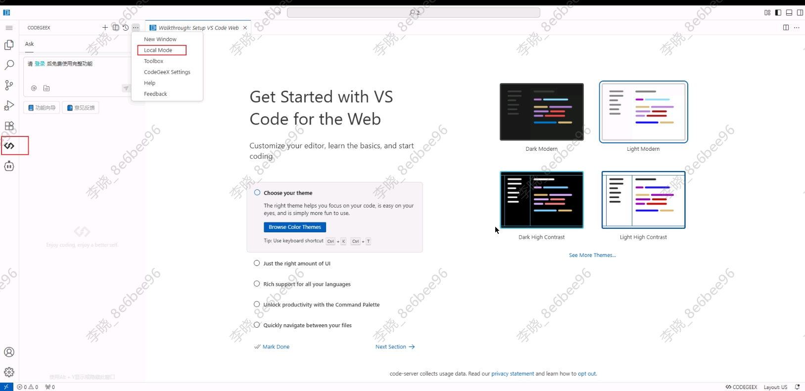

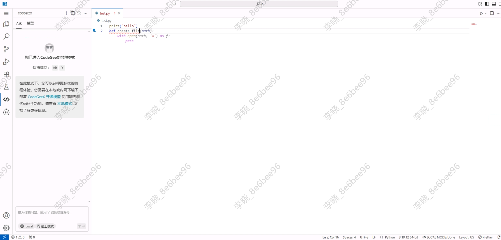

### 对话式代码生成

对话式代码生成通过cline插件实现，模型配置暂无法提前配置在镜像，需要再每次启动时手动配置一下：

左边导航栏 - cline插件 - "Use your own API key" - 按照图中的参数配置模型参数 - 点击"Let's go!" - 即出现对话页面

主要配置项：

1. API Provider选择：LM Studio
2. 选择 “Use custom base URL”，URL填 http://192.168.112.49:8000
3. Model ID 选择：/ms/AIED/lixiao/download/Qwen3-Coder-480B-A35B-instruct/

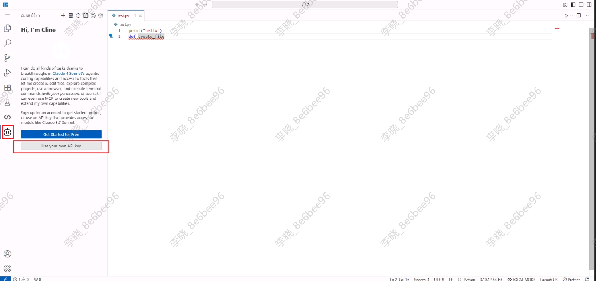

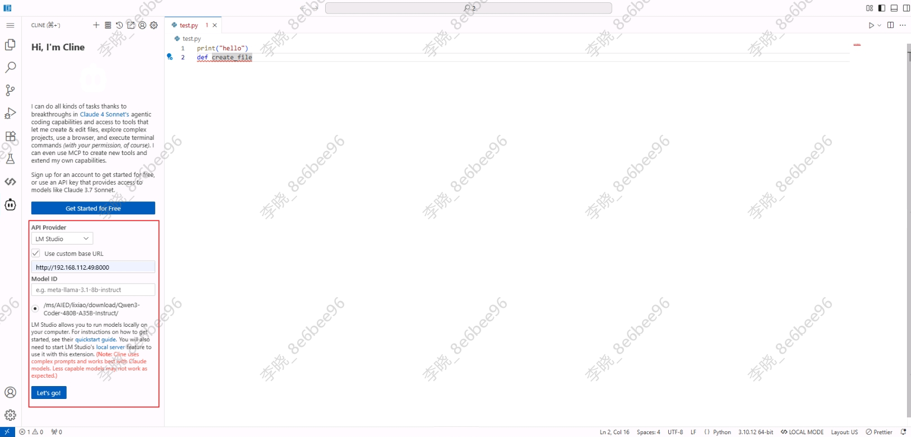

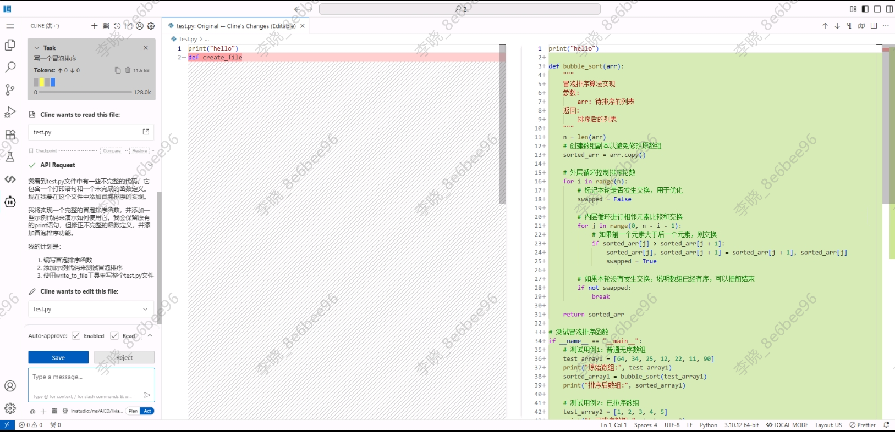

