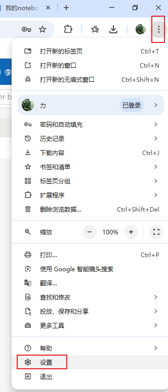
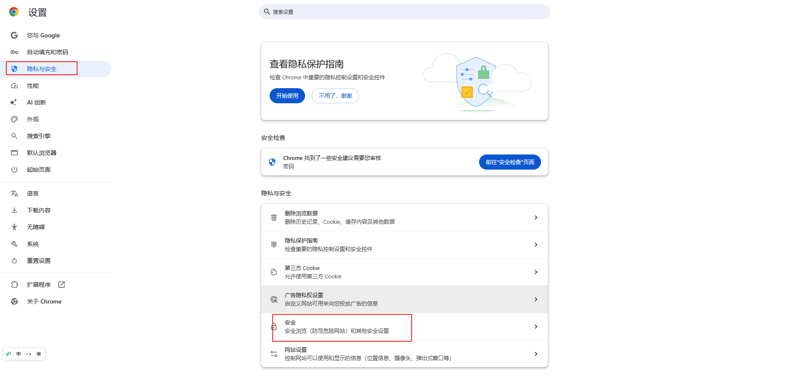
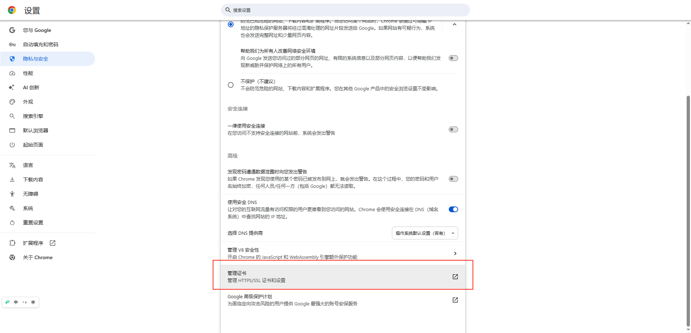
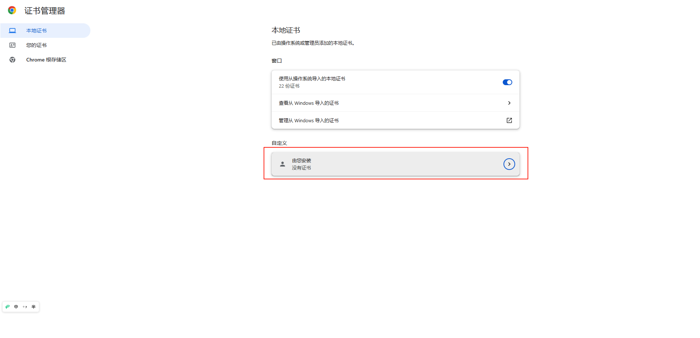
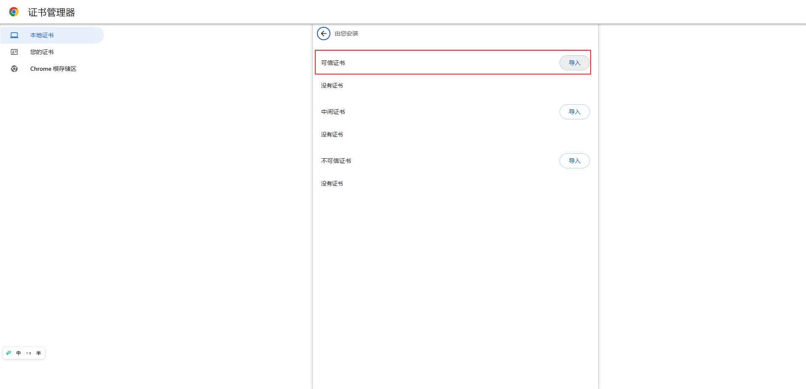
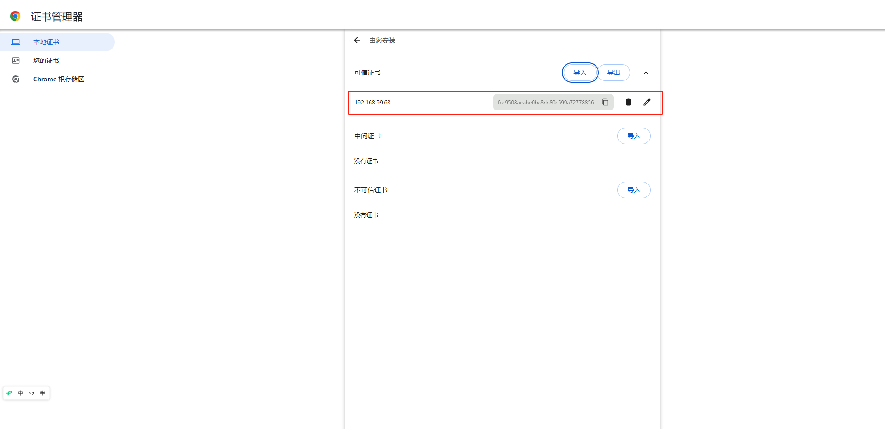
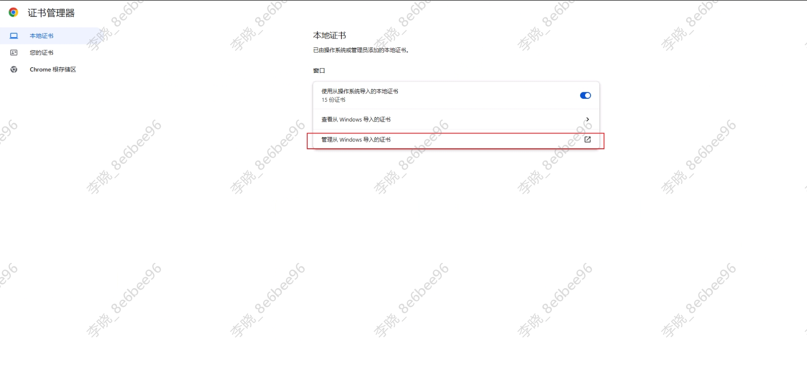
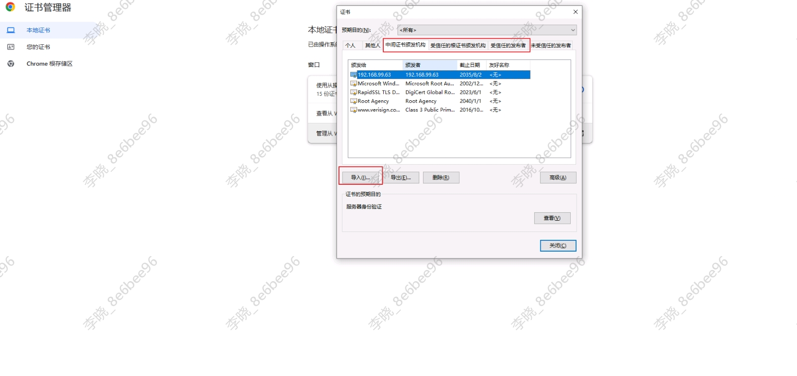

我们现已将 Jupyter Notebook 和 VSCode 无缝集成至 Aihub 平台，用户可在平台上快速启动 Notebook 实例或VSCode，进行模型调试、推理测试、可视化分析等任务。

其中vscode集成了AICoding能力，支持对话式编程和代码补全。

## 使用前准备

### 配置证书

由于vscode server限制，必须通过https访问页面才能使用插件，AICoding能力依赖vscode插件，因此如需使用ICoding，需先在浏览器信任内网AIHub签发的证书，操作方式如下

1. 通过如下链接下载证书：http://storage.ifai:5080/statics-live/cert/aihub-notebook-live.crt

2. 点击浏览器右上角的控制按钮，选择设置

   

3. 选择隐私与安全 - 安全 - 管理证书

   

   

4. 从这里开始不同版本的chrome浏览器导入证书方式有差异，这里提供两个不同版本的导入方法，如您的浏览器与此不同，请自行搜索导入方法或升级浏览器到比较新的版本。

  1. 138版本：

     1. 一次选择本地证书 - 自定义 -由您安装 - 可信证书 - 导入&#x20;

        

        

     2. 选择之前下载的证书导入，导入成功后可以看到新的证书显示。

        

  2. 133版本

     1. 依次选择 本地证书 - 管理从windows导入的证书 - 依次在“中间证书颁发机构”，“受信任的根证书颁发机构”,“受信任的发布者”导入前面下载的证书，导入成功后，可以在颁发者这里看到对应的证书已经导入。

        

        

## 启动和关闭容器

点击我的notebook菜单进入notebook启动页面，我们支持CPU和GPU两种环境的notebook,并默认挂载华为存储。notebookCPU环境为ubuntu22.04-py311，资源规格为2核10G内存； GPU环境镜像为ubuntu22.04-py311-cuda12-torch2.4.0，资源规格为2核10G内存和1个4090GPU。

容器启动成功后，Notebook和VSCode按钮变为可点击状态，点击即可进入原生notebook页面或vscode页面

可以在notebook页面编写代码，访问挂载存储。

或者在vscode页面编写和运行代码，vscode已预先安装了python，yaml，json等常用插件。

notebook使用完成后，可以点击关闭按钮手动关闭容器，如果GPU环境notebook超过60分钟没有活动，系统会自动关闭容器，vscode不支持活动检测，但关闭调试web页面60分钟后，系统也会自动关闭容器。

notebook使用单独的GPU集群，请记得使用完成后及时关闭容器，避免资源浪费。

## 使用AI编程

### 代码补全

代码补全通过codegeex插件实现，相关模型信息已经预装在镜像里，每次新启动镜像时，需设置插件工作方式为本地模式： 左边导航栏 - codegeex插件 - 设置 - 点击Local Mode, 可以看到界面显示“您已进入CodeGeeX本地模式”，此时可使用代码补全。

### 对话式代码生成

对话式代码生成通过cline插件实现，模型配置暂无法提前配置在镜像，需要再每次启动时手动配置一下：

左边导航栏 - cline插件 - "Use your own API key" - 按照图中的参数配置模型参数 - 点击"Let's go!" - 即出现对话页面

