原我的Notebook功能升级为我的应用，不仅支持 Jupyter Notebook 和 VSCode 无缝集成至 Aihub 平台，同时提供VNC+SSH环境，用户可在平台上快速启动 Notebook 实例，VSCode以及VNC和SSH服务，进行模型调试、推理测试、可视化分析,数据传输等任务。

其中vscode集成了AICoding能力，支持对话式编程和代码补全。

## 使用前准备

### 配置浏览器

vscode server限制所有插件都必须在HTTPS加密的网站环境下运行，AICoding能力依赖vscode插件，因此第一次启动VSCode使用AICoding时，需将我们的网站地址临时设置为“视为安全来源”，操作方式如下：

1. 获取VSCode服务网页地址：

      启动一次CPU环境和GPU环境的服务，并分别点击VSCode进入vscode页面，记住两个环境地址栏的IP和端口号。不同用户的服务端口号不同，同一用户多次启停，服务端口号不变。
    
    

2. 将VSCode服务网页地址设置为“视为安全来源”:
      1. 在Chrome浏览器地址栏中访问：chrome://flags/#unsafely-treat-insecure-origins-as-secure  

      3. 在“Insecure origins treated as secure”的右侧的下拉菜单中选择“已启用”或“Enable”。

      4. 在下面的文本框中输入你的CPU和GPU环境的VSCode的访问IP和端口号，多个地址用逗号分隔，如：
            ```
            http://192.168.99.63:30497,http://192.168.99.63:31840
            ```

      5. 点击页面右下角的“重新启动”或“Relaunch”按钮重启浏览器。
      

3. 如果你的浏览器版本过低，不支持该设置，请下载安装[最新浏览器版本](http://storage.ifai:5080/statics-live/chrome_packages/ChromeStandaloneSetup64-139.exe)后重试。

## 启动和关闭容器

点击我的应用菜单进入notebook启动页面，我们支持CPU和GPU两种环境的notebook,并默认挂载华为存储。notebookCPU环境为ubuntu22.04-py311，资源规格为2核10G内存； GPU环境镜像为ubuntu22.04-py311-cuda12-torch2.4.0，资源规格为2核10G内存和1个4090GPU。


容器启动成功后，Notebook和VSCode按钮变为可点击状态，点击即可进入原生notebook页面或vscode页面


可以在notebook页面编写代码，访问挂载存储。


或者在vscode页面编写和运行代码，vscode已预先安装了python，yaml，json等常用插件。


notebook使用完成后，可以点击关闭按钮手动关闭容器，如果GPU环境notebook超过60分钟没有活动，系统会自动关闭容器，vscode不支持活动检测，但关闭调试web页面60分钟后，系统也会自动关闭容器。

notebook使用单独的GPU集群，请记得使用完成后及时关闭容器，避免资源浪费。

## 使用AI编程

### 代码补全

代码补全通过codegeex插件实现，相关模型信息已经预装在镜像里，每次新启动镜像时，需设置插件工作方式为本地模式： 左边导航栏 - codegeex插件 - 设置 - 点击Local Mode, 可以看到界面显示“您已进入CodeGeeX本地模式”，此时可使用代码补全。


### 对话式代码生成

对话式代码生成通过cline插件实现，模型配置暂无法提前配置在镜像，需要再每次启动时手动配置一下：

左边导航栏 - cline插件 - "Use your own API key" - 按照图中的参数配置模型参数 - 点击"Let's go!" - 即出现对话页面

主要配置项：

1. API Provider选择：LM Studio
2. 选择 “Use custom base URL”，URL填 http://192.168.112.49:8000
3. Model ID 选择：/ms/AIED/lixiao/download/Qwen3-Coder-480B-A35B-instruct/


### 更多技巧

#### 把VSCode安装为PWA应用
在网页使用vscode的时候，存在vscode快捷键和浏览器快捷键冲突的问题，我们可以把vscode安装为PWA应用，这样就可以避免快捷键冲突的问题，使用也更加方便。

安装方法：

1. 打开vscode网页版本，在地址栏右侧找到安装按钮，点击该按钮
      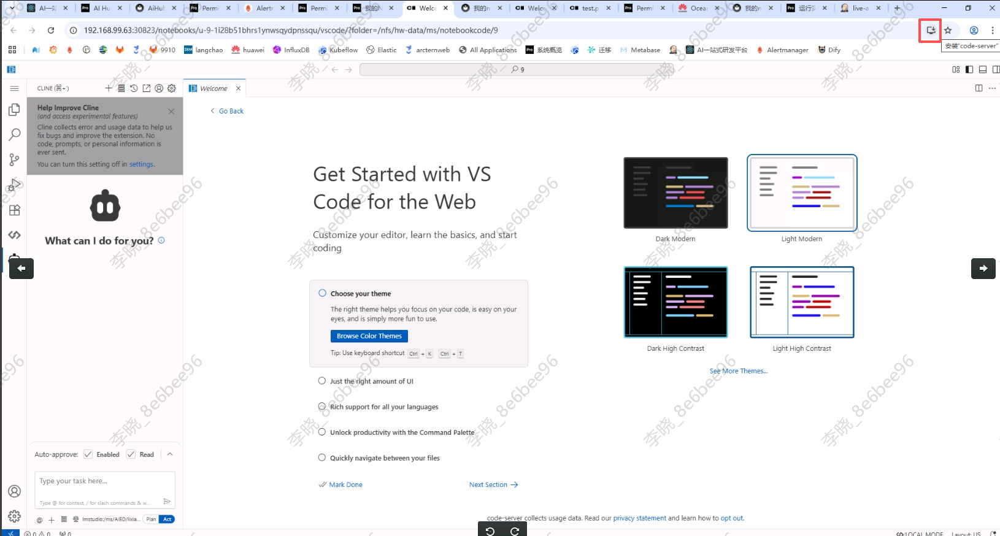
2. 在弹出的窗口中，点击“安装”
      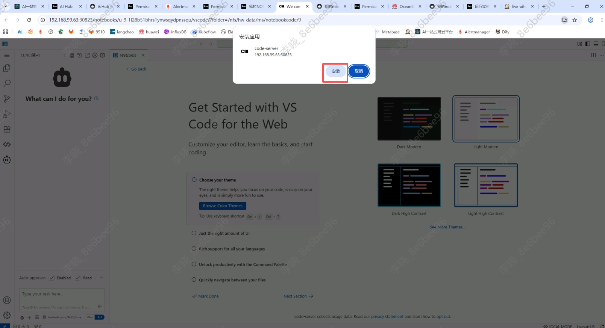
3. 回到桌面，可以看到桌面新增了一个vscode的快捷方式图标，双击即可直接打开vscode，使用方式和原生vscode一样，快捷键也都可以使用
      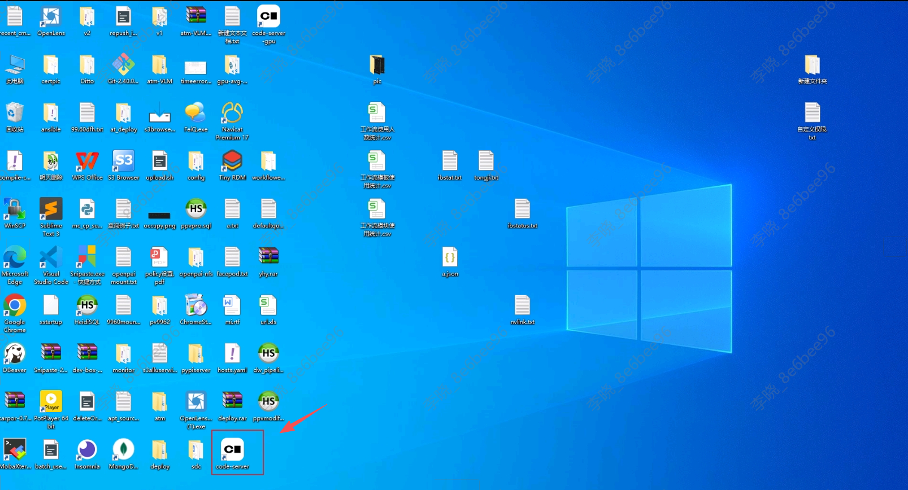
      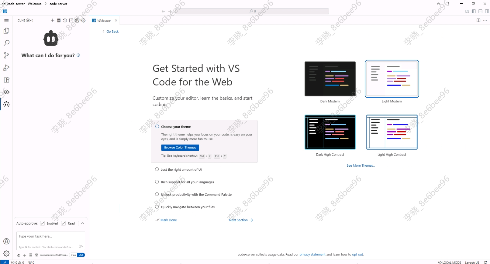

# VNC+SSH环境

## 启动和关闭容器

点击我的应用菜单，可以看到VNC+SSH环境卡片，该环境为纯CPU环境，资源规格为2核10G内存；预装VNC服务和SSH服务，用户可通过两种协议分别登录容器。点击启动按钮，等状态变为“已启动”时，卡片将显示VNC服务地址和SSH登录命令，同时“Web VNC”按钮变为可点击。点击关闭按钮，可以关闭容器。

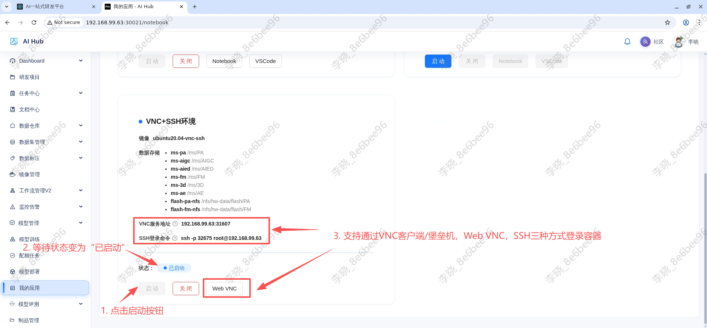

## VNC服务访问

VNC服务支持Web VNC和VNC协议两种方式访问，内部预置了vscode，pycharm，spyder，chrome，nomacs，VLC播放器等常用软件。

### Web VNC

直接点击Web VNC按钮，即可打开Web VNC服务网页使用。

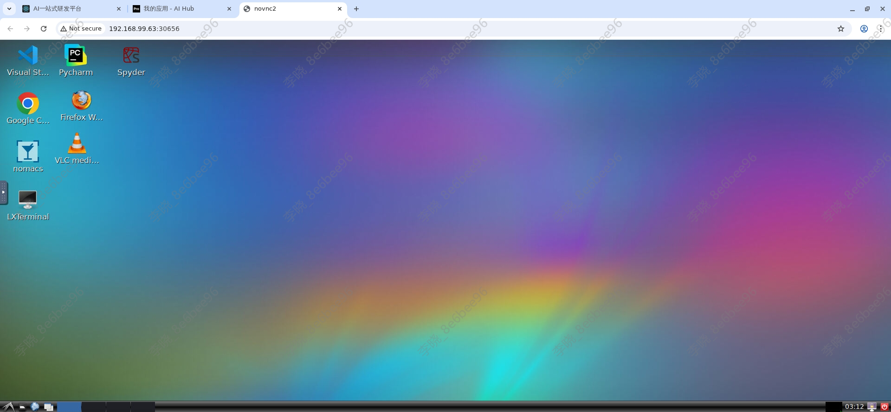

### VNC协议

VNC协议主要用于在办公网络电脑通过堡垒机访问使用。

1. 在办公网络电脑访问并登录公司堡垒机地址：http://192.168.120.100（堡垒机由IT部维护，如需注册账号或有其他疑问，请在飞书IT服务台咨询）。

2. 找到上文启动容器后，页面显示的VNC服务地址的主机，点击Quick Access，填写相关信息后，即可通过网页打开VNC服务


   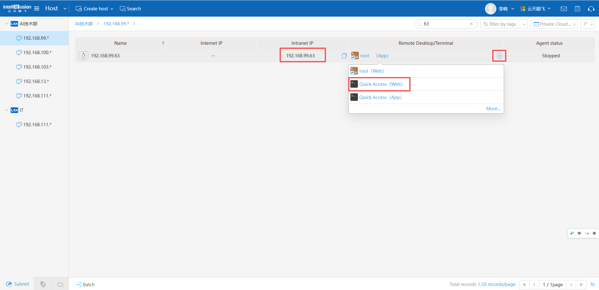

   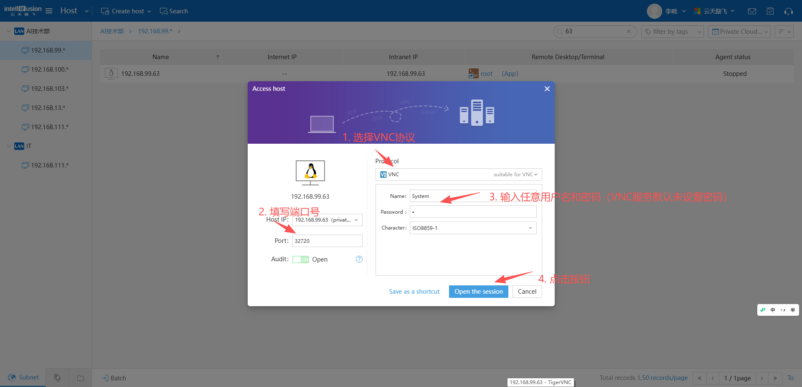

   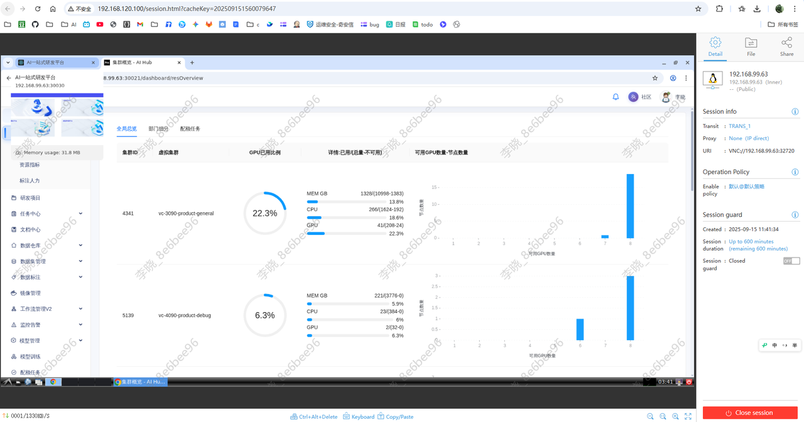

## SSH服务访问

ssh服务支持用户通过ssh协议登录容器，访问数据，同步代码。

### SSH服务同步vscode代码示例

服务已经预置了VSCode的“Remote”插件的服务端程序，支持通过该插件直接连接编辑和保存服务端代码，由于服务端程序必须与特定的插件和VSCode版本匹配，如需使用该功能，请安装1.103.2版本的VSCode，并安装特定插件后使用。

VSCode下载链接：http://storage.ifai:5080/statics-live/vscode/VSCodeUserSetup-x64-1.103.2.exe

Remote插件下载链接：http://storage.ifai:5080/statics-live/vscode/ms-vscode-remote.remote-ssh-0.120.0.vsix

安装后，即可使用remote插件直接访问服务端代码（使用说明：https://code.visualstudio.com/docs/remote/ssh）。

1. 按F1或ctrl+shift+P打开Remote-SSH: Connect to Host...页面，根据引导输入登录命令，密码后，即可打开remote VSCode。

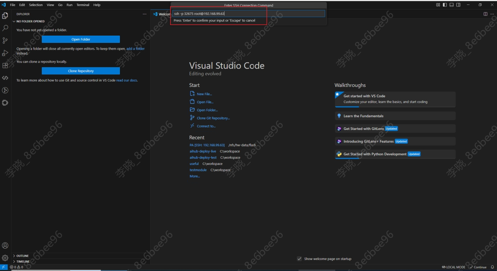

如图，VSCode通过remote和ssh服务打开了ms/PA目录

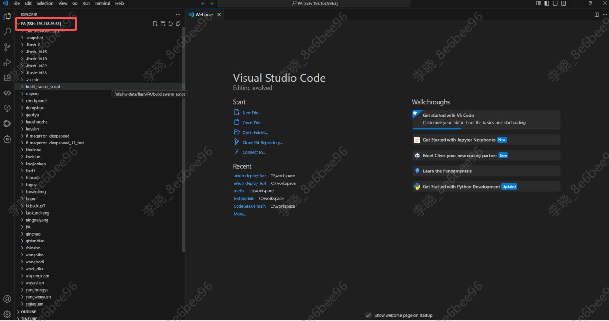

