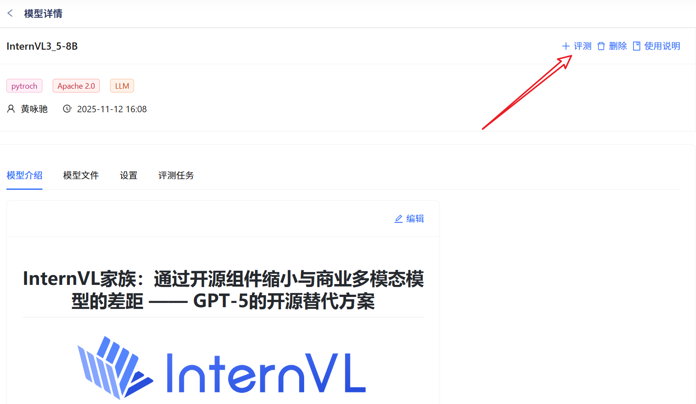
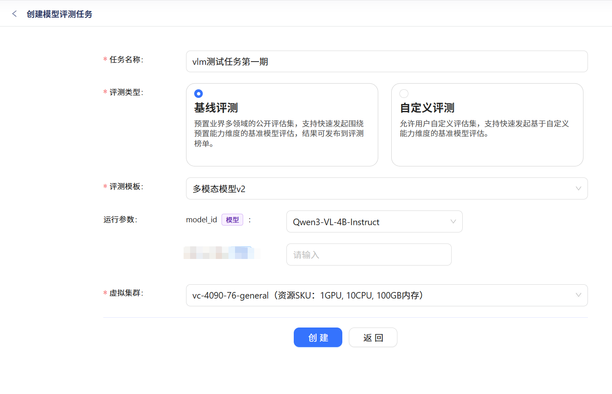
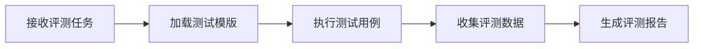
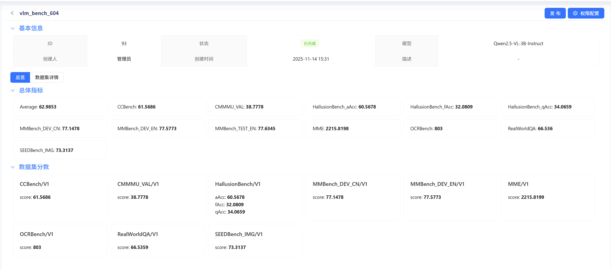
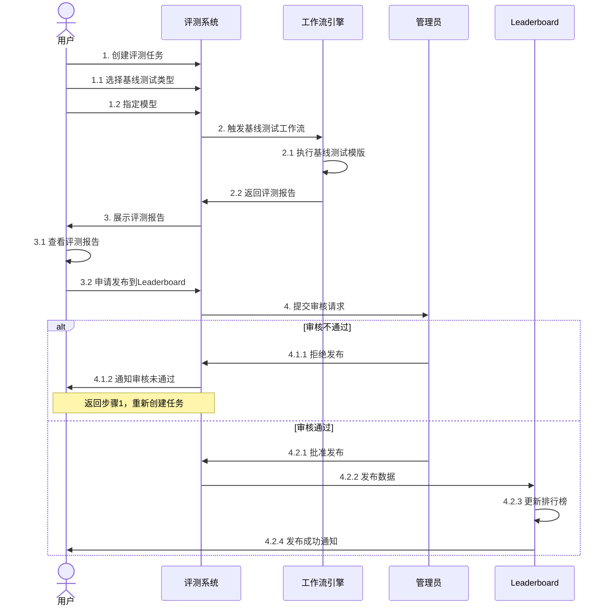

# 评测系统使用指南

本指南将帮助您了解如何使用评测系统进行模型评测，并将结果发布到 Leaderboard。

## 快速开始

评测系统支持基线测试，帮助您快速评估模型性能并与其他模型进行对比。整个流程包括：创建评测任务、查看评测报告、申请发布到排行榜。

---

## 1. 模型管理创建评测任务

点击进入模型详情页面，点击右上角「评测」 按钮，发起评测任务。

<figure markdown="span">
  { width="500" }
  <figcaption>模型评测-创建评测任务</figcaption>
</figure>

### 1.1 选择基线测试类型

登录评测系统后，进入「创建评测任务」页面，选择您需要的基线测试类型。

!!! tip "提示"
    不同的基线测试类型适用于不同的场景，请根据您的模型特点选择合适的测试类型。

<figure markdown="span">
{ width="500" }
<figcaption>创建评测任务</figcaption>
</figure>

### 1.2 指定评测模型

选择测试类型后，您需要指定要评测的模型。

**配置步骤：**

1. 输入任务名称
2. 配置模型参数（如适用）
3. 确认评测配置信息

!!! warning "注意事项"
    - 请确保模型名称准确无误
    - 检查模型参数是否符合测试要求
    - 部分测试可能需要较长时间，请耐心等待

---

## 2. 工作流执行过程

提交评测任务后，系统将自动触发工作流引擎执行基线测试。

### 2.1 工作流执行

工作流引擎会根据您选择的测试类型，自动执行相应的测试模版。

### 2.2 执行状态监控

您可以在任务列表中实时查看任务执行状态：

- 🟡 **等待中**：任务已创建，等待执行
- 🔵 **执行中**：工作流正在运行
- 🟢 **已完成**：评测成功完成
- 🔴 **失败**：评测过程出现错误

---

## 3. 查看评测报告

### 3.1 报告详情

评测完成后，系统会生成详细的评测报告，包含以下内容：

- 总体指标
- 数据集指标

{ width="500" }

### 3.2 申请发布到 Leaderboard

如果您对评测结果满意，可以申请将结果发布到 Leaderboard。

**发布前检查清单：**

- [x] 评测报告数据完整
- [x] 模型信息准确
- [x] 符合发布规范
- [x] 已阅读发布协议

点击「申请发布」按钮，提交审核请求。

---

## 4. 审核与发布流程

#### 4.1 审核通过

审核通过后，系统会自动将您的评测结果发布到 Leaderboard。

!!! success "发布成功"
    恭喜！您的模型已成功发布到 Leaderboard，可以在排行榜中查看您的排名。

### 4.2 查看 Leaderboard

访问 Leaderboard 页面，查看您的模型在排行榜中的位置。

    

---

## 常见问题

??? question "评测任务失败怎么办？"
    1. 检查模型配置是否正确
    2. 查看错误日志了解失败原因
    3. 确认网络连接稳定
    4. 联系技术支持获取帮助

??? question "审核不通过可以重新申请吗？"
    可以。根据反馈意见修改后，您可以重新创建评测任务并再次申请发布。

??? question "可以删除已发布的结果吗？"
    已发布的结果一般不允许删除，但可以联系管理员说明特殊情况。

---

## 附录：完整流程图

---

*最后更新时间：2024-11-14*