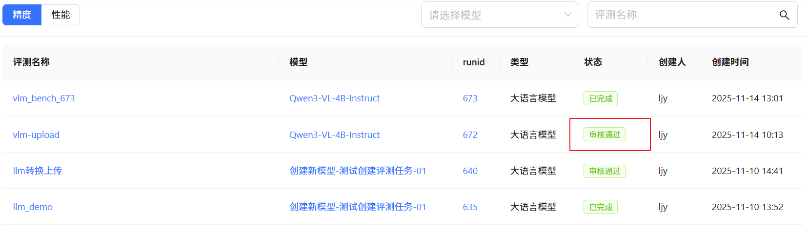
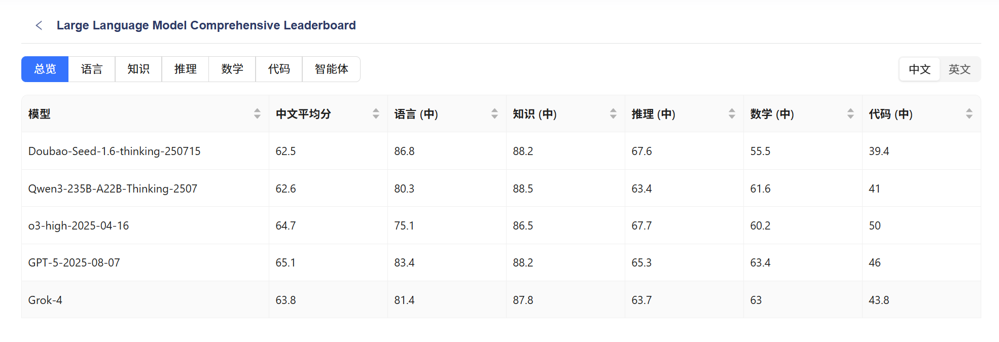
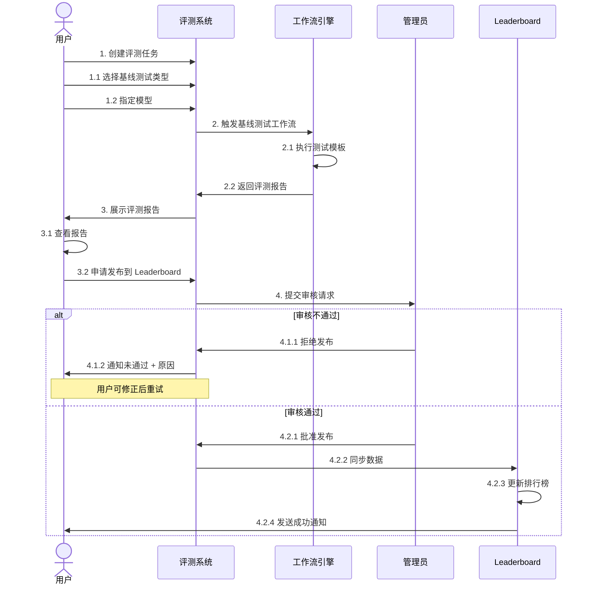

# 评测系统使用指南

本指南将帮助您快速上手评测系统，完成模型性能评估，并将结果发布至 Leaderboard。

---

## 快速开始

评测系统提供**基线测试**能力，助您高效评估模型表现，并与社区其他模型横向对比。整个流程包括：

1. **创建评测任务**
2. **查看评测报告**
3. **申请发布到 Leaderboard**

> 💡 **建议**：首次使用前，请确保您已登录并拥有模型管理权限。

---

## 1. 创建评测任务

### 进入模型详情页

在模型管理页面中，点击目标模型进入其详情页，然后点击右上角 **「评测」** 按钮，即可发起评测任务。

<figure markdown="span">
  { width="500" }
  <figcaption>点击「评测」按钮发起任务</figcaption>
</figure>

### 1.1 选择基线测试类型

在「创建评测任务」页面，首先选择适合您模型的**基线测试类型**。

!!! tip "如何选择测试类型？"
    不同测试类型面向不同场景（如通用语言理解、代码生成、多模态等）。请根据模型能力与目标选择最匹配的类型。

<figure markdown="span">
  { width="500" }
  <figcaption>选择合适的基线测试类型</figcaption>
</figure>

### 1.2 指定评测模型

配置评测任务的基本信息：

1. **输入任务名称**（建议包含模型名与测试目的）
2. **配置模型参数**（如 temperature、max_tokens 等，视测试类型而定）
3. **确认配置无误后提交**

!!! warning "重要注意事项"
    - 模型名称必须与注册名称完全一致
    - 部分测试对资源消耗较大，执行时间可能较长（最长可达数小时）
    - 提交后不可修改，请仔细核对

---

## 2. 工作流执行过程

提交任务后，系统将自动触发工作流引擎执行评测。

### 2.1 执行流程概览

### 2.2 实时监控任务状态

您可在 **任务列表** 中查看当前状态：

| 状态   | 图标 | 说明                     |
| ------ | ---- | ------------------------ |
| 等待中 | 🟡    | 任务已排队，等待资源分配 |
| 执行中 | 🔵    | 正在运行评测流程         |
| 已完成 | 🟢    | 成功生成评测报告         |
| 失败   | 🔴    | 执行异常，请查看日志     |

<figure markdown="span">
  
  <figcaption>任务执行状态面板</figcaption>
</figure>

---

## 3. 查看评测报告

### 3.1 报告内容

评测完成后，系统自动生成结构化报告，包含：

- **总体性能指标**（如准确率、F1、BLEU 等）
- **分数据集/子任务指标**
- **可视化对比图表**（部分测试支持）

<figure markdown="span">
  { width="500" }
  <figcaption>评测报告详情页</figcaption>
</figure>

### 3.2 申请发布到 Leaderboard

若结果符合预期，可申请将其公开至 Leaderboard。

点击 **「申请发布」** 按钮提交审核。

<figure markdown="span">
  
  <figcaption>点击“申请发布”提交审核</figcaption>
</figure>

---

## 4. 审核与发布流程

### 4.1 审核结果通知

管理员进行审核：

- **通过**：结果自动同步至 Leaderboard
- **拒绝**：您将收到具体反馈，可修正后重新提交

!!! success "发布成功！"
    您的模型已成功上榜！可在 Leaderboard 中查看排名与对比数据。

<figure markdown="span">
  
  <figcaption>模型成功发布至排行榜</figcaption>
</figure>

### 4.2 查看 Leaderboard

访问`Leaderboard` 页面，按测试类型筛选，查看您的模型位置及历史趋势。

<figure markdown="span">
  
  <figcaption>Leaderboard 展示效果</figcaption>
</figure>

---

## 常见问题（FAQ）

??? question "评测任务失败怎么办？"
    请按以下步骤排查：
    
    1. 检查模型配置是否合法（如 API 地址、token 权限）
    2. 在任务详情页查看 **错误日志**
    3. 确保网络与依赖服务正常
    4. 若仍无法解决，请联系技术支持

??? question "审核不通过可以重新申请吗？"
    **可以**。根据审核意见调整模型或评测配置后，重新创建评测任务并再次申请发布。

??? question "已发布的结果能删除吗？"
    出于公平性考虑，**已发布结果通常不可删除**。如遇特殊情况（如数据泄露、模型下架），请联系管理员人工处理。

---

## 附录：完整端到端流程图

---

<small>最后更新：2024-11-14</small>
