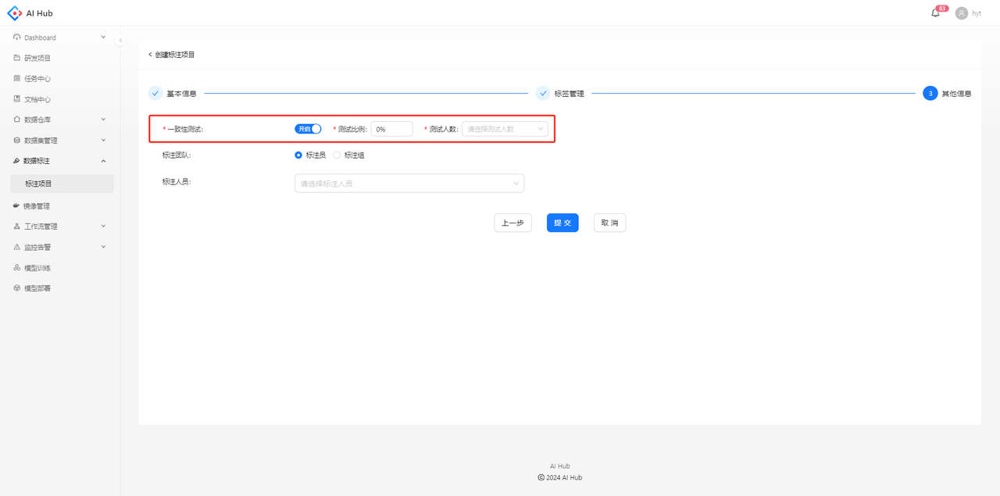
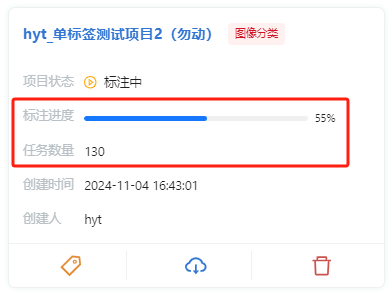
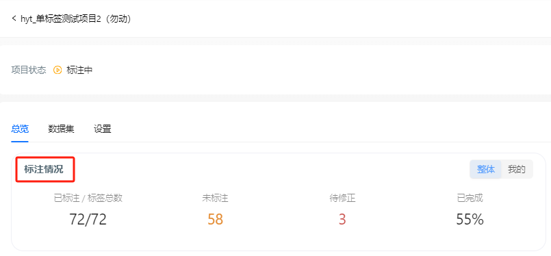
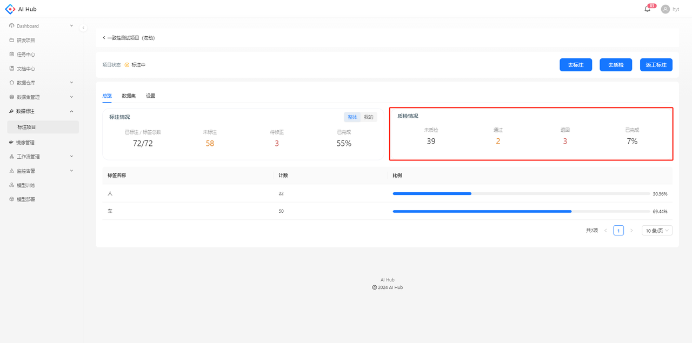

一致性测试主要是为了验证标注员对标注要求的理解是否一致到位、算法对标注要求的描述是否清晰全面，以便在标注的最初阶段小成本试错、减少后期大批量返工标注的可能

# 开启一致性测试

创建项目时支持开启一致性测试并设置参数，创建项目后无法更改

* 测试比例：从所有图片中抽取出一部分用于进行一致性测试的比例

* 测试人数：用于测试的单张图片所需的标注人数

# 统计指标

任务数量：**一个任务是指一个标注员标注一张图片**。如果一张图片需要3个人标注，则任务数量为3。

标注进度：已完成标注的任务数量占任务总量的比例

例如：已选数据集中有100张图片，一致性测试比例为30%，测试人数为2

在项目总览，标注情况中的指标也是以任务为单位进行统计的。

# 质检

当前，系统无法对用于一致性测试的图片进行质检。因此，质检情况中的指标只针对非一致性测试的图片。

