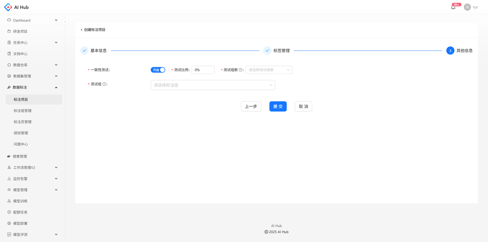

一致性测试主要是为了验证标注员对标注要求的理解是否一致到位、算法对标注要求的描述是否清晰全面，以便在标注的最初阶段小成本试错、减少后期大批量返工标注的可能。

## 开启一致性测试

创建项目时支持开启一致性测试并设置参数，创建项目后无法更改

1. 测试比例：从所有数据中抽取出一部分用于进行一致性测试的比例
2. 测试组数：参与测试的单个数据所需的测试组数
3. 测试组
    - 可选[标注组](./标注团队管理.md#annotation-group-management)
    - 参与测试的单个数据会分配给每个测试组中的1人标注
    - 创建项目后测试组不可更改，但允许在测试组中增加标注员

## 统计指标

任务数量：**一个任务是指一个标注员标注一张图片**。如果一张图片需要3个人标注，则任务数量为3。

标注进度：已完成标注的任务数量占任务总量的比例

例如：已选数据集中有100张图片，一致性测试比例为30%，测试组数为2。则任务数量 
        = 一致性测试的任务数量 + 非一致性测试的任务数量 
        = 100 × 30% × 2 + 100 × (1-30%) 
        = 130

在项目总览，标注情况中的指标也是以任务为单位进行统计的。

## 质检

当前，系统无法对用于一致性测试的图片进行质检。因此，质检情况中的指标只针对非一致性测试的图片。

