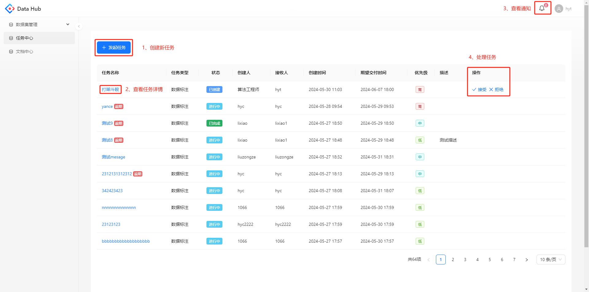
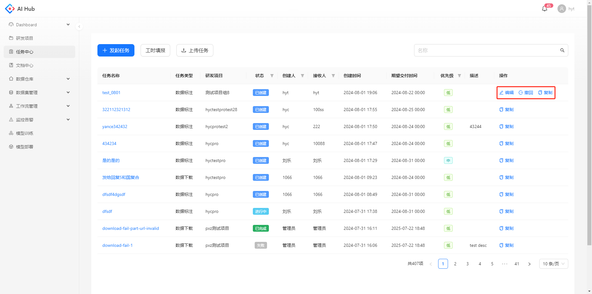
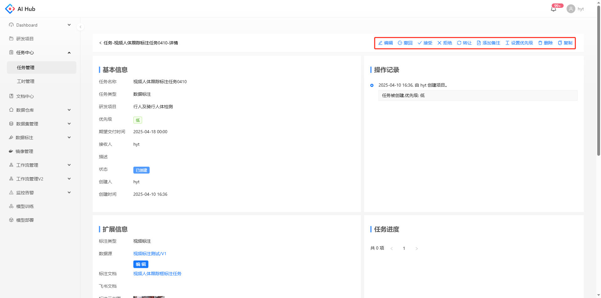
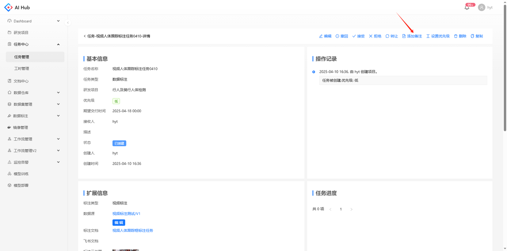
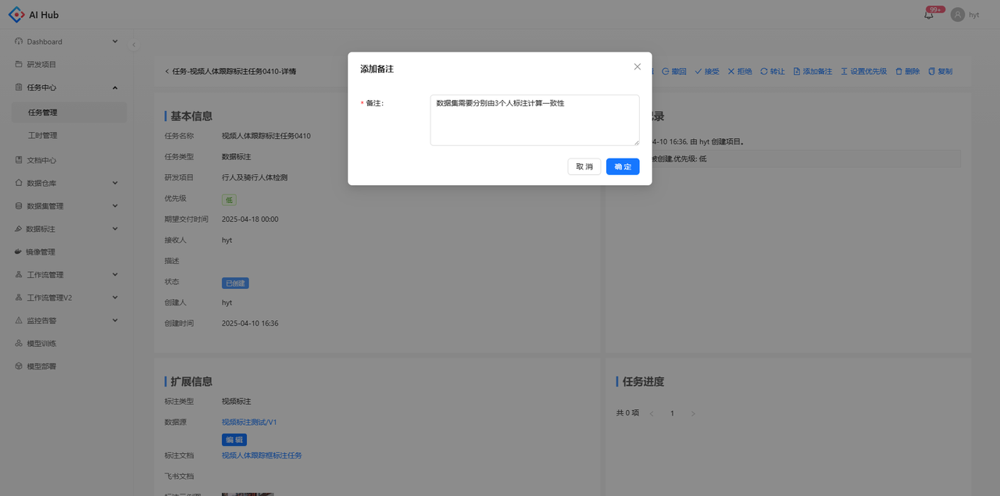
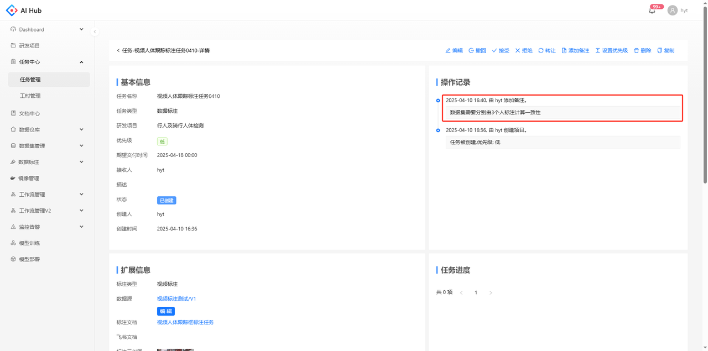

任务中心支持从任务创建到归档的全流程管理，旨在帮助团队更好地协调和完成各类任务。主要功能包括：

1. 任务发起和分配

   * 用户可以创建新任务，选择任务类型并设置具体参数。

   * 任务可以分配给特定的接收人，确保任务被正确执行。

2. 状态流转

   * 每个任务都有明确的状态流转过程，从“已创建”、“进行中”、“已完成”到最后的“已归档”。

   * 用户可以随时查看任务的当前状态，确保任务的进展情况透明化。

3. 操作记录存档

   * 所有任务的操作记录都会被详细记录并存档。

   * 用户可以随时查询任务的历史操作记录，了解任务的处理过程和每个环节的操作详情。

4. 通知提醒

   * 任务中心会在对任务进行操作后自动发送通知提醒，确保相关人员及时知晓。

# 快速开始

1. 创建新任务：点击发起任务，可以选择接收人、任务类型、优先级，设置该类任务的参数

2. 查看任务详情：点击任务名称，在详情页可以看到创建任务时的所有配置信息和该任务的所有操作记录

3. 查看通知：点击右上角的通知图标，可以看到所有和自己任务相关的操作提醒

4. 处理任务：根据当前的任务状态，可以在操作列选择对该任务进行相应的处理

5. 工时填报：填写当天的标注工时和数据量

发起任务时，支持选择不同的任务类型。不同类任务的操作说明请参考以下文档：

[ 数据标注任务 ](./数据标注任务.md)

[ 数据接入任务 ](./数据接入任务.md)

[ 外网数据下载任务 ](./外网数据下载任务.md)

# 处理任务

在不同的任务状态下，任务发起方和任务接收方会有相应的操作按钮对任务进行处理。当任务发起方确认任务完成情况已满足要求，任务状态变为`已归档`，任务才算真正的结束。若任务的结束时间超过发起方的期望交付时间，则将该任务判定为逾期。不同类型的任务流转状态稍有不同

可以在列表页或详情页点击操作按钮

  

    
    
任务列表

  

  

    
    
详情页

  

# 添加备注

在任务详情页点击添加备注的按钮，弹出备注窗口

输入备注内容，点击确定

可以在操作记录一栏看到添加的备注

