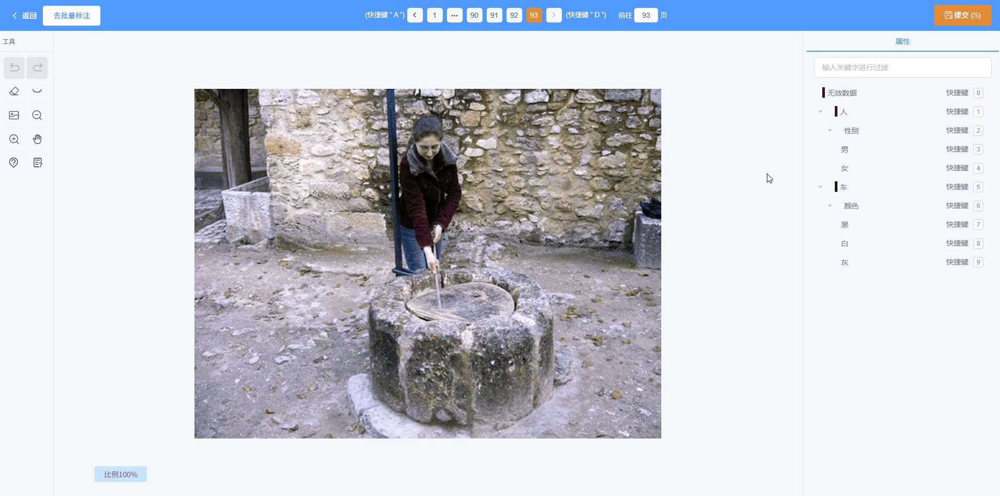
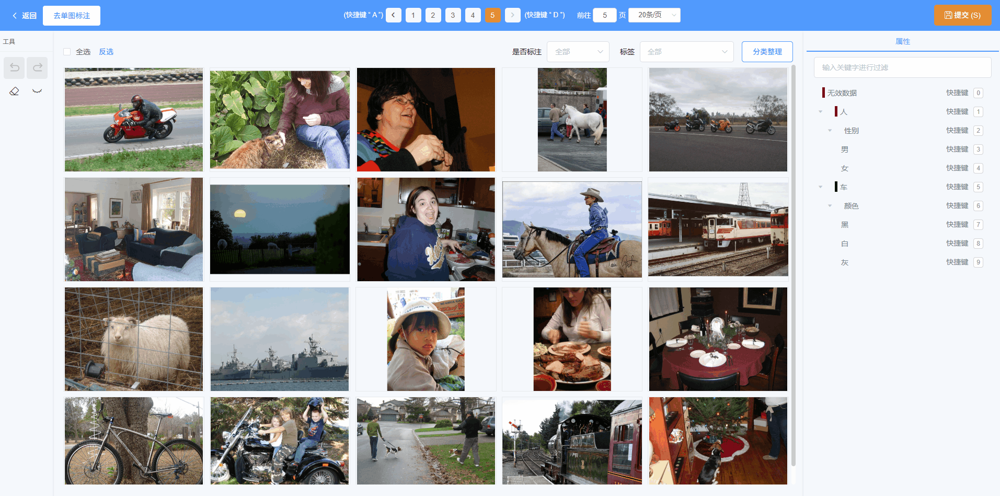
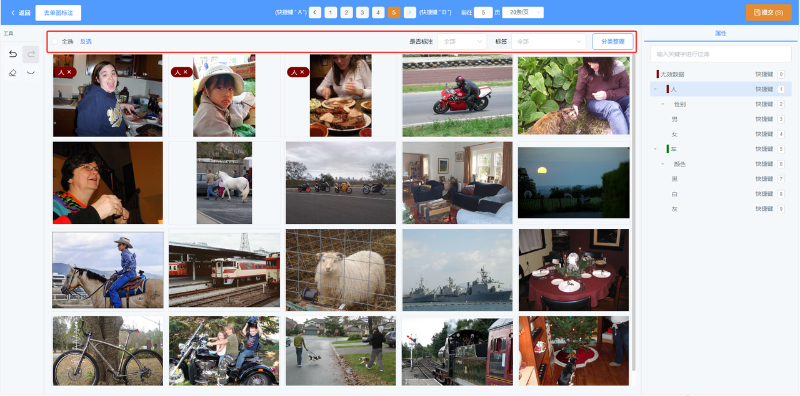
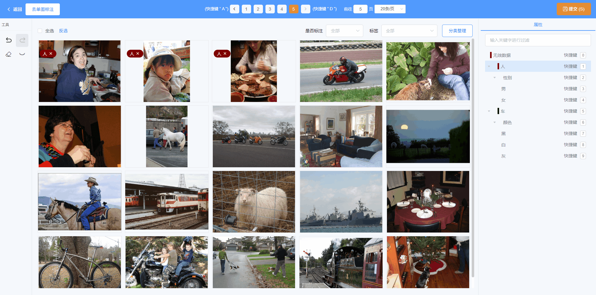

# 单图标注

* 点击右侧标签树上的对应按钮给图片打标签

* 左上角显示为提交的标注结果，可以点击删除

# 批量标注

* 选中多张图片后，点击右侧标签树上的对应按钮就可以给多张图片打上相同的标签

* 在每张缩略图上可以看到已打的标签，也可以删除标签

* 选择图片时，支持拖框多选图片、Shift首尾多选图片、全选、反选功能

* 支持按照标注状态对图片进行筛选/排序、根据标签筛选图片

点击某张图片放大镜的图标可以跳转到该图片的详情页，同样可以打标签删标签。支持切换到上一张/下一张图片

