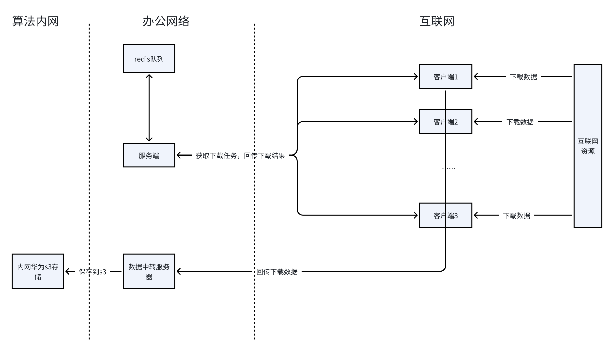
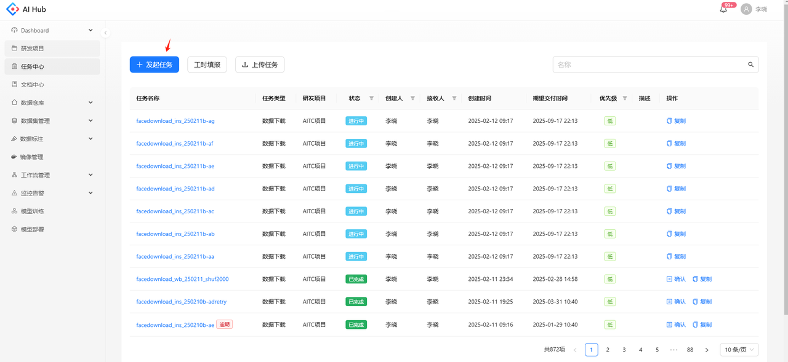
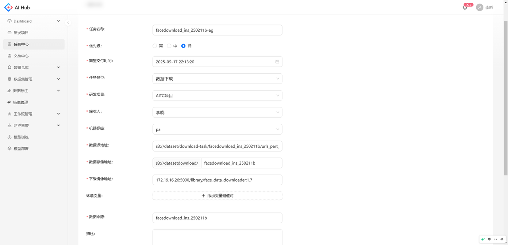
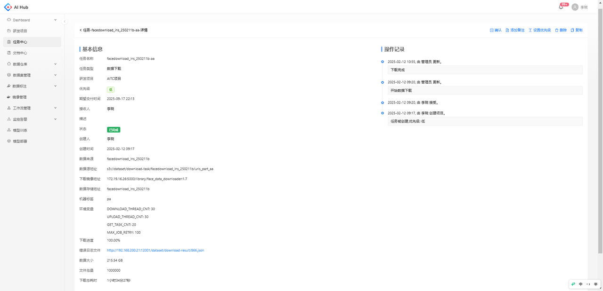

# 背景

由于国内网络的限制，许多外网数据集无法直接访问，或者下载速度极慢，而使用外网专线宽带成本较高。为解决这一问题，开发了 **外网数据下载任务功能**，通过多台 **低成本轻量级云服务器** 组成分布式下载集群，从外网高效下载数据，并自动传输至内网存储，以降低成本并提升下载效率。

# 架构

用户提交下载任务的index后，将待下载数据的index信息存储到一个队列里。客户端以 Docker 容器的形式部署在多个主机上，每个客户端起多个线程，周期性地通过接口从服务端中批量获取（例如 10 条）待下载任务，执行数据下载，将下载的数据回传到数据中转服务器存入内网，并把下载结果回传到服务端。下载和回传完成后，再请求下一批任务。

1. 用户提交下载任务的 index 文件，系统将待下载数据的 index 信息存入任务队列。

2. 客户端以 Docker 容器的形式部署在多个主机上，每个客户端同时运行多个线程，通过 API **批量拉取待下载任务**（例如，每次 10 条）。

3. 客户端获取任务后，开始下载数据，并将下载后的数据传输至**数据中转服务器**，再存入内网存储，同时将**下载结果回传至服务端**。

4. 所有处于 **“进行中”** 状态的任务按 **优先级** 和 **时间顺序** 依次执行，确保任务有序进行。



# 准备工作

## 下载服务器

**最低配置要求**：1 核 CPU / 4GB 内存

**服务器信息提交**：

* 提供 **公网 IP、用户名、密码** 给运维

* 确保防火墙 **开放 22（SSH）和 9100（监控）端口**

**运维操作**：

* 部署必要服务

* 录入至 **AIHub**

* 反馈 **机器标签** 给客户

## 下载数据的index文件

**客户需提供下载数据的index文件，其中包含下载链接和其他必要信息，每行表示一个下载任务，格式自行定义，每行数据将作为下面下载脚本的line参数输入到下载脚本。**

**示例下载数据的index文件**

```bash
https://instagram.fhkg1-2.fnatest.jpg|==|/14807/_/a01a_fa10.jpg
https://instagram.fhkg3-2.fnatest2.jpg|==|/14807/_/df11_647d.jpg
https://scontent-test3.jpg|==|/14806/_/968b_c002.jpg
```

## 下载脚本

客户需根据要求提供下载脚本，**脚本需提供download方法，入参和返回值需遵循以下要求**

* 输入参数：

  * line：用户下载数据index文件中的单行数据

  * output\_local\_dir：本地存储目录

* 返回值

  * 成功下载时，返回 **本地文件路径（必须在 output\_local\_dir 目录下）**

  * 下载失败时，返回 `None`

**示例下载脚本**

```bash
import os
import pandas as pd
import requests
from fake_useragent import UserAgent

import warnings
warnings.filterwarnings('ignore')

def download(line: str, output_local_dir) -> str:

    ua = UserAgent()
    headers = {
        'User-Agent': ua.random,
    }

    line = line.strip()
    img_url_1, file_name = line.split('|==|')
    img_urls = [img_url_1]

    file_path = output_local_dir + file_name

    folder_pat = os.path.dirname(file_path)
    if not os.path.exists(folder_pat):
        os.makedirs(folder_pat, exist_ok=True)

    for img_idx, img_url in enumerate(img_urls):
        if len(img_url) == 0:
            continue

        if 'http:' not in img_url and 'https:' not in img_url:
            img_url = 'http:' + img_url

        max_request = 1
        request_idx = 0
        while request_idx < max_request:
            try:
                response = requests.get(img_url, headers=headers, timeout=10, verify=False)
                # response = requests.get(img_url, headers=headers, timeout=10, verify=False, proxies=proxies)
                response.raise_for_status()  # Raise an HTTPError for bad responses

                with open(file_path, "wb") as f:
                    f.write(response.content)
                return file_path

            except Exception as err:
                print(f"{img_url}  An error occurred: {err}")
                request_idx += 1

    return None

if __name__ == "__main__":
    with open('/home/app/dataset/download_1016/urls.txt', 'r') as f:
        lines = f.readlines()

    for line in lines:
        file_path = download(line, '//home/app/dataset/temp')
        print(file_path)

```

# 提交下载任务

**登录外网 AIHub**：<http://192.168.11.18:30021>

进入 **Aihub → 任务中心 → 发起任务**，跳转至任务创建页面。



填写任务名称，任务类型选择数据下载，并设置其他参数。请确保提交任务前已把下载服务器和下载脚本提交给运维。



* 任务名称：长度为1\~32个字符，只能包含中文、字母、数字、“\_”和"-"

* 优先级：默认为低，可选低/中/高

* 期望交付时间：可精确到秒

* 任务类型：选择 **数据下载**

* 研发项目：若需要下载的数据有明确对应的研发项目请选择项目，若没有该项目可联系运维添加

* 接收人：数据下载任务请选择李晓;

* 机器标签：选择运维提供的 **下载服务器标签**

* 数据源地址：需**提前上传** index 文件至 S3 服务器，并填写 **S3 地址。**

* 数据存储地址：数据存储在 **华为 S3 `datasetdownload` bucket** 下，请填写数据在该bucket下的相对路径。

* 数据来源：**请务必填写清楚数据用途、预估大小等，接收人将据此决定是否审批通过**

# 状态流转

任务提交后，状态变为 “已创建”

待接收人审批，审批通过后，状态变为 “进行中”

任务调度与执行：

* 相同 机器标签 的任务按照 优先级 和 时间顺序 依次执行

* 任务下载完成后，状态变为 “已完成”

# 任务详情

点击任务名称进入任务详情，在任务状态变为“已完成”后，可在左侧查看文件总量，实际下载的数据大小，和下载失败文件的错误日志，可在右侧查看任务状态流转记录。



