# 术语说明

| **术语** | **说明**                                                                                      |
| ------ | ------------------------------------------------------------------------------------------- |
| 工作流    | 工作流是对机器学习Pipeline的描述，包括Pipeline中的所有组件以及这些组件如何以图形的形式相互关联。工作流配置包括运行工作流所需的输入参数以及每个组件的输入和输出的定义。 |
| 工作流节点  | 节点是工作流中的基本执行单元，对应一个具体的任务或模块。每个节点负责执行某段逻辑，接收输入参数，产生输出结果，并与前后节点通过依赖关系进行连接。工作流节点分为普通节点和模块节点。   |
| 工作流模块  | 工作流模块是从具体工作流节点中抽象出的可复用工作单元，其设计理念类似于“可重入函数”，具备如下核心特性：<br>- 单一职责：一个模块完成一个清晰、明确的任务。名称准确表达其功能。<br>- 通用性：具备通用逻辑、良好参数设计，能在多个场景复用<br>- 确定性：模块的输出仅由其输入决定，不依赖外部不可见状态（如硬编码路径、环境变量），输入（输入参数，环境变量）相同时应产生相同输出；模块开发请参考[工作流模块开发指引](#工作流模块开发指引)                                        |
| 运行实例   | 运行实例是工作流的单次执行。                                                                              |


# 系统设计

* 统一管理工作流及其版本，运行工作流会生成一个运行实例

* 统一管理运行实例，支持查看、复制、停止、重试等操作


1. 创建工作流：生成一个工作流并在该工作流下生成一个版本

2. 新增版本：在已有的工作流下生成一个新版本

# 快速开始

1. 工作流页面点击创建工作流

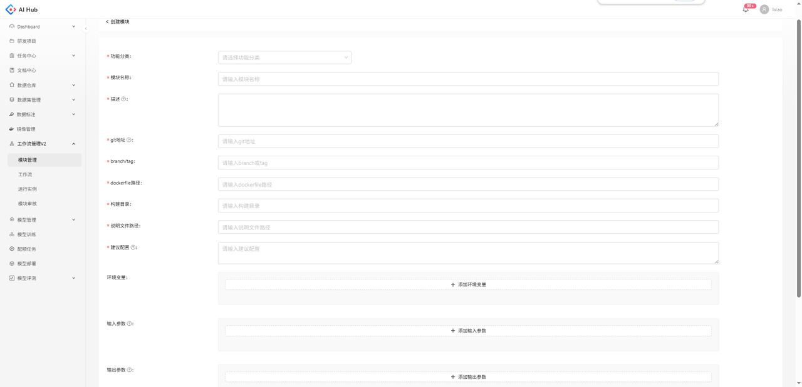

2. 填写基本信息


3. 编辑初始输入参数和节点依赖关系

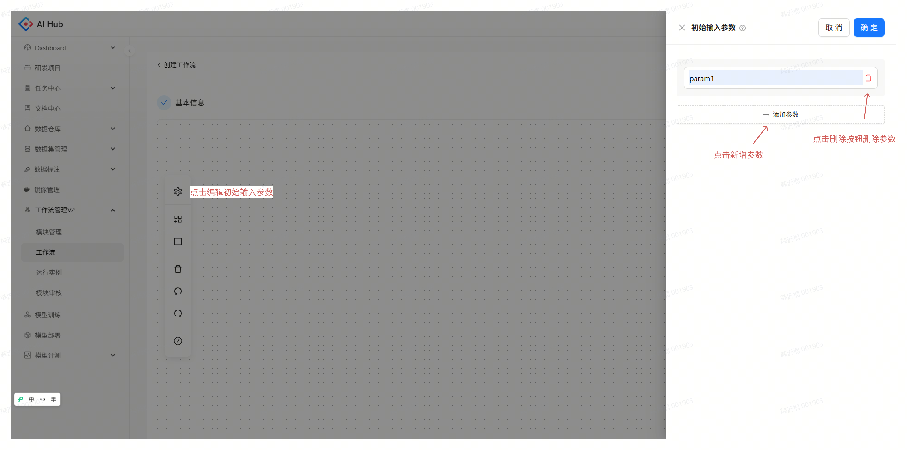


4. 添加模块节点


5. 编辑节点信息

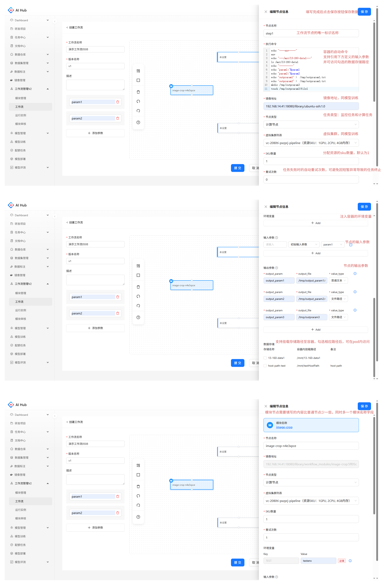

6. 点击最下方提交按钮，保存工作流信息。


7. 保存的工作流可在工作流列表查看，点击运行按钮，跳转到创建运行实例界面

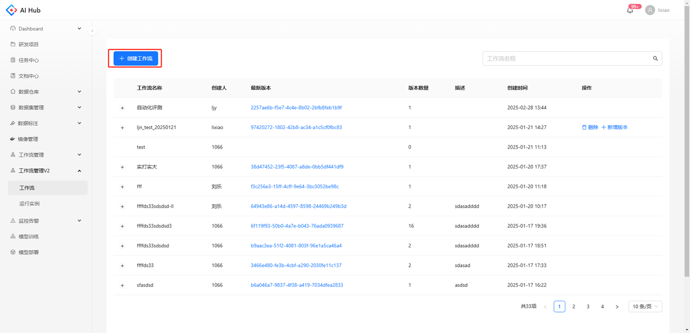

8. 编辑运行实例名称后输入参数后，点击创建，创建一个运行实例。


9. 创建后可在运行实例列表点击查看运行实例

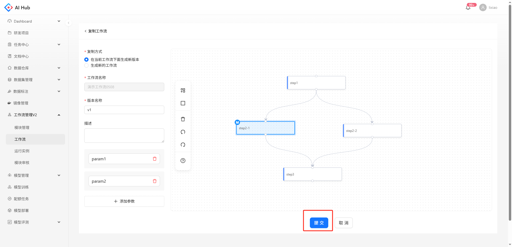

10. 流程图中的节点颜色表示该步骤的运行状态，蓝色表示运行中，绿色表示成功，红色表示失败，灰色表示等待中,节点名称后面括号里的数字表示重试次数。

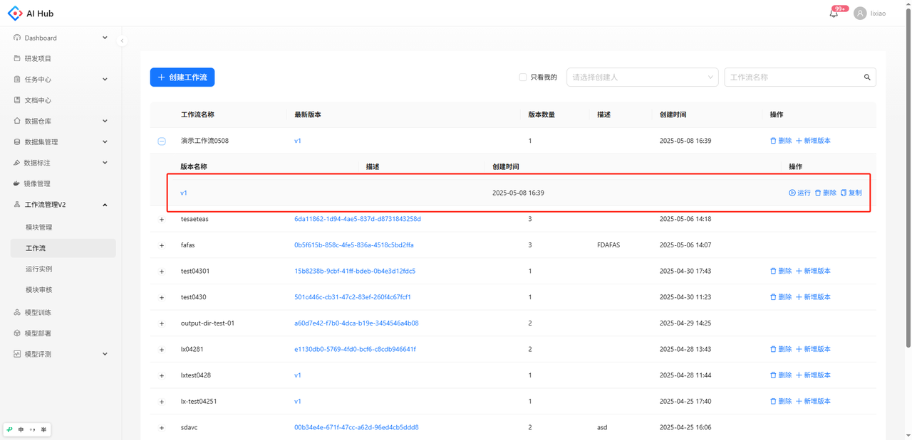

11. 点击流程图中的单个节点，可以看到该步骤运行的详细信息

* 输入输出
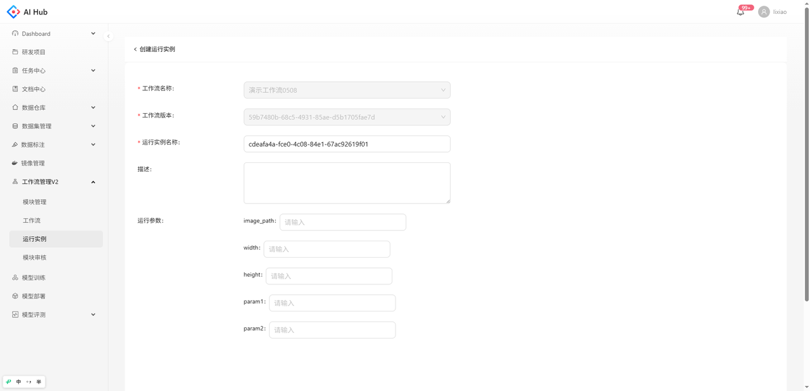

* 详情


* 日志


* 容器


* k8s事件
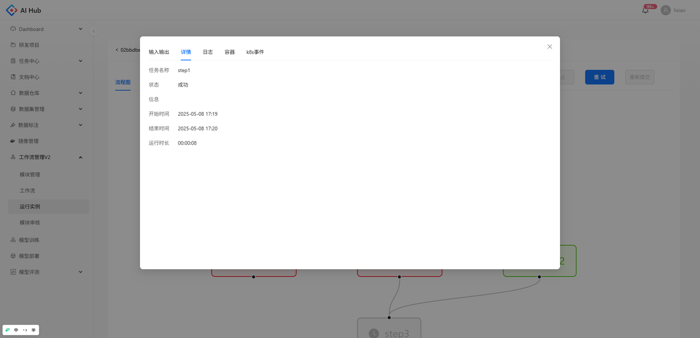

##

# 模块管理

在模块管理可以查看所有已发布和未发布的工作流模块，支持创建模块，模块的详细要求，请参考[模块开发指引](#工作流模块开发指引)

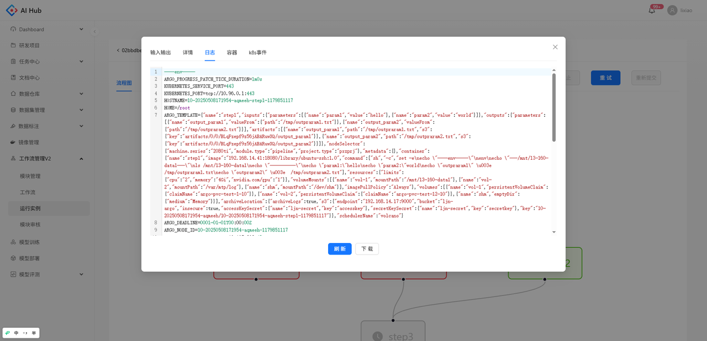

## 创建模块

点击创建模块按钮，跳转创建模块页面，依次填写相关参数后，点击提交。


参数说明：

1. 功能分类： 模块的功能分类，如需添加分类请联系管理员。

2. 模块名称：请填写清晰表明模块作用的模块名称，支持小写字母数字和-。

3. 描述：请简要描述模块功能

4. git地址：模块代码的git仓库地址，比如：http://192.168.70.8/aisdp/data\_service/pipeline\_demo

5. branch/tag: 模块代码的分支或tag，比如：master、lyy-demo

6. dockerfile路径：模块代码的dockerfile路径，在项目中的相对路径，比如: Dockerfile、modules/hash\_file/Dockerfile

7. 构建目录：模块镜像的构建目录，跟Dockerfile中COPY的写法有关，比如：/、modules/hash\_file

8. 说明文件路径: 模块的说明文件路径，说明文件需使用markdown格式，在项目中的相对路径，比如:readme.md、modules/hash\_file/readme.md

9. 环境变量：支持键值对格式传递至容器环境，适用于自定义运行参数。

10. 输入参数：定义模块的输入参数，需写明输入参数的名称和说明，在执行命令中引用输入参数时，需在参数 `Key` 前加上 `$`（例如：`$param_name`）具体规则请参考[参数传递](#参数传递匹配和类型说明)。

11. 输出参数：用于传递数据至后续工作流节点，需填写四个字段：参数名称，输出文件路径，参数类型，参数说明。具体规则请参考[参数传递](#参数传递匹配和类型说明)。

参数填写示例：


# 模块审核

用户可在模块审核页面查看工作流模块的审核情况，其中管理员用户可以查看所有用户的审核记录，可以审核通过或拒绝用户审核请求，审核不通过时，需说明不通过的理由；审核通过后，模块变为已发布状态，普通用户仅可查看自己的模块审核记录。


## 模块状态流转

模块创建或编辑完成后，系统将根据配置的代码仓库与 Dockerfile 自动构建模块镜像。镜像构建成功后，模块将对创建者本人可见，创建者可在工作流中直接引用并使用。

若需将模块提供给团队或平台用户共享使用，创建者可提交发布申请。模块发布需经管理员或所属团队 Leader 审核，审核通过后，模块将进入“已发布”状态，向所有用户开放引用；


# 工作流

在工作流模块可以查看所有工作流及每个工作流的所有版本，支持创建工作流或在已有的工作流上新增版本


## 创建工作流

创建类型选择使用模板，填写基本信息。


进入画布页面


### **参数说明**


1. **任务名称**：工作流节点的唯一标识名称。

2. **执行命令**：容器的启动命令，支持引用下方定义的 输入参数，并可访问 勾选的数据存储路径。

3. **镜像地址**：请填写 99.199 镜像仓库 的镜像地址。

4. **任务类型**：任务类型分为“监控任务”和计算任务两种类型，监控任务固定分配100mCPU（1000m=1CPU）和1000M内存，推荐用于通过API监听其他模块执行情况（如模型训练任务是否完成等）。计算任务的资源通过虚拟集群和sku数量确定，用于GPU和内存密集型任务。

5. **虚拟集群**：展示可用的 计算资源，例如 `RTX2080x8`（资源 SKU：`1GPU、10CPU、80GB 内存`）。

   * 资源 SKU 代表最小分配单元，包括 GPU、CPU 和内存 资源。

   * 支持 GPU 虚拟集群及纯 CPU 虚拟集群，可按需选择。

6. **SKU 数量**：分配的 资源 SKU 数量，默认为 `1`，不可小于 `1`。

7. **重试次数**：任务失败时的自动重试次数，可避免因短暂异常导致任务终止。

8. **环境变量**：支持键值对格式传递至容器环境，适用于自定义运行参数。

9. **输入参数**：定义工作流节点的输入参数，需写明输入参数的名称和说明，在执行命令中引用输入参数时，需在参数 `Key` 前加上 `$`（例如：`$param_name`）具体规则请参考[参数传递](#参数传递匹配和类型说明)。

10. **输出参数**：用于传递数据至后续工作流节点，需填写三个字段：参数名称，输出文件路径，参数类型。具体规则请参考[参数传递](#参数传递匹配和类型说明)。

11. **数据存储**：支持挂载存储路径至容器，勾选相应路径后，可在 执行命令 中访问。

> 若有需要访问的存储路径不在列表中，请联系管理员进行添加

## 查看工作流

点击工作流的版本名称，可以跳转至工作流的详情页。可以查看工作流的流程图


点击流程图中的单个节点，可以看到该组件的详细信息


## 运行工作流

可以在版本列表或版本详情页点击运行以[创建运行实例](#创建运行实例)

<div style="display: flex; justify-content: space-between;">
  <div style="text-align: center;">
    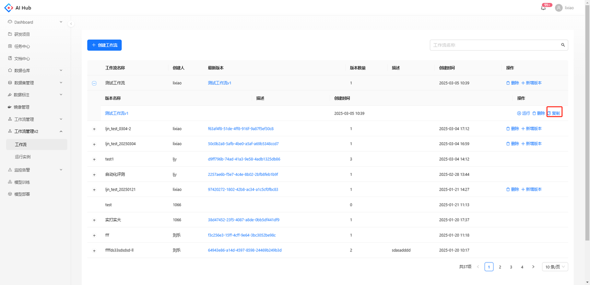
    <p>版本列表</p>
  </div>
  <div style="text-align: center;">
    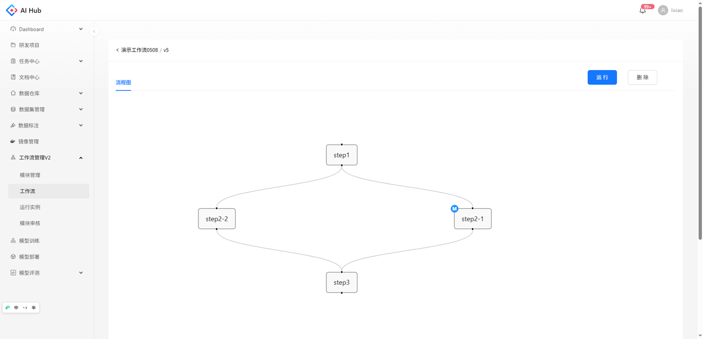
    <p>版本详情页</p>
  </div>
</div>


## 复制工作流

对于使用模板创建的工作流版本，支持在版本列表点击复制按钮，跳转到复制页面


所有配置项的内容都会复制过来，且支持修改

<div style="display: flex; justify-content: space-between;">
  <div style="text-align: center;">
    
    <p>在当前工作流下生成新版本</p>
  </div>
  <div style="text-align: center;">
    
    <p>生成新的工作流</p>
  </div>
</div>

# 运行实例

在运行实例模块可以看到所有运行实例的状态和对应的工作流及版本，支持查看、复制、停止、重试等操作

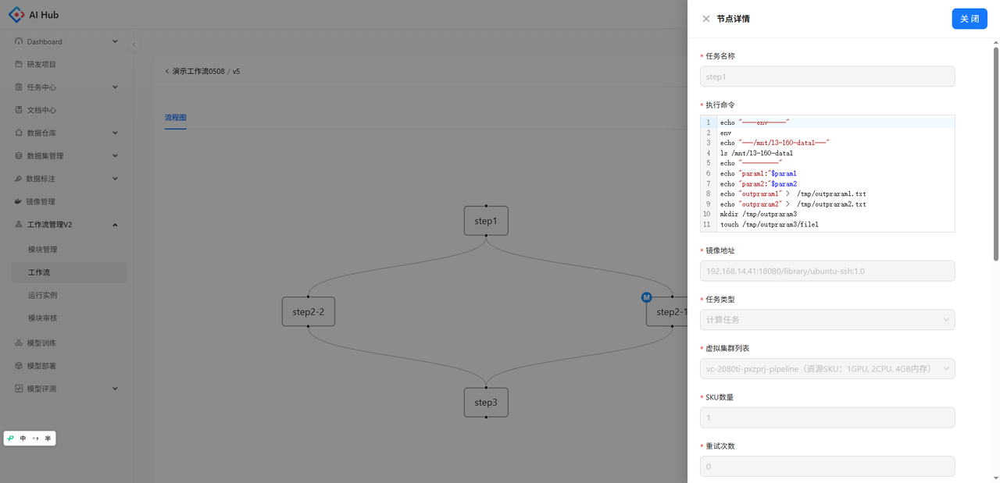


## 创建运行实例

点击创建运行实例的按钮，会跳转到创建页。选择工作流版本后，需要填写相应的运行参数

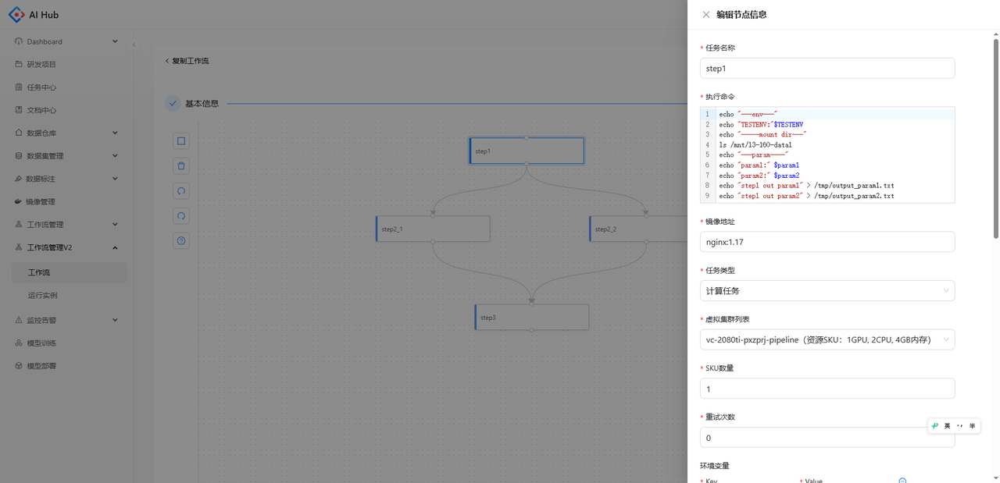


## 查看运行实例

点击运行实例名称，可以跳转至运行实例的详情页。可以查看其流程图和配置信息，支持复制、停止、重试（已完成的节点不再重新执行，从失败和未完成的节点开始重试）

<div style="display: flex; justify-content: space-between;">
  <div style="text-align: center;">
    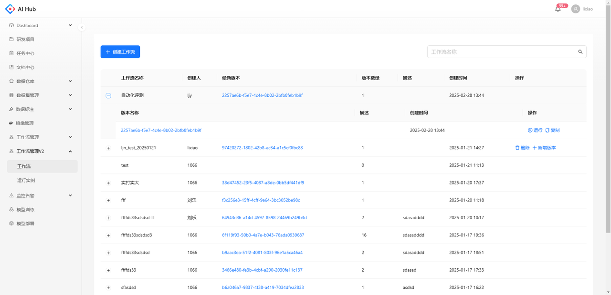
    <p>流程图</p>
  </div>
  <div style="text-align: center;">
    
    <p>配置信息</p>
  </div>
</div>


流程图中的节点颜色表示该步骤的运行状态，蓝色表示运行中，绿色表示成功，红色表示失败，灰色表示等待中

点击流程图中的单个节点，可以看到该步骤运行的详细信息如下：

* 输入输出
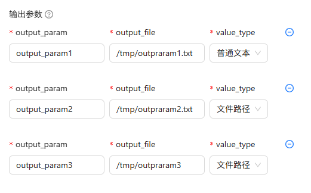

* 详情


* 日志


* 容器
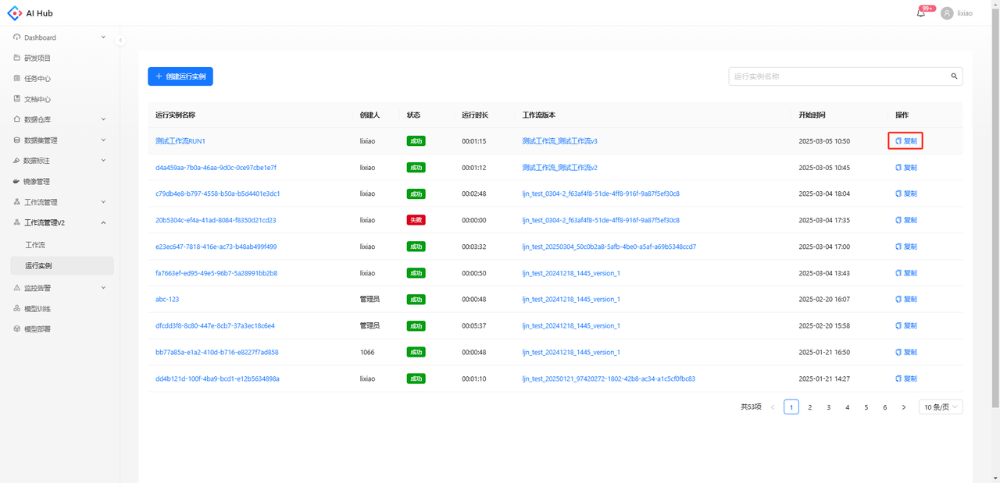

* k8s事件


## 复制运行实例

在运行实例的列表页点击复制按钮，会将包括运行参数的所有内容复制，支持修改部分信息

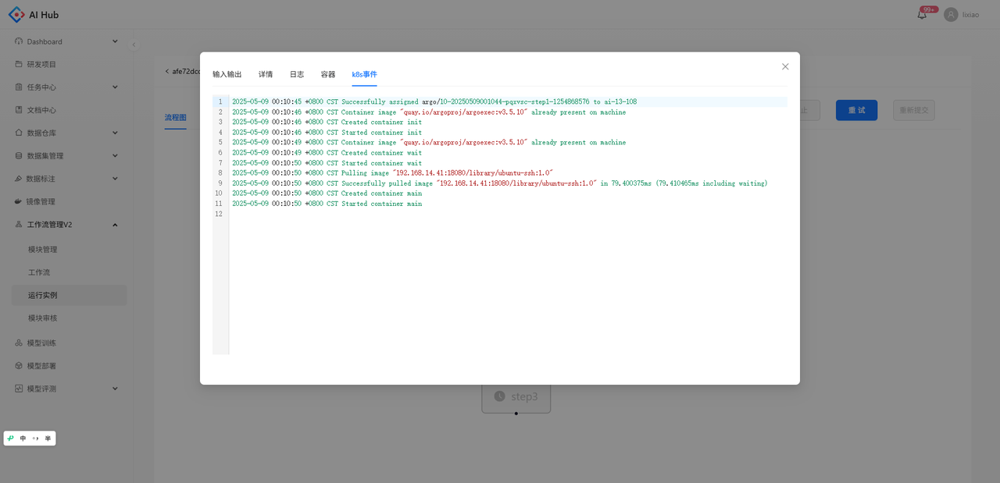


# 工作流模块开发指引

## 定义

工作流模块是从具体工作流节点中抽象出的可复用工作单元，其设计理念类似于“**可重入函数**”，具备如下核心特性：

* **单一职责：**&#x4E00;个模块完成一个清晰、明确的任务。名称准确表达其功能。

* **通用性**：具备通用逻辑、良好参数设计，能在多个场景复用

* **确定性**：模块的输出仅由其输入决定，不依赖外部不可见状态（如硬编码路径、环境变量），输入（输入参数，环境变量）相同时应产生相同输出；

## 模块结构

模块包含以下字段：

**功能分类**：模块所属的功能类别，用于组织和检索模块。

**模块名称**：模块的唯一标识符，建议简洁明了，便于引用和管理。

**描述**：对模块功能和用途的简要说明，帮助用户快速了解模块的作用。

**代码配置**：模块代码的相关配置信息，包括：

* **Git 仓库地址**：存放模块源代码的 Git 仓库完整 URL。

* **Branch/Tag**：指定用于构建模块的分支或标签。

* **Dockerfile 路径**：用于构建模块镜像的 Dockerfile 文件路径。

* **构建路径**：镜像构建路径。

* **说明文件路径**：模块说明文档（ README.md）的路径，详细说明模块功能，使用方式，资源要求等。

**环境变量**：模块运行时需要设置的环境变量列表，用于配置模块的运行环境。

**输入参数**：模块执行所需的输入信息，每个参数应包括名称和说明。具体参数含义和要求请参考[参数传递](#参数传递匹配和类型说明)。

**输出参数**：模块执行后产生的输出信息，用于传递给下游节点，每个参数应包括名称、类型和输出路径和说明。具体参数含义和要求请参考[参数传递](#参数传递匹配和类型说明)。

## 模块开发要求

* 所有输入参数必须显式定义，拒绝隐式外部依赖；

  典型问题：某些模块的输入参数是一个配置文件路径，配置文件中包含依赖数据集的共享盘路径。表面上看，输入参数未发生变化，但当共享盘路径变动时，模块将因找不到数据而执行失败，排查成本高，行为不可控。

  模块处理建议：

  * 方案一：将配置文件中的可变信息（如共享盘路径）提取为显式输入参数，在运行时配置；

  * 方案二：或将所依赖的数据集直接打包进镜像，在模块中引用镜像内固定路径，避免运行时依赖外部环境。

* 模块输出物的保存路径，可以写到平台约定的工作目录：`/tmp/workflow_space` 的子目录，或者用输入参数指定保存的路径。

* 模块执行过程应具备健壮性，如发生错误需明确抛出异常并返回非零退出码；

* 模块应支持标准化参数调用方式，具备良好的命令行可配置能力

### 模块代码开发要求

* **模块代码遵循如下结构**：

  ```yaml
  模块项目
  ├── Dockerfile            # 镜像构建文件，容器入口命令需使用entrypoint形式，并支持    --param=value 参数方式
  ├── README.md             # 使用说明，需使用markdown格式
  └── （其他逻辑代码）
  ```

* **Dockerfile 中必须使用 `ENTRYPOINT` 作为镜像的启动命令，禁止使用 `CMD`**，以确保平台参数注入的一致性与可控性；

示例Dockerfile：

```bash
FROM 192.168.99.199:8080/aied/python:3.9-slim
# 设置工作目录
WORKDIR /app
# 拷贝当前目录内容到容器中
COPY . /app
# 设置启动命令（main.py支持参数注入）
ENTRYPOINT ["python", "main.py"]
```

* **镜像启动命令必须支持标准参数格式**，如：`--param1=value1 --param2=value2 ...`，便于平台通过命令行方式传递运行参数；

命令行参数解析示例：

```python
import argparse

if __name__ == "__main__":
    parser = argparse.ArgumentParser()
    parser.add_argument("--input_file", required=True, type=str, help="输入文件路径")
    args = parser.parse_args()
    print(f"输入文件路径:{args.input_file}")
```

* **说明文档必须使用 Markdown 格式编写 `README.md`**，内容需包含模块功能简介、输入输出说明、使用示例、运行依赖等信息，方便他人理解与复用。

* **可引用的环境变量，这些环境变量由AIHUB平台自动注入到模块中，可以在模块的代码中读取。**

  * AI\_HUB\_USER\_ID，当前运行的用户的ID。

  * AI\_HUB\_TOKEN，当前运行的用户的Token，可用于API调用。

  * AI\_HUB\_WORKFLOW\_RUN\_ID，当前运行实例的ID。

## 模块发布流程

1. **开发提交**
   模块开发者需在指定的 GitLab Group（http://192.168.99.198/aihub-modules/）的部门子group 下创建模块仓库，上传代码。

2. **创建模块**
   在平台“模块管理”界面中，注册新模块，填写相关参数。提交信息后平台将自动构建镜像。镜像构建成功的模块对创建人可见，对其他用户暂不可见。创建人可在创建工作流 - 添加模块 -“我的”分类中引用使用。

3. **审核发布**
   模块注册后需通过审核才能进入平台公共模块仓库，供全体用户共享使用。

   所有研发同事都已分配审核权限，由各组leader统筹本组模块审核，可自行审核或同组同事交叉审核，
   审核人需对提交的模块代码进行审核把关，确保模块：

   * 功能准确、文档完整；

   * 输入输出规范、可复用性强。

审核通过后，模块变为已发布状态，全体用户可在工作流中自由引用使用。

## 模块调试指引

### 代码调试

调试代码是否能正常运行，检查代码执行的结果是否正确。

1. 本地调试

   a. 在本地办公电脑安装python运行环境，直接运行Python脚本进行调试。

2. 模型训练调试

   a. 启动模型训练任务，挂载华为盘，运行命令填写 `sleep 1h`，开启ssh登录，需要注意的是镜像需要提前安装好openssh-client和openssh-server。

   b. 在模型训练列表页展开训练任务的POD列表，点击POD名称进入POD详情页，根据SSH信息进行登录。

   c. cd 到代码目录，运行代码进行调试。

3. docker run调试

   a. 把代码放到华为盘上，例如：/nfs/hw-data/ms/AIED/lanyiyou/my-module

   b. 登录到服务器，用docker run的方式进行调试。

```shell
docker run -it --rm -p /nfs/hw-data/ms/AIED/lanyiyou/my-module:/app -w /app --entrypoint=/bin/bash nvidia/cuda:11.7.1-cudnn8-devel-ubuntu20.04

python main.py --input_file=test.txt
```

### 模块调试

检查Dockerfile是否正确，代码能否在镜像中正常运行。

1. **提交代码**

   a. 按照上述模块开发要求，把代码提交到git。

2. **构建镜像**

```shell
git clone http://192.168.99.198/aihub-modules/aied/my_module.git # 拉取模块代码
cd my_module # 进入项目目录
docker build -t 192.168.99.199:8080/aied/workflow_modules/my_module:1.0 . # 构建镜像
```

需要注意的是，镜像的构建目录跟Dockerfile的写法有关，主要跟COPY命令的源文件所在的目录有关。

3. **运行镜像**

```shell
docker run --rm -p $PWD/output:/tmp/workflow_space 192.168.99.199:8080/aied/workflow_modules/my_module:1.0 --input_file=test.txt
```

根据运行时打印的日志和output下输出的文件，检查结果是否正确。


# 参数传递匹配和类型说明

在工作流中，参数分为以下三类，每类参数在使用时有不同的定义方式与传递机制：

1. **初始输入参数**

* **定义位置**：工作流创建时定义。

* **填写位置**：运行实例创建时填写具体值。

* **用途**：为整个工作流提供初始数据输入，可被所有节点引用。

2. **节点输入参数**

* **定义位置**：每个节点创建时定义，模块节点在模块创建时定义。

* **取值来源**：

  * 工作流的初始输入参数；

  * 父节点或祖先节点的输出参数。

* **引用方式**：在节点执行命令中，通过 `$param_name` 的形式引用参数或路径值。

3. **节点输出参数**

* **定义位置**：每个节点创建时定义，用于将当前节点的结果传递给子节点或后续节点，模块节点在模块创建时定义。

* **属性说明**：

  * **参数名称**：自定义的输出变量名。

  * **参数类型**：

    * `普通文本`：表示输出结果是简单类型的内容，比如数字、布尔值、文本；当内容长度较短时（少于1000字符），可以选择这个类型；

    * `文件路径`：表示输出结果是一个文件或目录，需跨节点传递文件实体；当内容类型为二进制，或者内容长度比较长的时候，必须选择这个类型。

  * **输出路径**：

    * 若参数类型为`普通文本`，系统会读取该路径对应文件中的文本内容，作为参数值传递给下游节点

    * 若参数类型为`文件路径`，系统会将指定路径下的文件或目录打包上传，并在引用该参数的下游节点中自动下载并解压至运行环境，最终将解压后的路径作为参数传入供访问使&#x7528;**。**


**参数匹配示例说明**<br>
操作演示：[参数传递说明.mp4](files/参数传递说明.mp4)


**参数类型说明**

1. 对于如图所示工作流：


2. step1的输出参数和执行命令如下：


```
echo "outpraram1" >  /tmp/outpraram1.txt
echo "outpraram2" >  /tmp/outpraram2.txt
mkdir /tmp/outpraram3
touch /tmp/outpraram3/file1
```

3.  step2的输入参数和执行命令如下：


```
echo $step1param1
echo $step1param2
echo $step1param3
cat $step1param2
ls $step1param3
```

4. 运行后，step2日志输出如下：
```
outpraram1
/tmp/outpraram2.txt
/tmp/outpraram3
outpraram2
file1
```

可以看到

&#x20;**普通文本类型输出参数**

* 示例：`output_param1`（/tmp/outparam1.txt）

* 在下游节点中，输入参数 `step1param1` 直接接收到其文本内容：`outparam1`。

**文件路径类型输出参数（单个文件）**

* 示例：`output_param2`（/tmp/outparam2.txt）

* 在下游节点中，输入参数 `step1param2` 接收到的是该文件的路径，通过 `cat` 可读取文件内容：`outparam2`。

**文件路径类型输出参数（目录）**

* 示例：`output_param3`（/tmp/outparam3）

* 在下游节点中，输入参数 `step1param3` 接收到的是该目录路径，通过 `ls` 可访问其中所有文件，如 `file1`。
