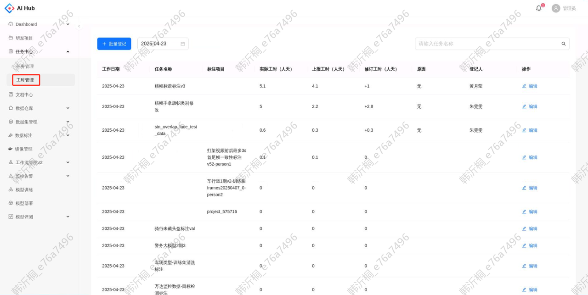
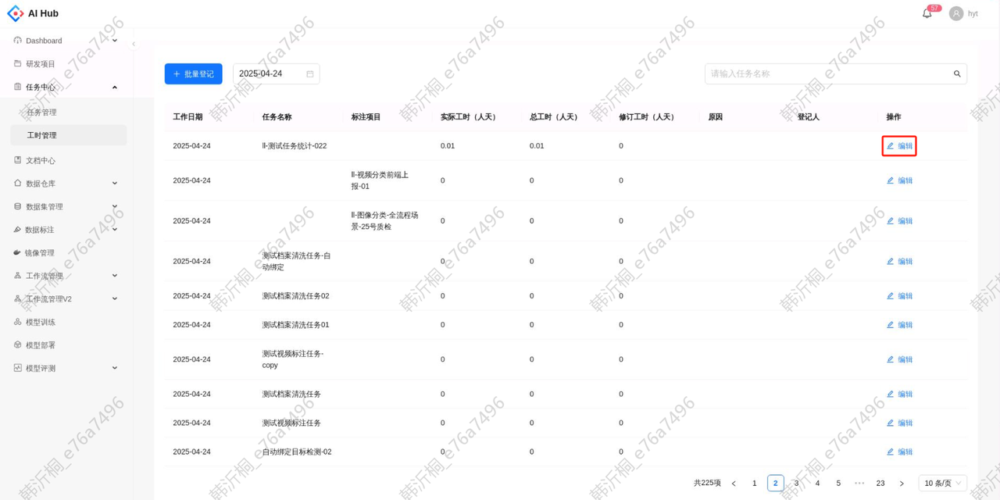
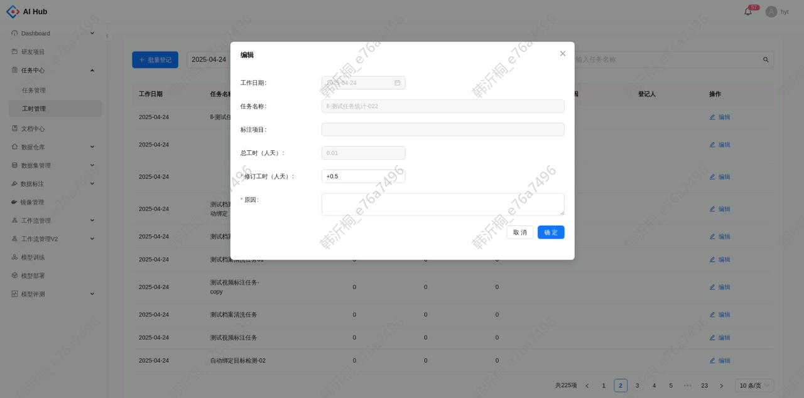
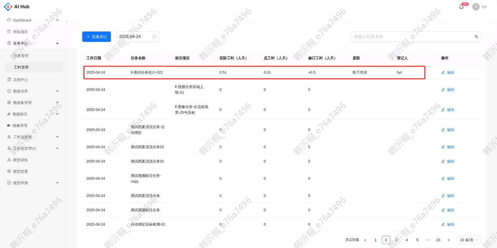
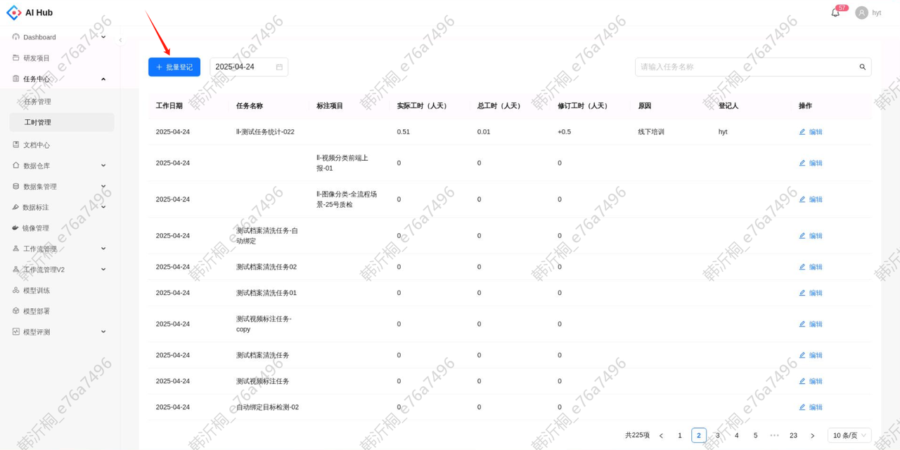
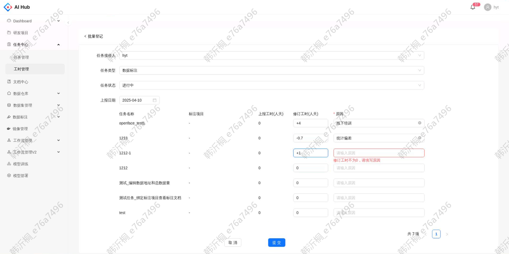

## 工时列表

在任务中心的工时管理模块，支持查看平台上报工时并进行修订。通常情况下，以标注任务为维度展示总工时，此时标注项目字段为空。但是对于未绑定任务的标注项目，会单独展示项目工时，此时任务名称字段为空

【字段说明】

* 工作日期：平台统计工时的日期

* 任务名称：\[任务中心]中类型为数据标注的任务名称。任务名称为空时，\[标注项目]字段不为空

* 标注项目：未绑定标注任务的项目名称。标注项目为空时，\[任务名称]字段不为空

* 实际工时：上报工时和修订工时进行求和。例如上报工时为10，修订工时为-1.4，则实际工时为10+(-1.4)=8.6人天

* 上报工时：平台上报的工时，对应标注绩效中的总工时字段

* 修订工时：默认为0。+n表示在上报工时的基础上增加n人天，-n表示在上报工时的基础上减少n人天

* 原因：默认为空，修订工时后会展示填写的原因

* 登记人：默认为空，修订工时后会展示最新一次进行操作的用户名称

## 工时登记

在工时列表点击编辑按钮，可以修订单个记录的上报工时

修订工时填写正数表示在上报工时的基础上要添加的工时，填写负数表示在上报工时的基础上要减少的工时，精确度支持填写到小数点后一位。修订工时不为0的情况下，原因不能为空

点击确定后可以看到该条工时记录的登记人、修订工时、实际工时字段进行了更新

点击`批量登记`按钮，可以修订多个任务的上报工时

登记页面默认筛选任务接收人为本用户、任务类型为数据标注且任务状态为进行中的所有任务/标注项目，上报日期默认为前一天。如需登记其他任务接收人，状态和日期的工时，修改筛选条件后也可以修订

