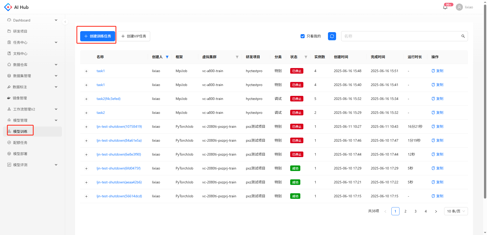
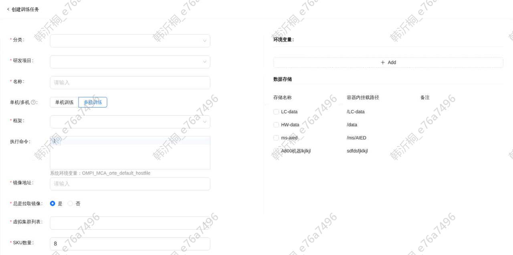
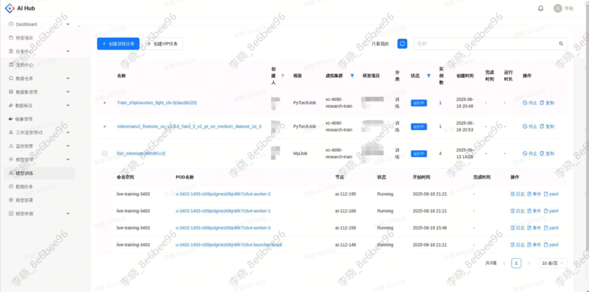
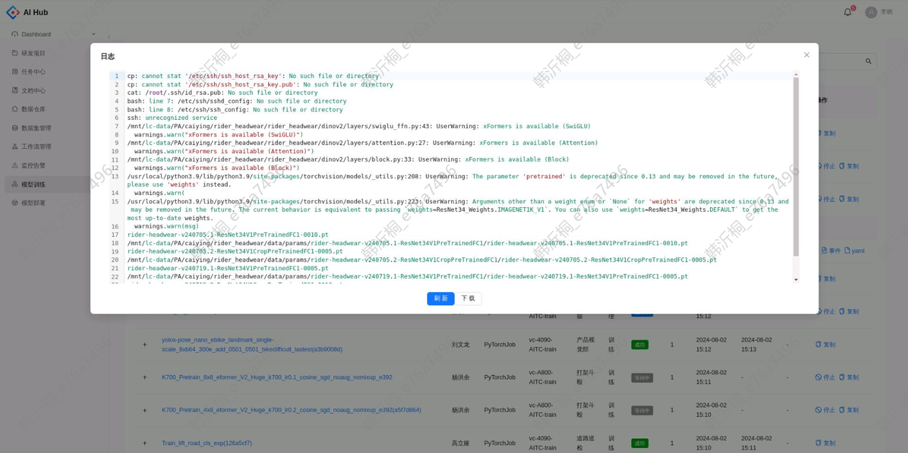
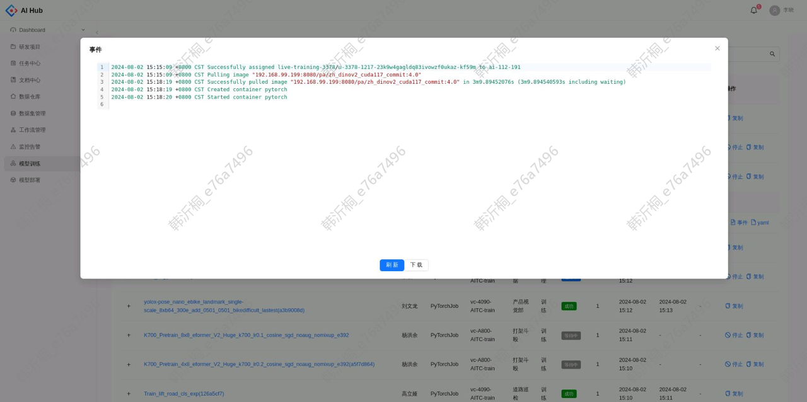
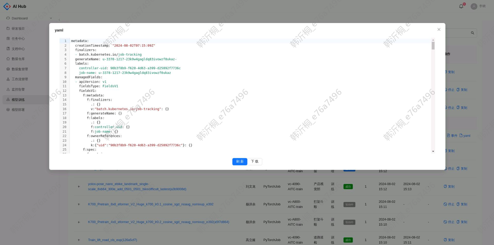

# 创建模型训练任务

## 1. 创建训练任务
1. 点击 模型训练菜单 - 创建训练任务 打开创建训练任务页面

    

2. 填写相关参数后，点击 创建 按钮创建任务

    

    

**参数说明**

* 分类：任务的分类，根据实际情况从调试、推理、训练、特别中选择一个。

* 项目：任务所属的项目，可以从左侧菜单的 \[研发项目] 模块查看，若需添加请飞书联系&#x20;

* 名称：训练任务的名称。

* 单机/多机：单机训练默认实例数量为1，不可更改，多机训练sku数量需大于等于5。

* 框架

  * MpiJob，可以用mpirun或deepspeed的方式进行训练。系统会自动生成hostfile，路径在环境变量OMPI\_MCA\_orte\_default\_hostfile里面，可以在执行命令中使用该环境变量。注意：只有launcher节点才有hostfile，laucher节点就是Pod名称后面有laucher-xx的节点，ssh登录调试的时候要注意。

  * PyTorchJob，可以用pytorch的方式进行分布式训练。系统会自动生成MASTER\_ADDR, MASTER\_PORT, RANK, WORLD\_SIZE, PET\_NPROC\_PER\_NODE等环境变量，可以在执行命令中使用这些环境变量。

* 执行命令：MpiJob框架会在launcher节点执行命令，mpirun和deepspeed会自动SSH登录到worker节点执行训练命令。PyTorchJob框架和单机训练则会在所有节点执行命令，环境变量的值会自动根据节点生成。

* 镜像地址：如果是MpiJob框架或者开启SSH，需要在镜像里面安装好SSH。

* 总是拉取镜像：如果选是，则启动任务的时候会拉取最新的镜像；如果选择否，则会用已有的镜像。

* 虚拟集群：按GPU资源分组的虚拟集群。集群可用的资源可以在左侧菜单的【资源面板】查看。

* SKU数量：每个节点分配的资源数量。单个节点消耗的资源数等于：SKU数量\*虚拟集群SKU资源。

* 共享内存：单位GB，建议。

* 实例数量：训练节点（Node）的数量，worker节点数量。

* 开启SSH：如果开启SSH，需要先在镜像中安装好SSH。之后在POD详情中的SSH信息中可以看到登录SSH的方法，例如：

```bash
请用以下命令登录到POD中(默认登录密码是“root”): ssh -p 2345 root@192.168.13.160
```

* IB网络：如果开启IB网络，需要虚拟集群支持才行。

* 预估运行时长：训练任务运行完成需要的大致时长，支持精确到秒。

* 描述：选填。

* 环境变量：配置环境变量后，会打到每个pod中。

* 数据存储：可访问的外部存储，勾选后可在pod内访问，路径字段为在pod内访问的路径。

更多详细说明请参考：[模型训练](./模型训练.md)

## 2. 查看训练任务

创建任务后，可在列表看到已创建任务，点击左侧加号可展开查看pod信息，并支持查看和下载每个Pod的日志、k8s事件和yaml文件



<div style="display: flex; justify-content: space-between;">
  <div style="text-align: center;">
    
    <p>日志</p>
  </div>
  <div style="text-align: center;">
    
    <p>k8s事件</p>
  </div>
  <div style="text-align: center;">
    
    <p>yaml文件</p>
  </div>
</div>
