# 模型评测：创建与查看结果
本文面向算法角色，提供模型评测的快速入门指南，主要内容包括创建数据集和模型，构建评测工作流，执行评测任务，以及查看可视化结果和模型对比。
## 创建数据集

在【数据集管理v2】点击【创建数据集】，填写相关信息后，点击【创建】创建评测数据集，记录数据集名称和版本。

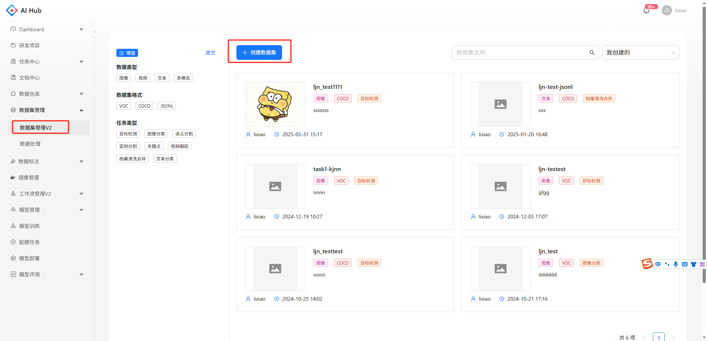

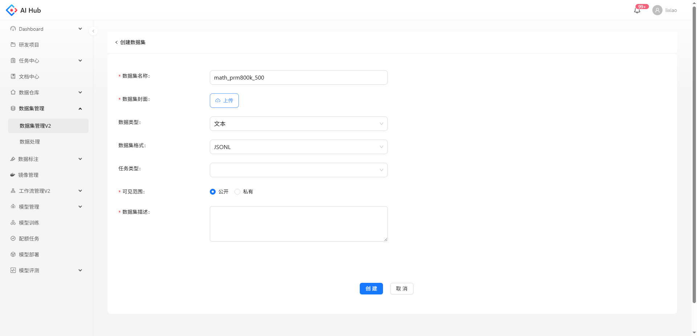

## 创建模型

在【模型管理】点击【创建模型】，填写相关信息后，点击【创建】创建模型。

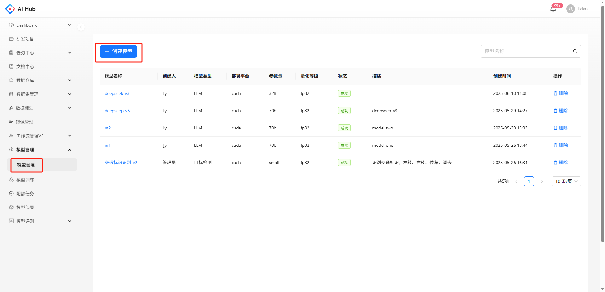

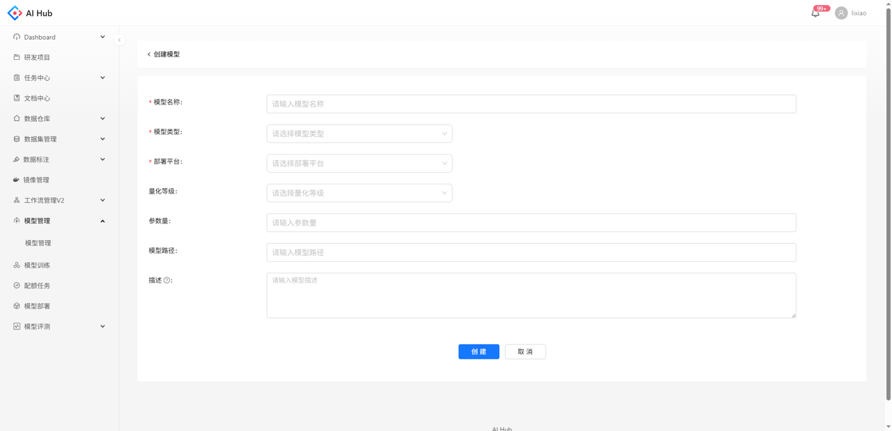

## 创建评测工作流

在【工作流】创建评测工作流

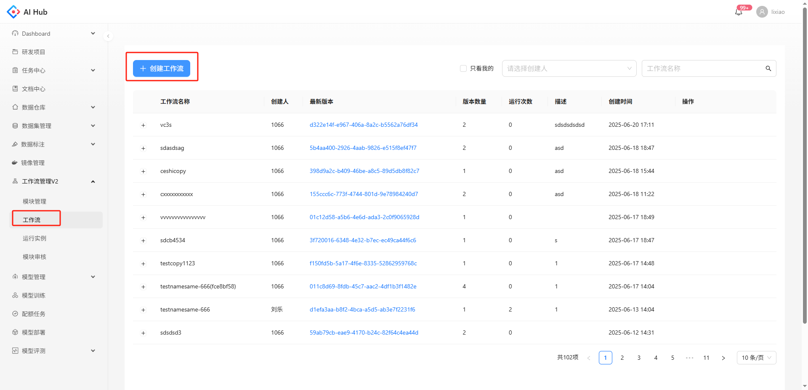

典型的评测工作流流程如下：

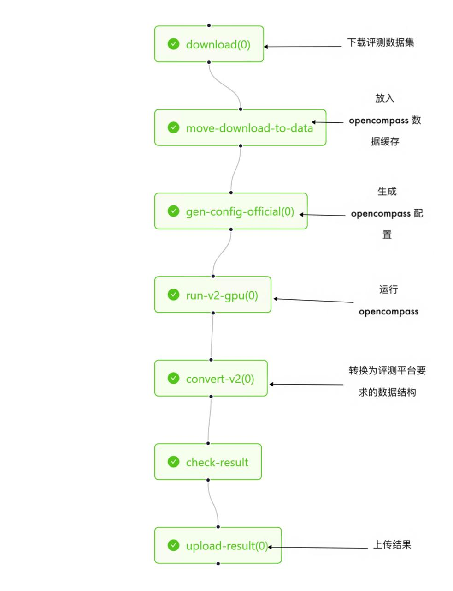

## 执行评测

在工作流列表中找到评测需要执行的评测工作流和版本，点击【运行】，跳转到运行页面，填写相关参数（如上文创建的数据集名称和版本，模型名称以及其他参数）后，点击【创建】

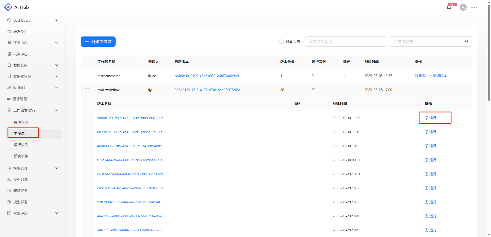

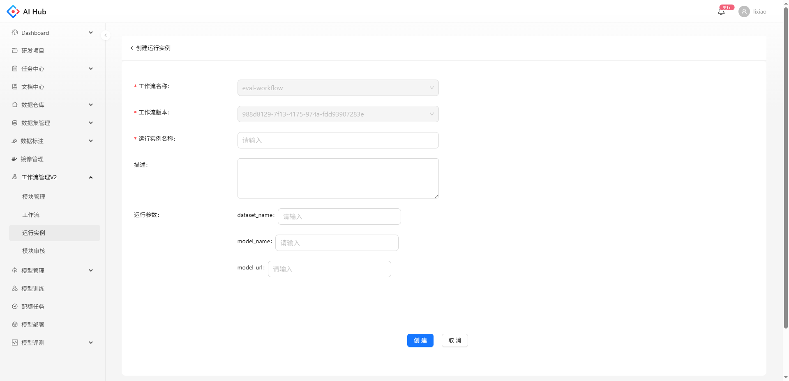

## 查看可视化结果

工作流执行成功后，在模型评测列表，找到对应的评测任务，可查看相关统计数据，点击评测名称，可查看评测结果详情

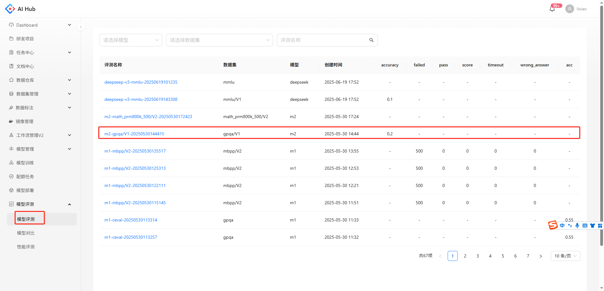

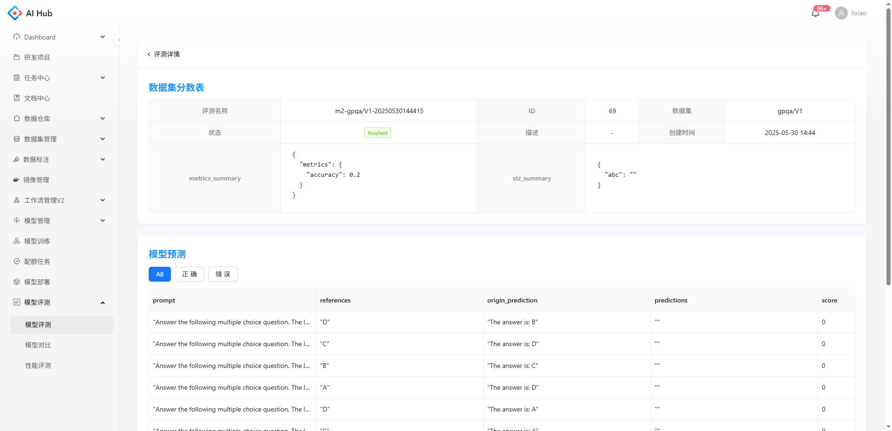

## 查看模型对比

在【模型对比】中选择需要对比的模型和数据集，系统会生成模型\*数据集的对比表，展示模型在不同数据集下的评测数据对比，对于有acc或accuracy的评测数据，会自动计算平均分。

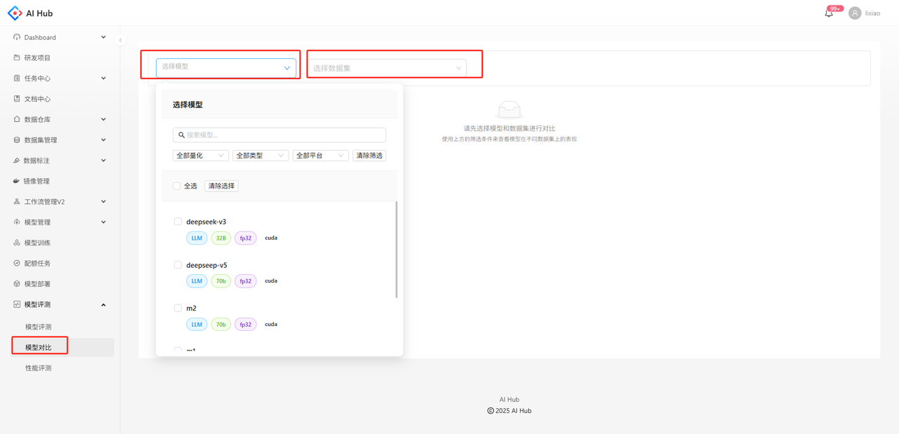

