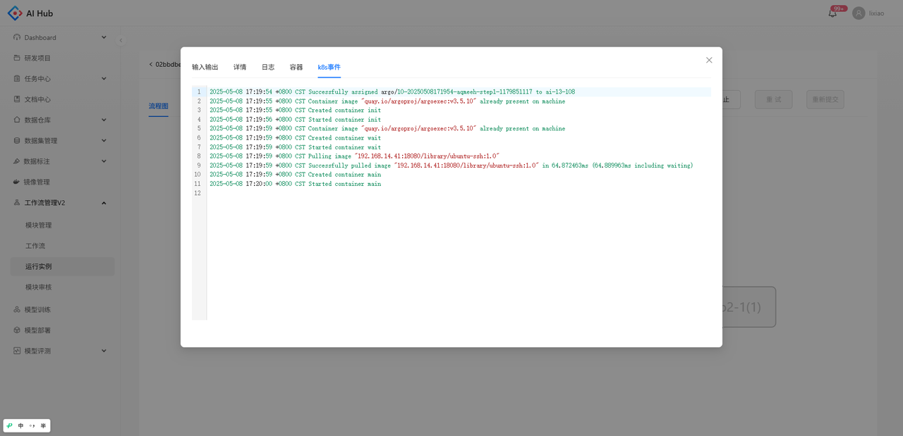

## 创建工作流

1. 工作流页面点击创建工作流

    

* 填写基本信息

    

* 编辑初始输入参数，添加节点并配置节点依赖关系

    
    

* 添加模块节点

    

* 编辑节点信息

    

* 点击最下方提交按钮，保存工作流信息。

    

* 保存的工作流可在工作流列表查看，点击运行按钮，跳转到创建运行实例界面

    

## 运行工作流

1. 编辑运行实例名称后输入参数后，点击创建，创建一个运行实例。

    

* 创建后可在运行实例列表点击查看运行实例

    

* 流程图中的节点颜色表示该步骤的运行状态，蓝色表示运行中，绿色表示成功，红色表示失败，灰色表示等待中,节点名称后面括号里的数字表示重试次数。

    

* 点击流程图中的单个节点，可以看到该步骤运行的详细信息

  

    
    
输入输出

  

  

    
    
详情

  

  

    
    
日志

  

  

    
    
容器

  

 

  

    
    
k8s事件

  

