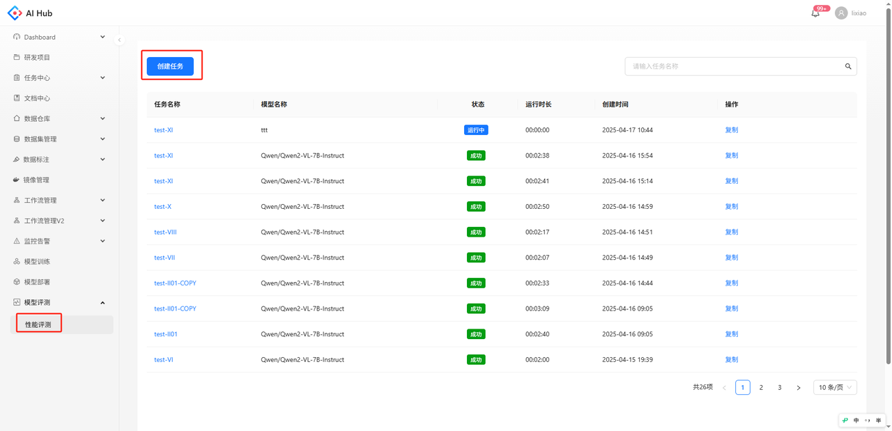
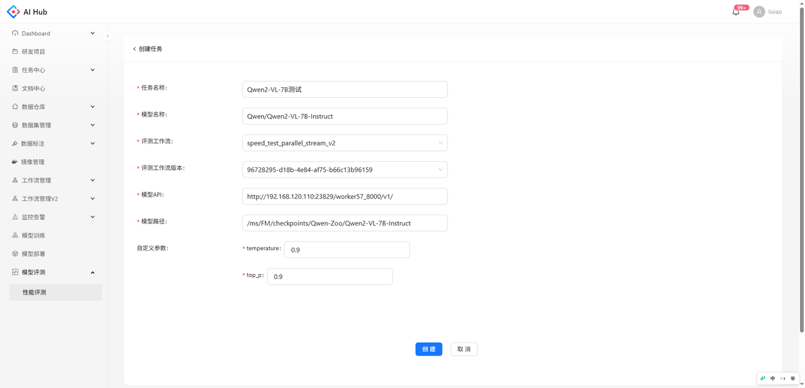
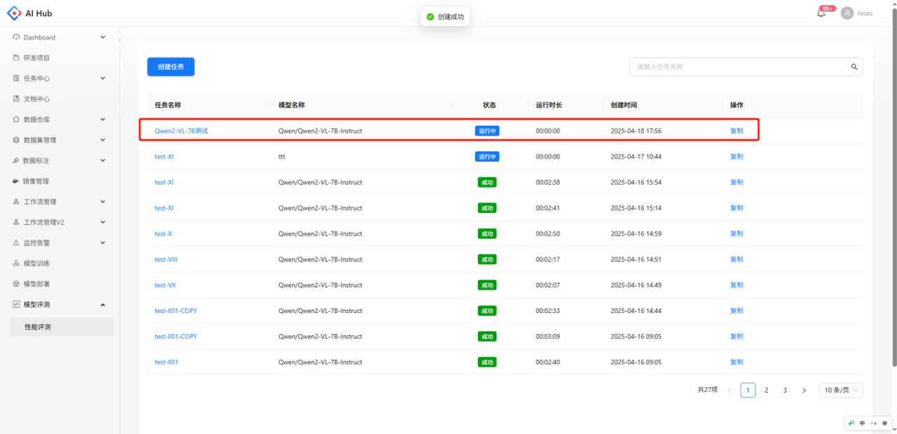
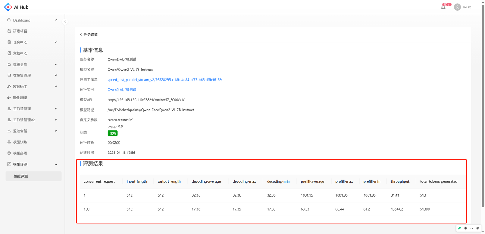
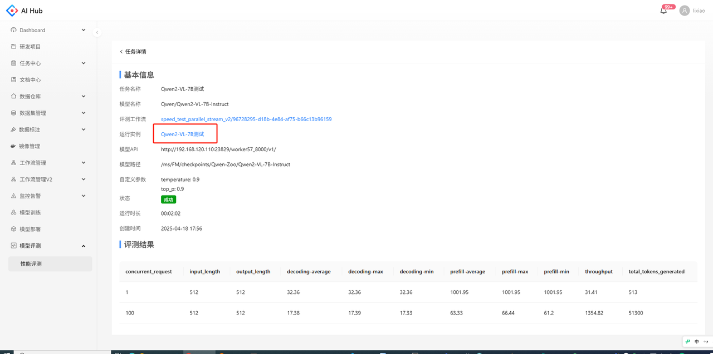
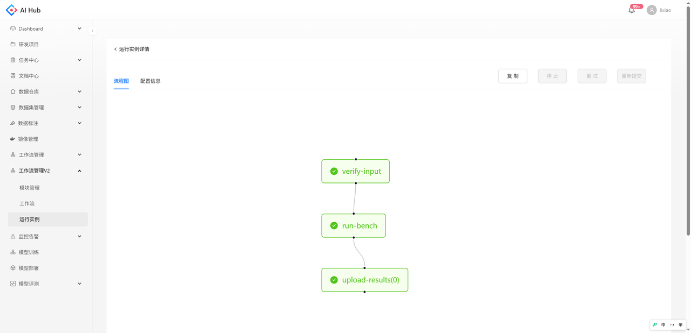
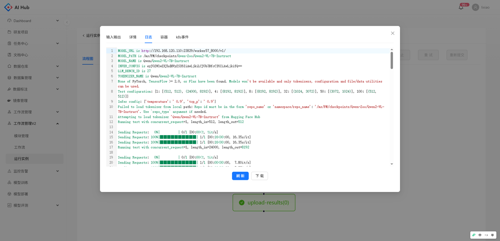

## 简介
性能评测是借助评测工作流，对模型在并发请求情况下的吞吐量、响应时间、成功率等指标进行评测，以衡量模型的性能表现。 

## 创建评测任务

菜单栏点击模型评测-性能评测，进入性能评测页面，点击创建任务。

填写对应参数，选择评测工作流后，点击创建。

**参数说明**

* 任务名称：填写评测任务名称

* 模型名称：填写评测模型的名称

* 评测工作流：预置了一些用于评测的工作流，如需修改请联系管理员

* 评测工作流版本：预置的评测工作流版本

* 模型API：需要评测的模型api地址

* 模型路径：调用api时指定的模型路径

* 自定义参数：不同评测工作流有不同的自定义参数

跳转到性能评测列表，可以看到任务创建成功。

## 查看评测结果

点击任务名称，进入任务详情。任务详情页面可以查看任务的基本信息，任务运行成功后，可以查看评测结果。

## 常见问题

1. 任务卡在进行中或运行失败如何处理？

   用户可点击任务名称进入评测任务详情，点击运行实例，可跳转到工作流任务实例页面，查看任务运行详细信息，点击节点可以查看节点的详情和运行日志。

   

   

   

