数据仓库支持以下三种查询方式：

1. sql查询：支持对[数据表管理](#数据表管理)中的人车非属性表进行查询

2. 图搜图：支持在clip特征底库中搜索相似的图片、在DinoV2特征底库中搜索相似的图中目标

3. 文搜图：支持在clip特征底库中搜索与关键词描述相近的图片

> 目前支持对图片的meta表和arctern算法结构化的6个表进行sql查询、在平台现有的特征底库中查询图片，如果有对其他数据的查询需求可联系&#x20;


在数据查询模块新建查询任务，支持对数据表进行sql查询、以图片或关键词在底库中搜索图片。在数据表管理模块可以看到当前已有的表及其字段。

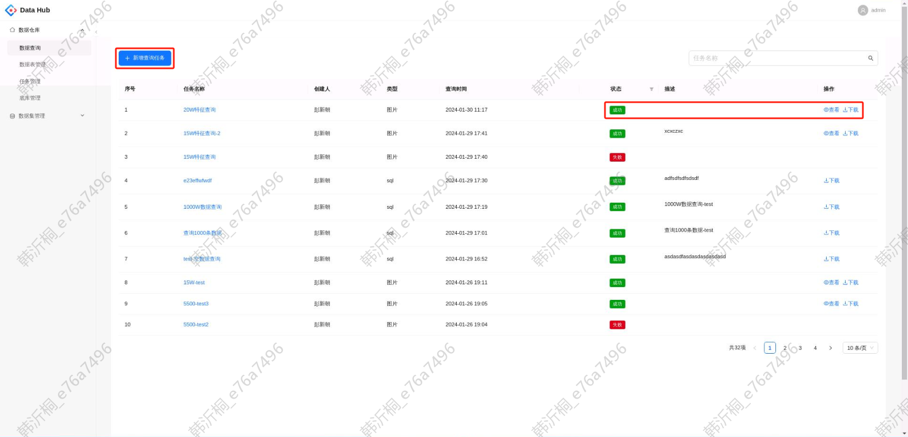

创建后手动刷新页面以更新任务状态，当状态为成功时可以将查询结果的csv文件下载到本地，再通过[sdk](#下载查询结果sdk)解析csv文件将图片下载到本地。若查询类型为图片或文本，支持可视化查看查询结果。


# 数据查询

在数据查询模块点击"新增查询任务"，可以支持sql查询、图搜图、文搜图三种查询方式。

> 创建任务后需要手动刷新页面以更新任务状态。

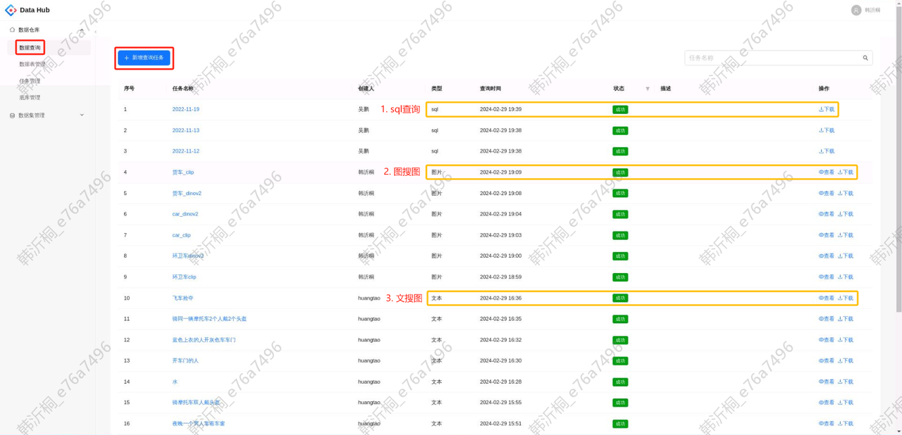

若查询成功，支持将查询结果以csv的方式下载到本地，其中图搜图和文搜图的查询结果支持可视化查看。


点击任务名称，会跳转至查询的详情页。若查询成功，则可以下载查询结果；若查询失败，则可以查看失败原因。

<div style="display: flex; justify-content: space-between;">
  <div style="text-align: center;">
    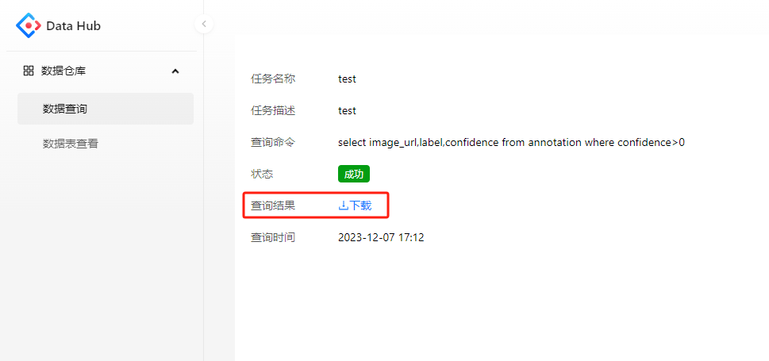
    <p>成功</p>
  </div>
  <div style="text-align: center;">
    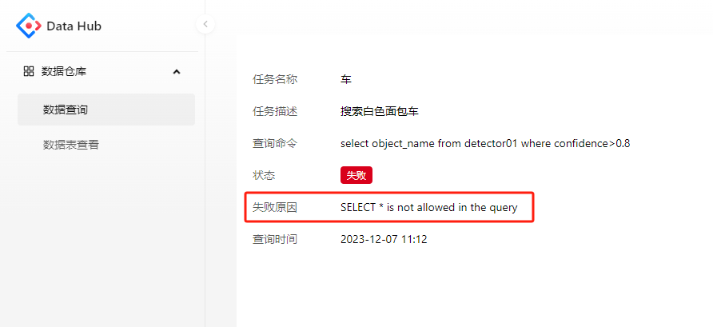
    <p>失败</p>
  </div>
</div>


## sql查询

查询类型选择sql时，在查询命令输入sql语句对[数据表管理](#数据表管理)中的表进行查询。

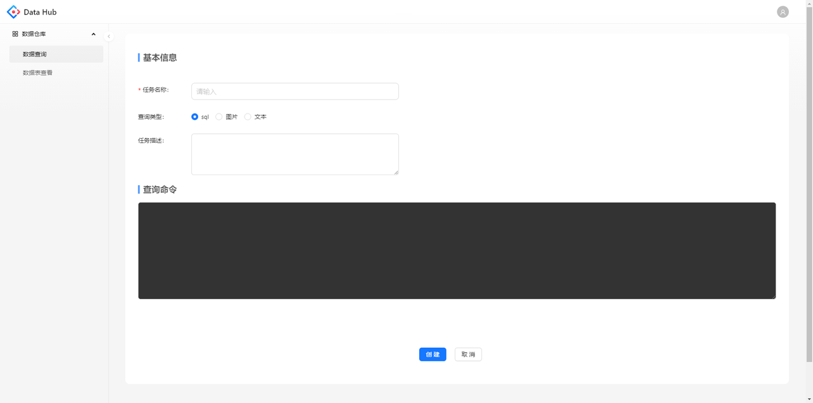


## 图搜图

查询类型选择图片时，支持上传一张或多张图片在搜索底库中进行检索。

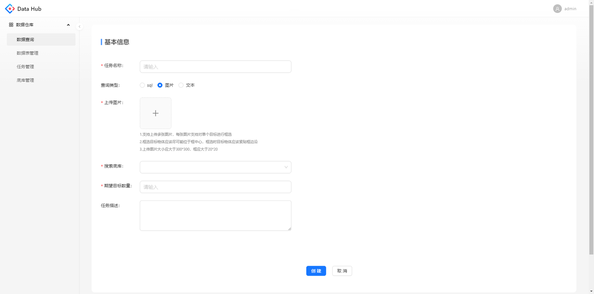


对每张图片，只支持对一个目标进行框选。

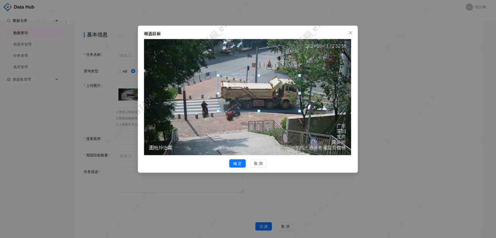

当搜索底库选择的是clip开头命名时，查到的结果是整张图片；当搜索底库选择的是DinoV2开头命名时，查到的结果是图片中的目标。

<div style="display: flex; justify-content: space-between;">
  <div style="text-align: center;">
    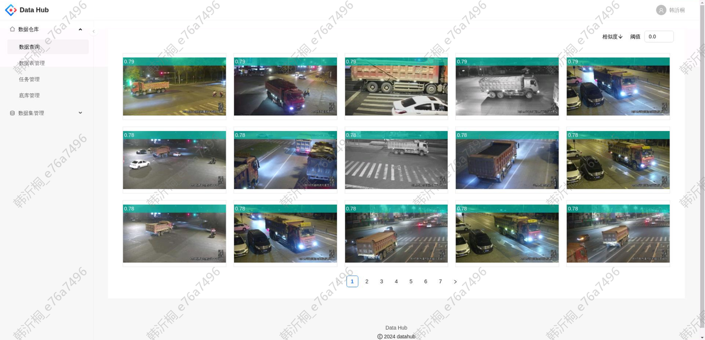
    <p>搜索底库是clip图库</p>
  </div>
  <div style="text-align: center;">
    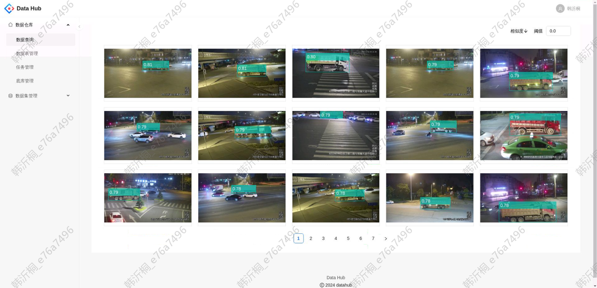
    <p>搜索底库是DinoV2目标库</p>
  </div>
</div>

在可视化页面，支持按照相似度进行升降序排列、根据阈值筛选查询结果。


## 文搜图

查询类型选择文本时，通过关键词在搜索底库中进行检索。

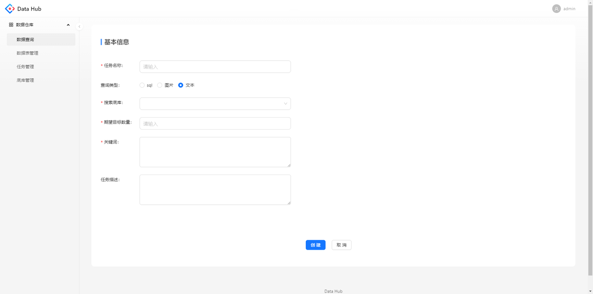


目前文搜图只支持在clip底库中搜索整张图片，例如关键词为“道路积水”时的搜索结果：

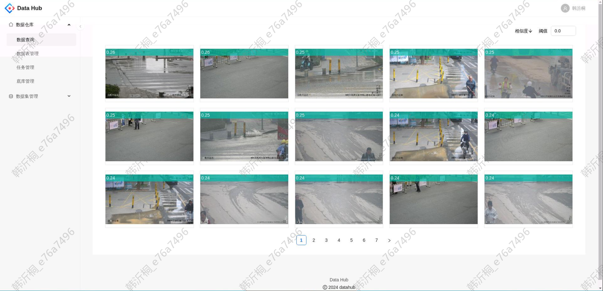


# 数据表管理

点击左侧导航栏的数据表管理，可以看到当前所有的数据表。点击表名称可以跳转至该表的详情页。

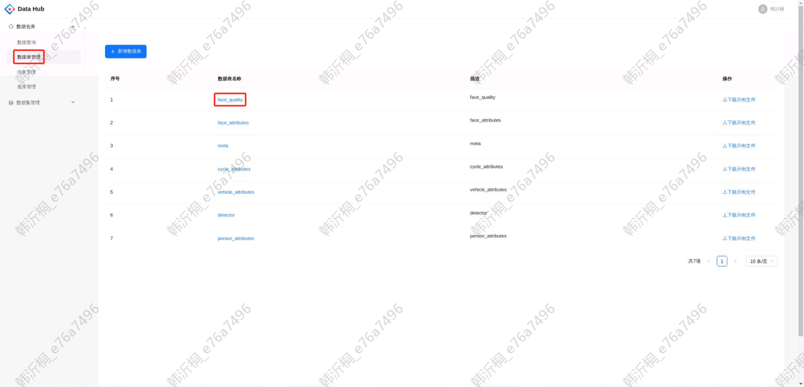


在详情页中可以看到数据表的所有字段信息，也可以下载示例文件查看。

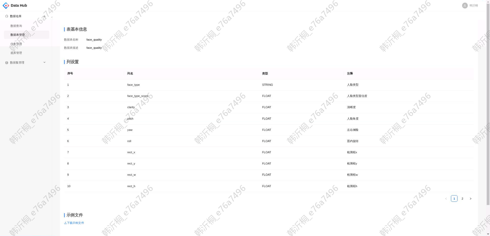


# 下载查询结果sdk

## sdk代码

外网：<http://192.168.14.17:9000/warehouse/sdk/data_warehouse_sdk_test.zip><br>
内网：http://storage.ifai:5080/warehouse/sdk/data\_warehouse\_sdk\_live.zip


## 命令行使用方式

查看命令行帮助。

```plain&#x20;text
python3 .\data_warehouse_sdk\search_result.py -h
usage: [-h] [-i INPUT_FILE] [-d OUTPUT_DIR]
options:  
  -h, --help    show this help message and exit  
  -i INPUT_FILE, --input_file INPUT_FILE    the csv file download from search result  
  -d OUTPUT_DIR, --output_dir OUTPUT_DIR    the output directory to save images/数据仓库
```

从搜索结果的csv文件`truck.csv`下载所有图片, 保存到目录`truck`下。

```plain&#x20;text
python3 .\data_warehouse_sdk\search_result.py -i truck.csv -d truck
```


## python包

示例项目目录结构:

```plain&#x20;text
├── demo.py
└── data_warehouse_sdk    
    ├── __init__.py    
    ├── search_result.py    
    └── readme.md
```

示例代码文件 `demo.py`

```python
from data_warehouse_sdk import search_result
# 从s3路径下载单个图片文件（csv中的单个image路径）
search_result.download_file_from_s3_path("s3://test/imgs/1.jpg", "1.jpg")
# 从搜索结果的csv文件truck.csv下载所有图片, 保存到目录truck下。
search_result.download_images/数据仓库_from_csv_to_dir("truck.csv", "truck")
```

