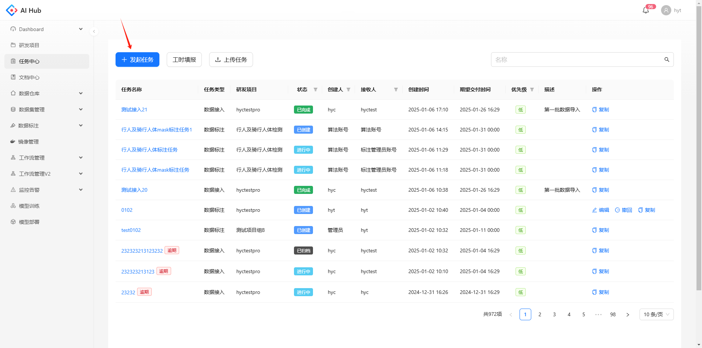
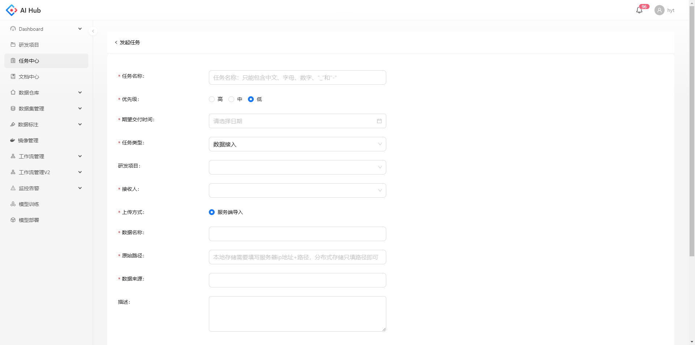
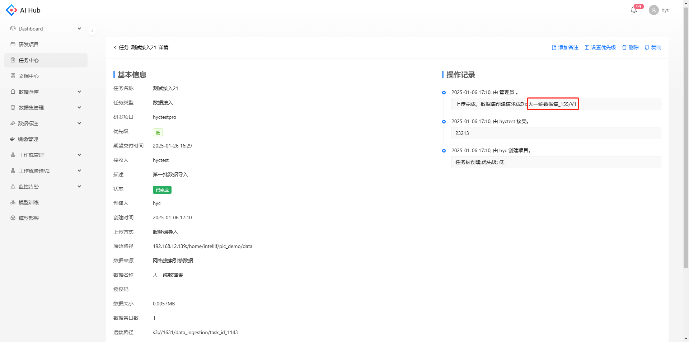
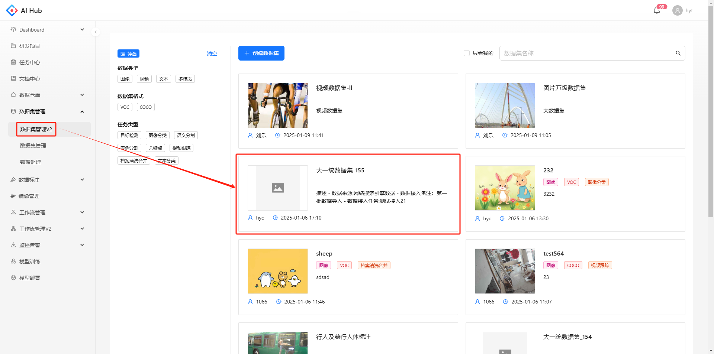

## 发起任务

点击发起任务，跳转到任务的创建页

填写任务名称，任务类型选择数据接入，并设置其他参数

* 任务名称：长度为1\~32个字符，只能包含中文、字母、数字、“\_”和"-"

* 优先级：默认为低，可选低/中/高

* 期望交付时间：可精确到秒

* 研发项目：若需要接入的数据有明确对应的研发项目请选择项目，若没有该项目可联系李晓添加

* 接收人：数据接入任务请选择李晓;

* 数据名称：建议填写需要接入数据的关键信息，例如日期、拍摄地点、拍摄对象等

* 原始路径：本地存储需要填写服务器ip地址+路径，分布式存储只填路径即可

* 数据来源：请务必填写清楚数据的具体内容、数据用途、数据大小等，管理员将据此决定是否审批通过

## 查看任务详情

点击任务名称进入任务详情，在任务状态变为“已完成”后，在左侧的基本信息可以看到数据大小、数据条目数等，在右侧的操作记录可以看到数据导入成功后的数据集名称

在数据集管理V2可以查看该数据集，具体说明可参考[ 数据集管理 ](./数据集管理.md)

