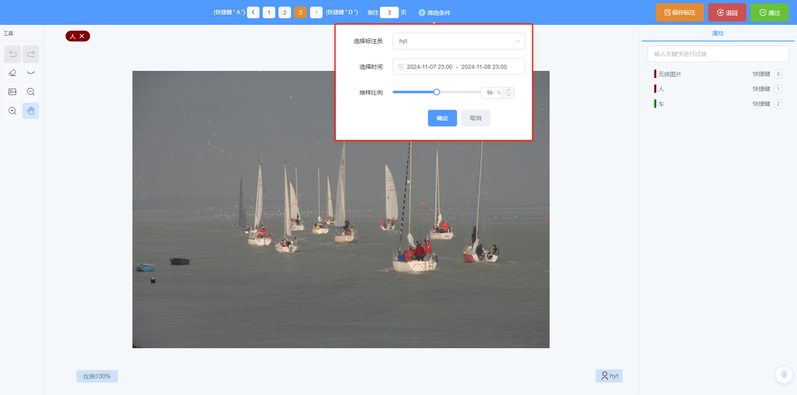
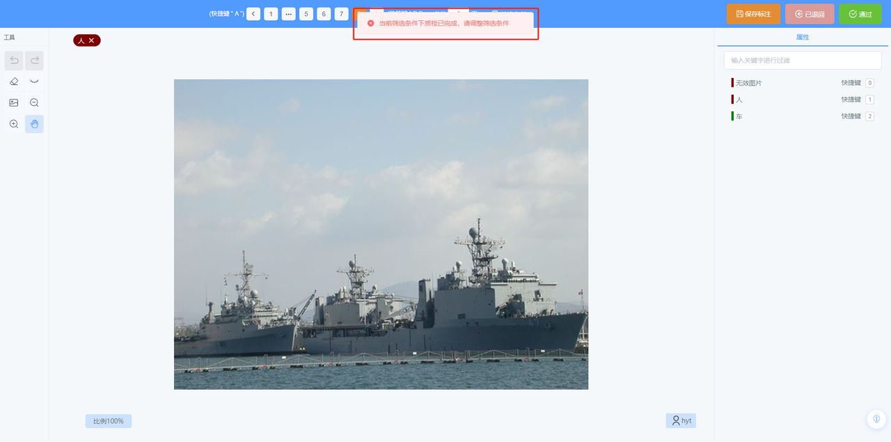

## 质检流程

在项目详情页点击去质检的按钮，进入质检页面

根据标注结果选择质检退回或通过，会获取下一张图片，直至所有图片都质检完毕

## 修改标注结果

修改标注结果后，点击保存标注的按钮

弹出提示点击确定后，当前的标注结果会覆盖原有的标注结果

## 质检筛选条件

抽样比例：从已选标注员在已选时间段内标完待质检的图片中抽取

若当前图片未质检，则筛选条件从下一张图片开始生效；若当前图片已质检，则立即按照筛选条件请求下一张图片

在当前筛选条件下请求图片时，筛选条件后会有（生效中）字样

若满足当前筛选条件下的图片都已质检完，则会提示调整筛选条件，不会请求到其他待质检的图片

## 返工标注

点击返工标注按钮，可以重新标注被质检退回的图片

进入返工标注的页面，只能看到待修正的图片，无法查看修正历史

点击去标注的按钮，可以在历史页面看到修正后的标注结果

