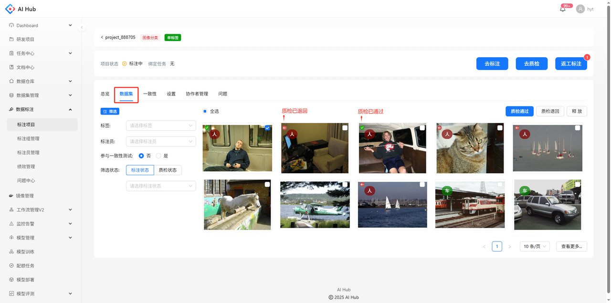
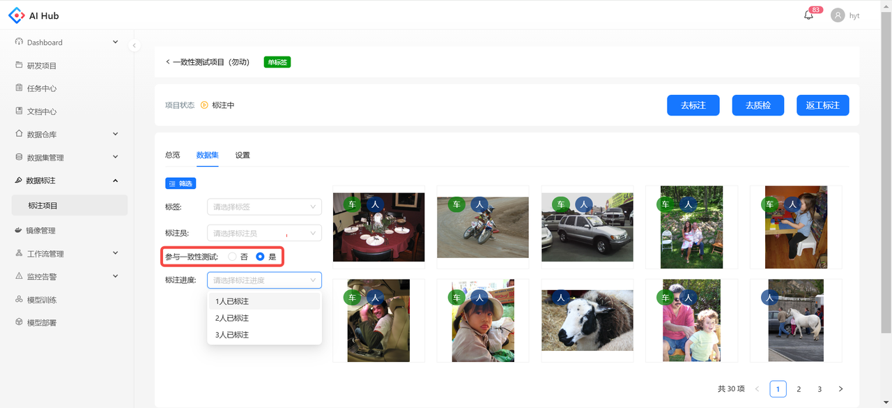
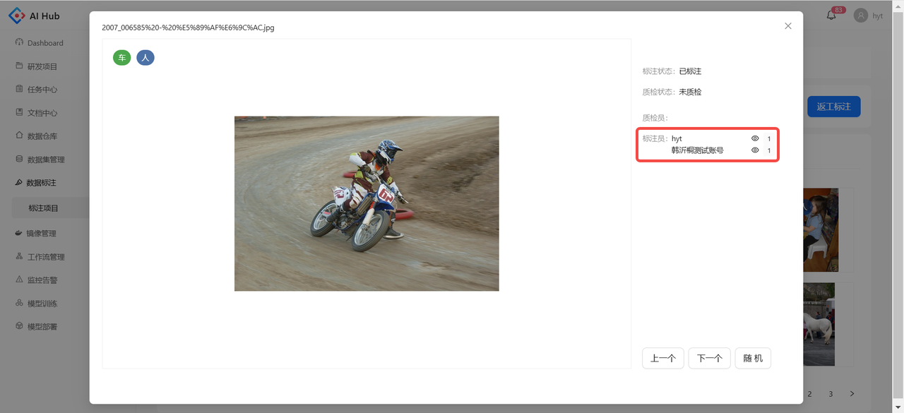
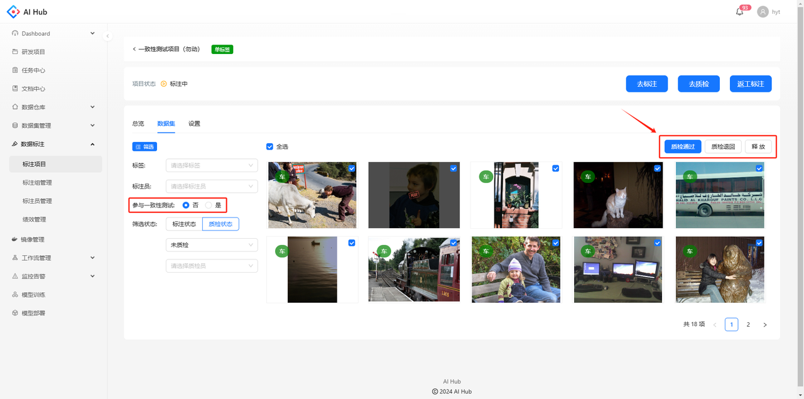
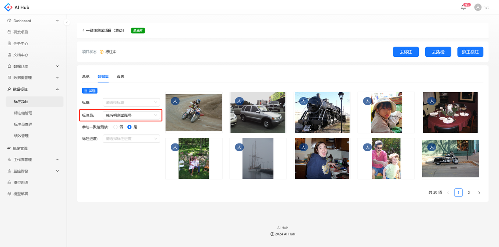
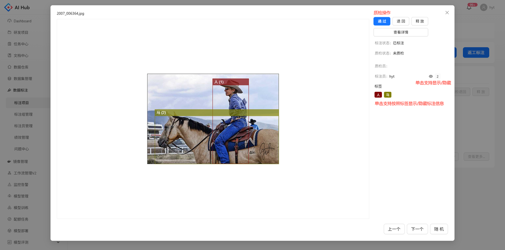
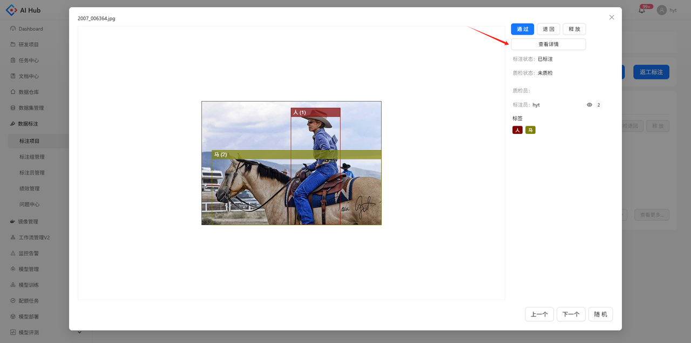
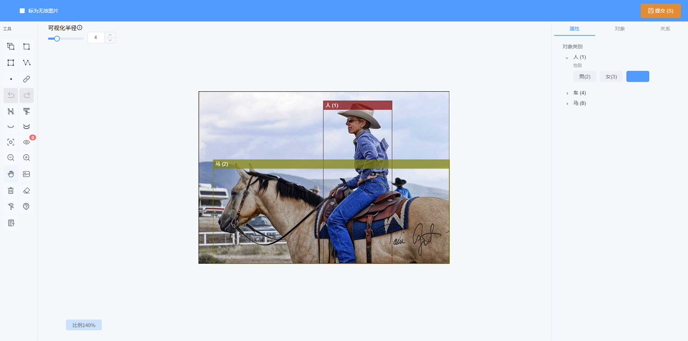

## 数据列表

在项目详情页的数据集模块，左侧可以设置不同的筛选条件，右侧可以查看筛选出的图片、标签及质检状态

### **筛选条件**

1. 标签：可选择一个该项目的一级标签

2. 标注员：可选择一个已参与标注的标注员

3. 参与一致性测试：可通过该字段筛选一致性图片或非一致性图片

4. 筛选状态：可选择需要针对`标注状态`或`质检状态`进行筛选

    * 标注状态：在所有图片中对标注状态进行筛选

      * 未标注：未分配给标注员的图片

      * 标注中：已分配给某个标注员但未提交的图片

      * 已标注：已提交的图片

    * 质检状态：在已标注的图片中对质检状态进行筛选

      * 未质检：已标注、未被质检的图片

      * 已通过：被质检通过的图片

      * 已退回：被质检退回的图片

      * 待重新质检：被质检退回后重新提交的图片

5. 质检员：可选择一个已参与质检的质检员

### **查看一致性图片**

筛选出参与一致性测试的图片，可以对图片的标注进度进行筛选查看

在图片详情可以查看每个标注员的标注结果

### **查看非一致性图片**

筛选出未参与一致性测试的图片，可以多选图片进行批量质检或释放

### **查看单人的标注结果**

标注员选择某个人时，会筛选出其标注过的所有图片，包括一致性和非一致性的图片。在一致性图片上，只会展示该标注员的标注结果

## 数据详情

支持在详情页进行质检操作、显示/隐藏标注信息、查看上一个/下一个或随机抽查数据

点击查看详情，可以跳转至标注页面

支持提问、标注等操作，但只有该图片的标注员可以提交标注结果

