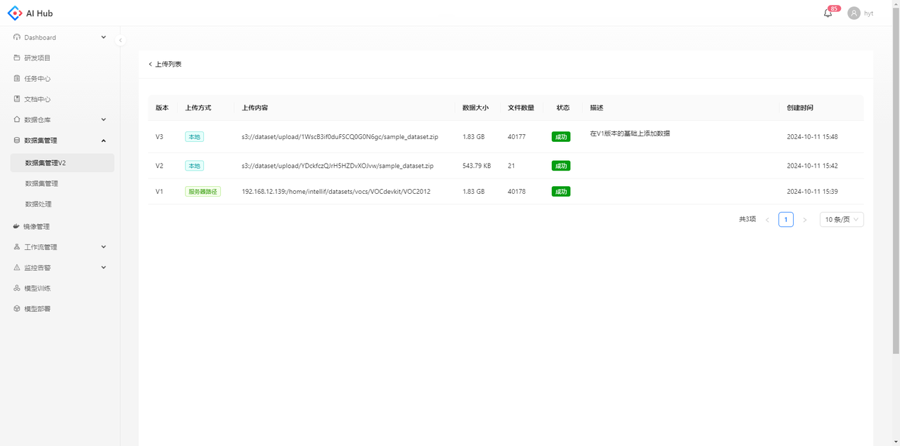
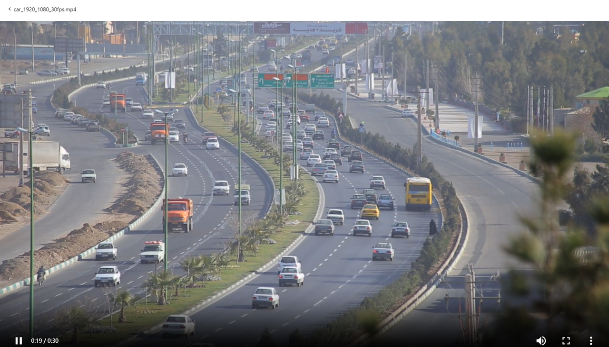
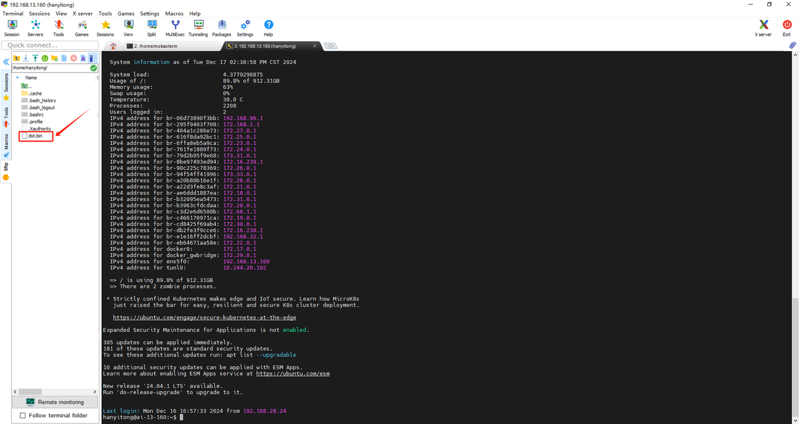

## 数据集列表

点击导航栏的数据集管理V2可以看到当前的数据集列表，左侧可以通过不同类别的标签筛选数据集

## 创建数据集

点击创建数据集，跳转至创建数据集的页面

填写数据集的必填字段，数据集描述支持填写markdown格式的readme。数据类型、数据集格式、任务类型为数据集标签，用于对数据集进行快速分类和筛选。

## 上传数据

点击数据集卡片，跳转至该数据集的详情页

在数据集文件模块，点击上传按钮，跳转至上传数据的页面

支持本地上传和服务器路径两种方式，每次上传后会生成一个版本

  

    
    
本地上传

  

  

    
    
服务器路径

  

点击上传列表，跳转至列表页

可以看到当前数据集所有版本的上传状态、数据大小、文件数量等信息

* 版本：由平台自动生成，从V1开始自增

* 上传方式：本地/服务器路径

* 上传内容：本地则展示上传至s3的压缩包路径，服务器路径则展示填写的具体地址

* 数据大小：所有文件大小的总和

* 文件数量：除文件夹以外的所有文件数量

* 状态：等待中、上传中、成功、失败

## 继承历史版本

上传数据时，选择要继承的历史版本，在该版本的基础上增加数据

创建成功后，查看该版本的目录结构，在根目录可以看到一个新的文件夹名称为随机字符串，该文件夹下是新上传数据的原始目录结构

## 查看数据集

在数据集介绍支持查看创建数据集时在描述填写的readme信息

在数据集文件支持切换版本，以列表或缩略图的模式查看数据集的原始目录结构

  

    
    
列表模式

  

  

    
    
缩略图模式

  

单击文件，支持预览图像、文本、视频等多种格式的文件内容

  

    
    
图像

  

  

    
    
文本

  

  

    
    
视频

  

## 编辑数据集

在数据集详情页的设置模块，支持修改创建数据集时填写的信息，点击保存后修改生效

## 分享数据集

若数据集为私有，创建人可以通过添加协作者将数据集分享给相关人员查看。

协作者在 \[分享给我的] 筛选项下可以看到该数据集

## 下载数据集 {#download-dataset}

提供客户端下载工具，命令行参数如下：

| 参数 | 解释       | 是否必须 | 示例                          | 备注                                         |
| -- | -------- | ---- | --------------------------- | ------------------------------------------ |
| n  | 数据集版本名称 | 是    | 人脸检测2023/v2                 | 格式：{dataset\_naem}/V{datset\_verson\_nmum} |
| o  | 下载本地目录   | 是    | ./dataset2023               |                                            |
| w  | 并发下载数    | 否    | 20                          | 默认是20                                      |
| s  | 服务地址     | 否    | http://192.168.13.160:30021 | 生产环境，编译时指定到生成环境                            |

### Linux
下载工具：[dst.bin](files/dst.bin)

下载后将文件移至所需服务器的路径下

命令行示例：

### Windows
下载工具：[dst.exe](files/dst.exe)

下载后在文件所在目录下打开Git Bash命令行工具

命令行示例：&#x20;

