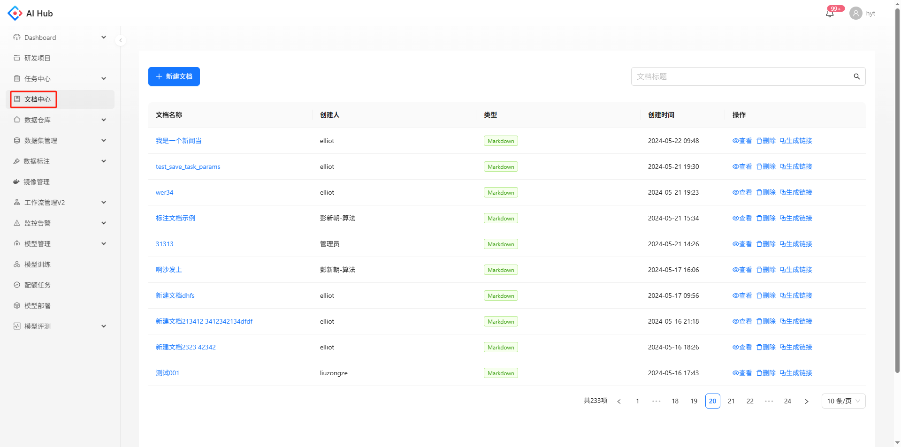
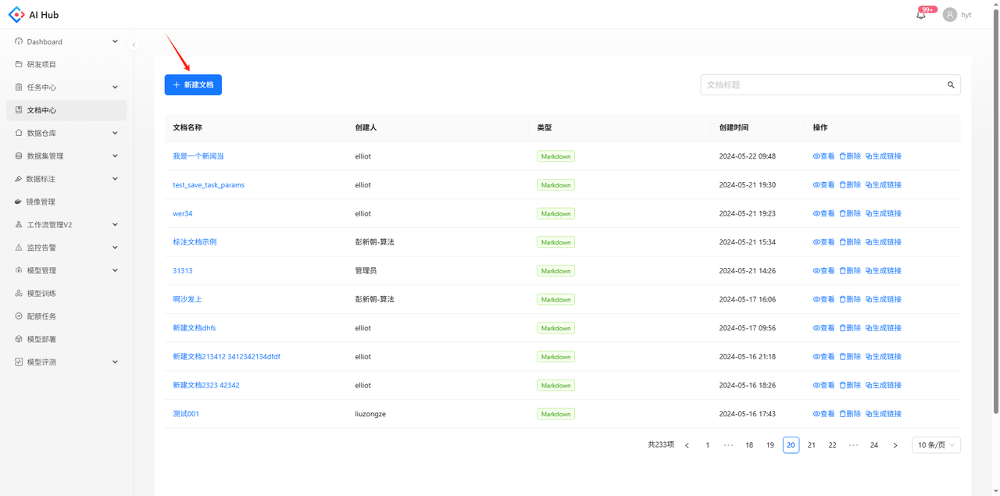
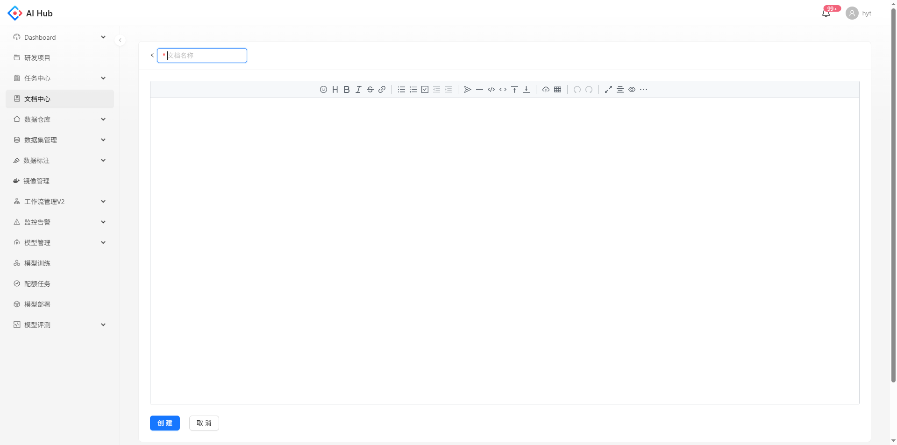
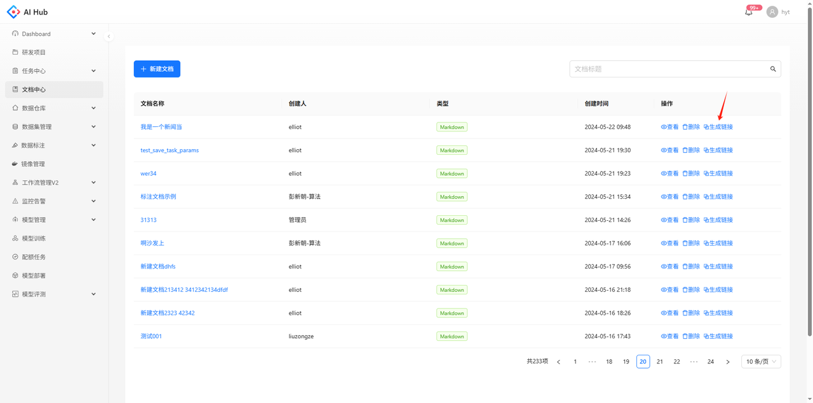
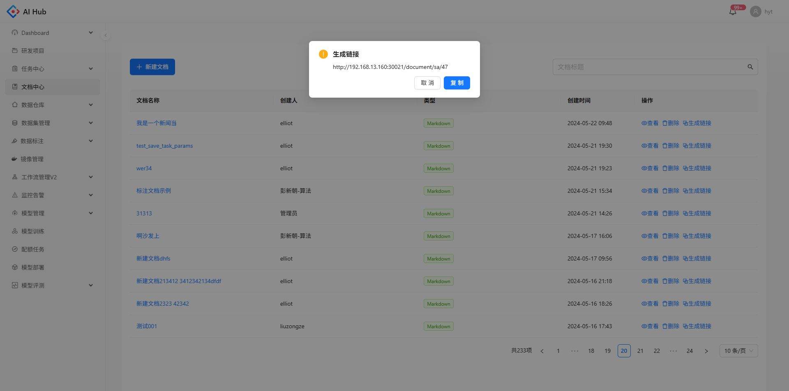
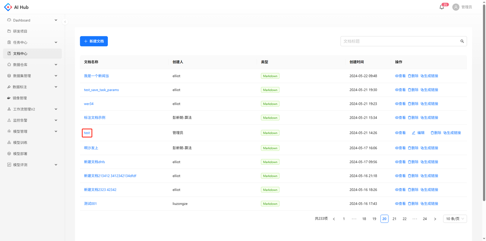
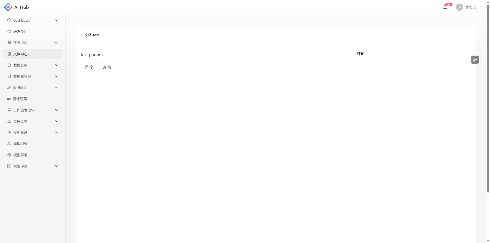
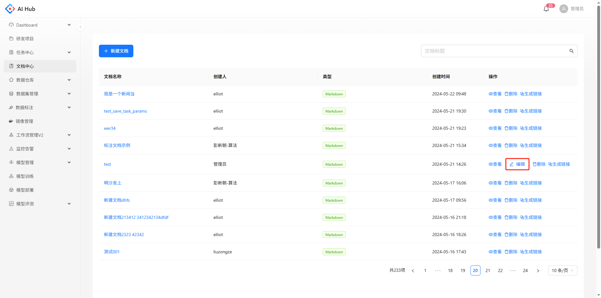
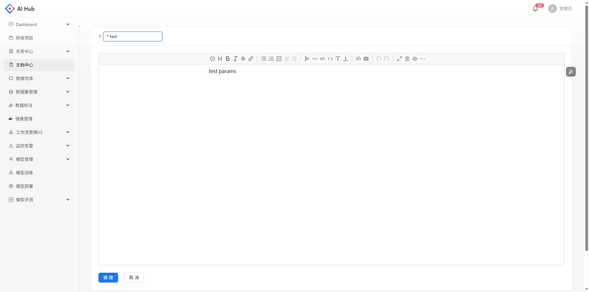
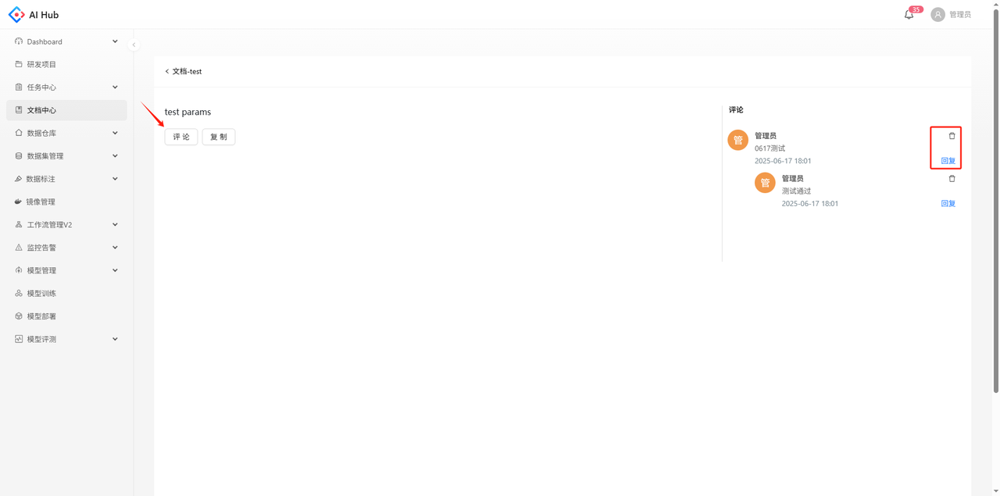

文档中心支持新建、编辑、查看、删除、复制和评论文档，也可对文档生成链接

# 新建文档

点击新建文档的按钮进入创建页，文档名称必须填写

# 生成链接

点击生成链接的按钮后支持复制当前文档的链接

# 查看详情

点击文档名称，进入文档详情页

可以查看文档内容、评论或复制该文档

# 编辑文档

只有文档创建人可以编辑文档。点击编辑按钮，进入编辑页面

支持修改文档名称及文档内容，点击修改按钮即可保存修改内容

# 评论文档

支持多级评论回复及评论删除功能

# 复制文档

点击复制按钮后会生成一个副本并进入文档的编辑状态

