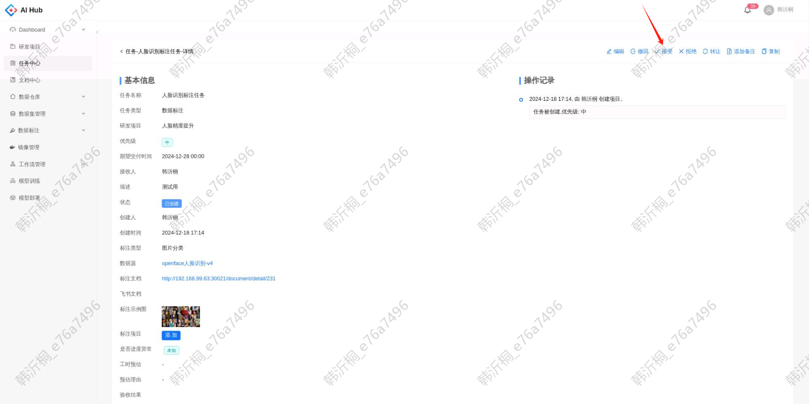
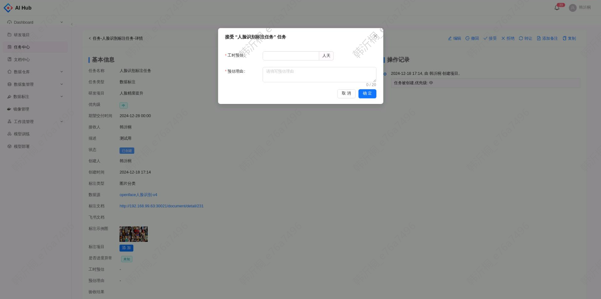
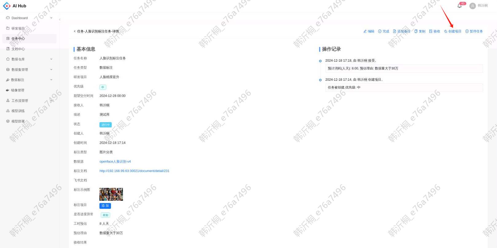
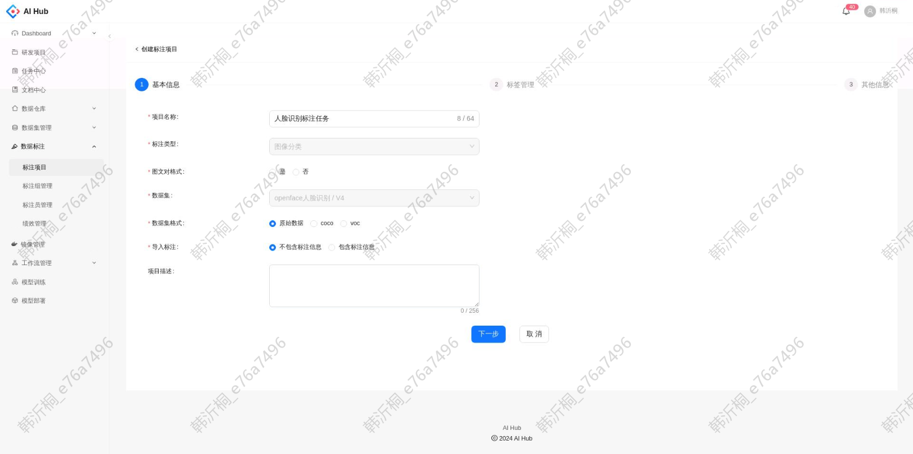
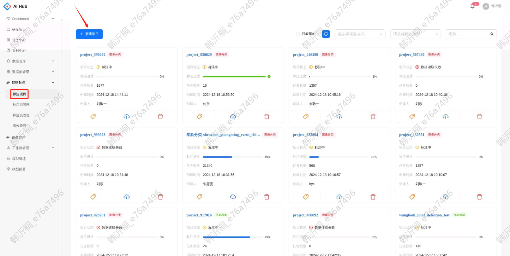
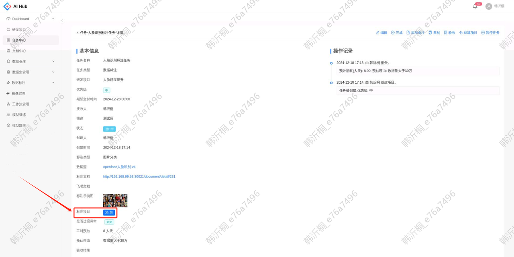
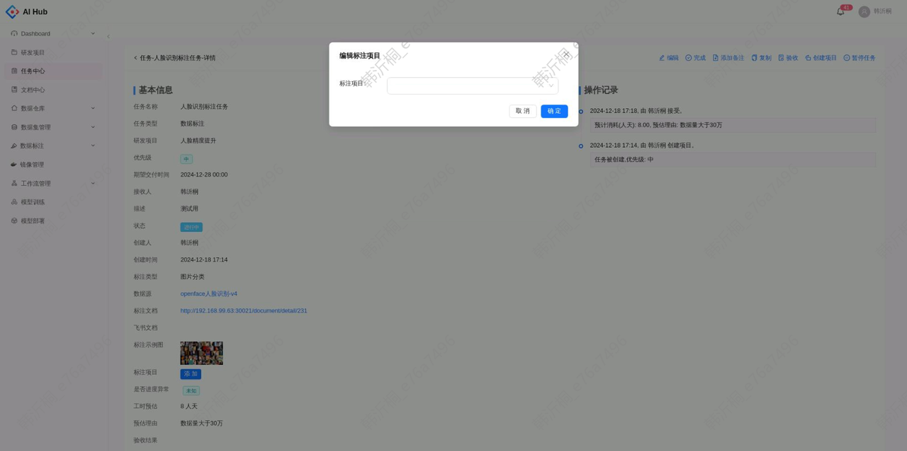
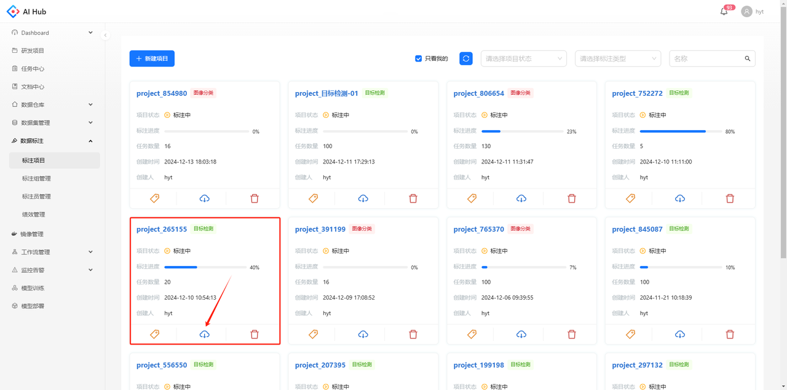
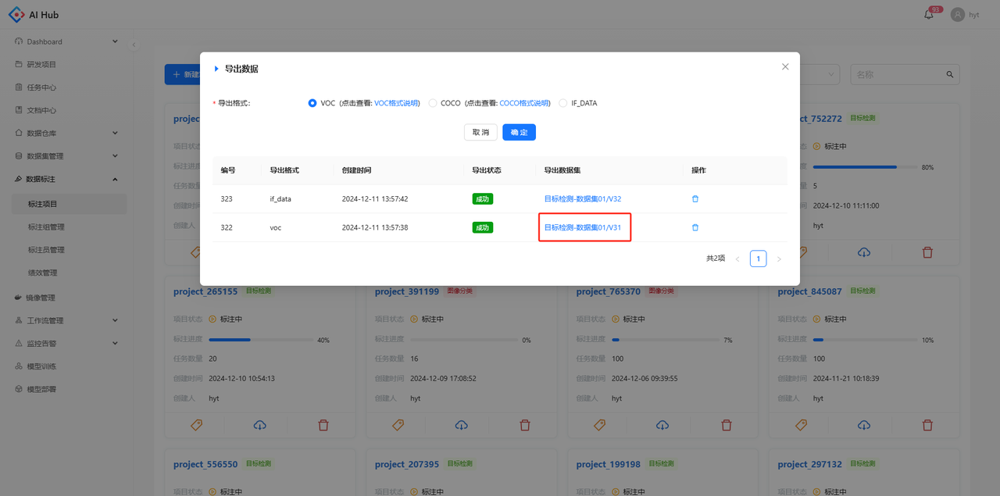
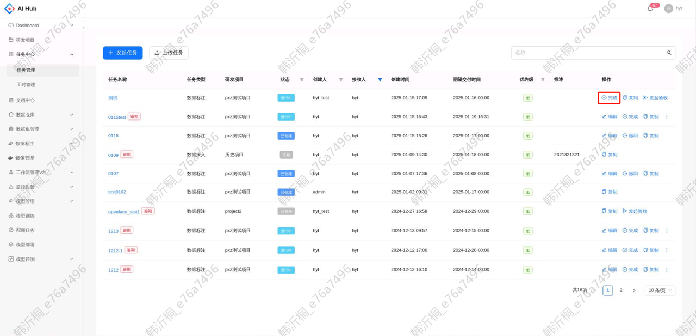

本文面向标注管理员角色，提供从标注任务接收到最终交付的全流程操作指南，涵盖预估标注工时、创建标注项目到最后的数据导出等关键环节。

## 1. 接收标注需求

在查看标注任务的详情后，点击接受按钮

填写预估工时及预估的理由

## 2. 创建标注项目

* **从标注任务直接创建**

接受标注任务后，点击创建项目的按钮

跳转至创建标注项目的页面，项目名称、标注类型和数据集已按照标注任务自动填充

* **创建项目后绑定标注任务**

在`标注项目`创建新的项目

创建好标注项目后，回到标注任务的详情页，在标注项目处点击添加按钮

选择和该任务相关的所有标注项目进行绑定，支持选择多个

## 3. 导出已标数据

数据标注完成且算法验收无误后，点击标注项目的导出图标

导出任务所需的格式，将导出数据集的名称及版本号同步给算法同事

## 4. 本地数据备份

无论是原始数据还是标完的数据，都可以使用客户端工具将数据集下载到指定路径。具体使用方法请参考[ 数据集下载](./数据集管理.md#download-dataset)

## 5. 提交标注任务

交付标注数据后，点击完成按钮

