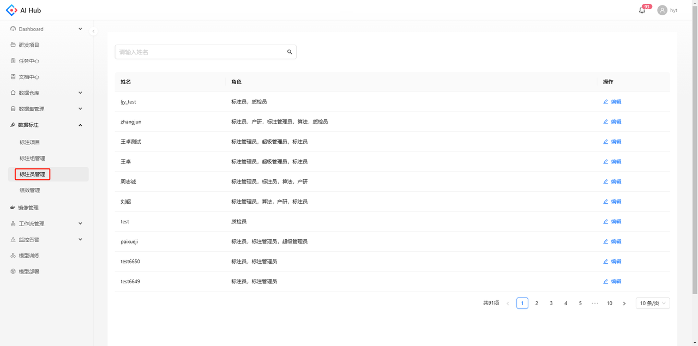
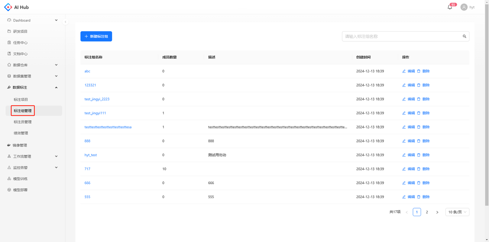
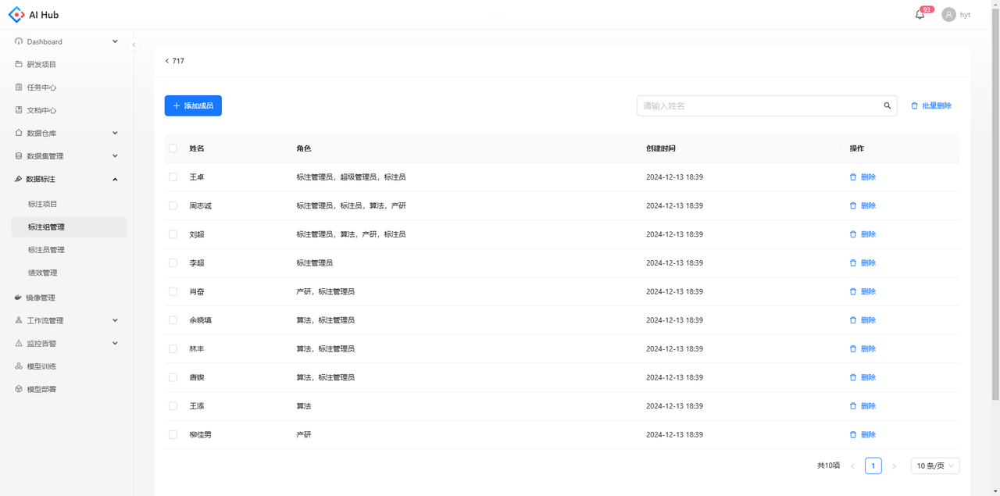

## 标注员管理

支持修改用户标注员和质检员的角色，但无法同时删除标注员和质检员的角色

## 标注组管理 {#annotation-group-management}

支持对标注组进行增删改查

* 新增/修改标注组：标注组名称不可重复
* 删除标注组：已绑定标注项目的标注组不可删除

点击标注组名称，可跳转到标注组详情页，可对标注组的成员进行管理

* 添加成员：支持模糊搜索，可多选批量添加
* 删除成员：可多选批量删除，已绑定项目的标注组中的成员不可删除

