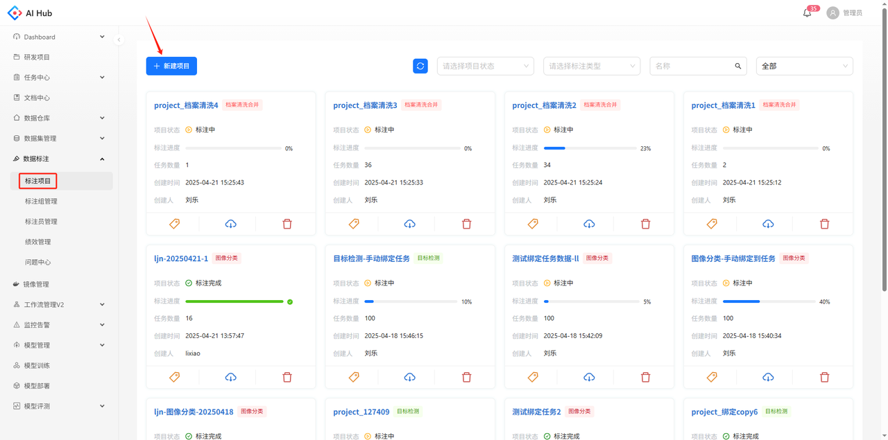
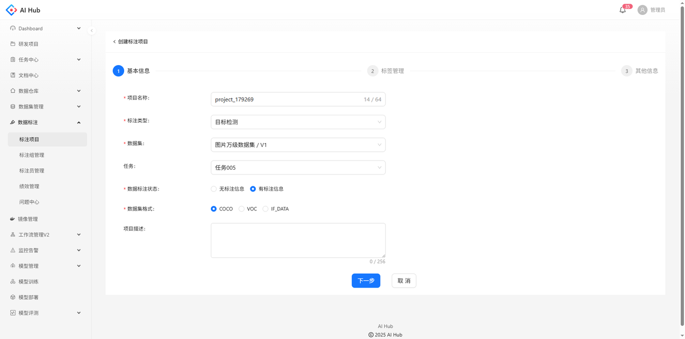
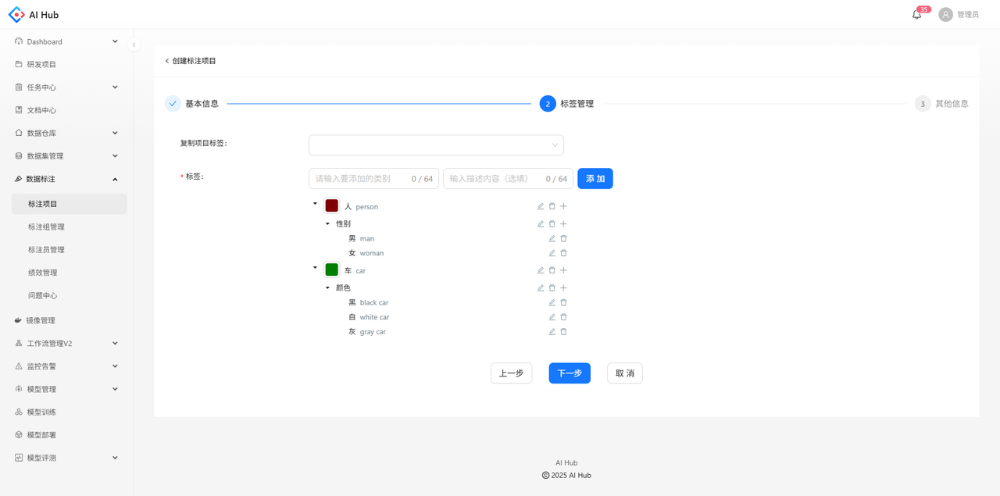
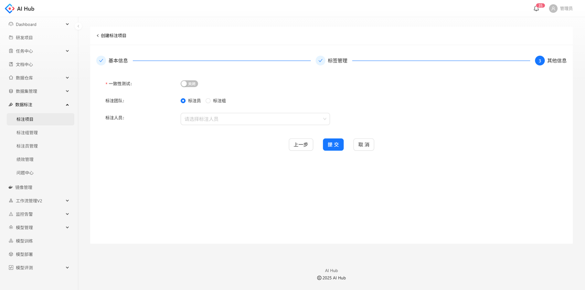
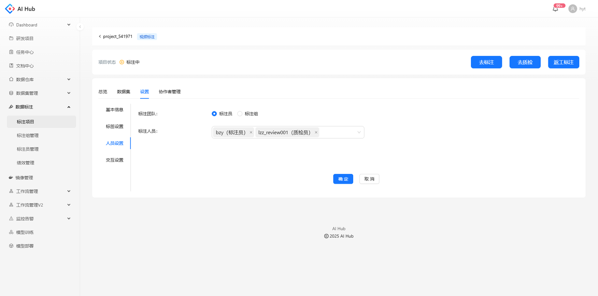
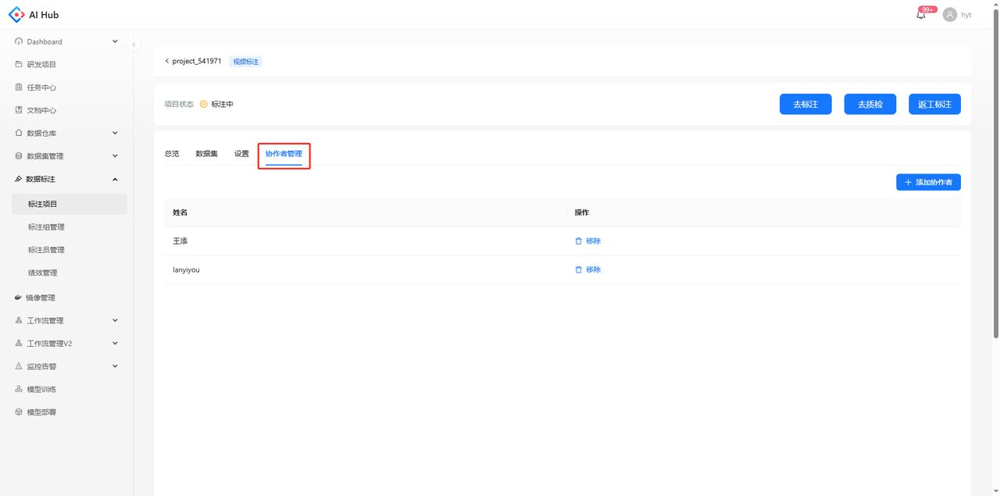
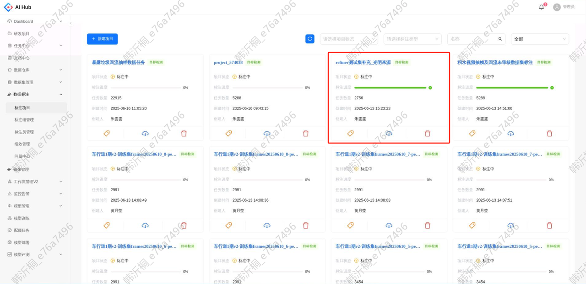
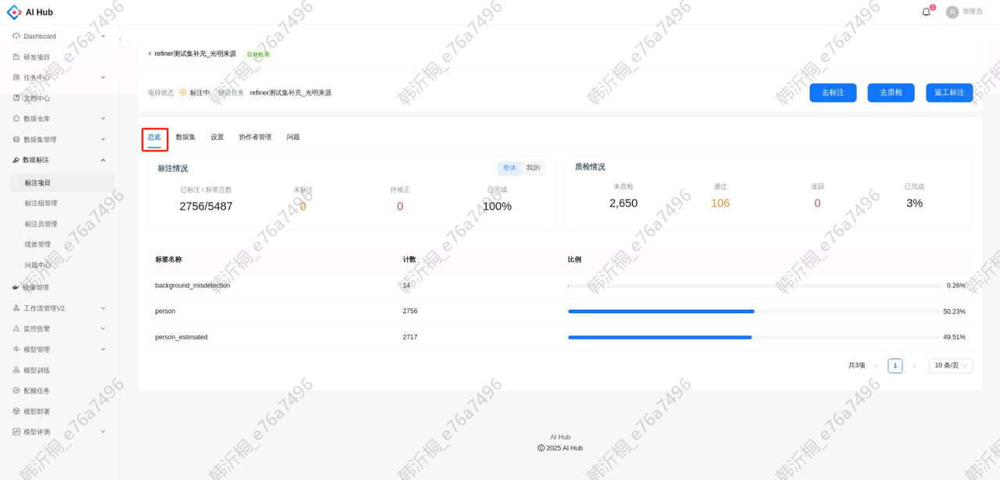
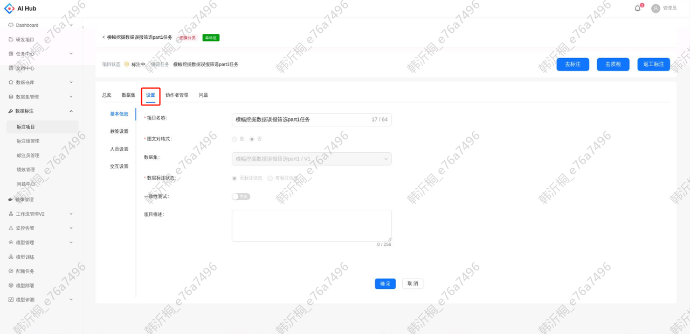
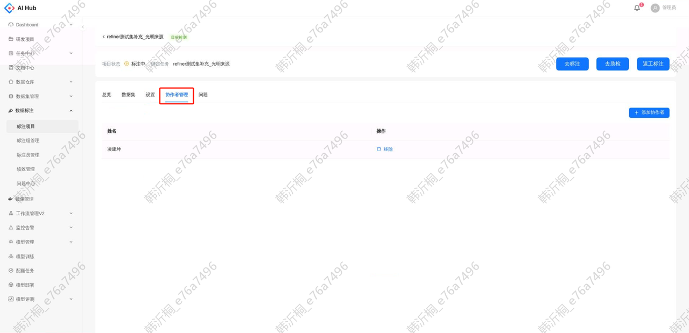

# 创建项目

点击新建项目的按钮，跳转到创建页面

## 基本信息

* 项目名称：不可与已有项目名称重复

* 标注类型：支持目标检测、图像分类、视频标注、视频分类、档案清洗合并

* 数据集：可选数据集管理V2中任一导入成功的数据集版本

* 任务：若数据集在任务中心存在绑定的标注任务，则可选任一绑定的标注任务；若数据集无绑定的标注任务，可选任务中心的任一标注任务

* 数据标注状态：选择无标注信息时，只会读取数据集中的图片/视频；选择有标注信息时，会按照数据集格式读取标注信息，并自动跳过没有标注信息的图片/视频

* 数据集格式：在`数据标注状态`选择有标注信息时可见，不同的标注类型支持的数据集格式不同

* 项目描述：用于填写对项目的基本说明，非必填

## 标签管理

* 复制项目标签：可选任一标注项目，选择后该项目的标签列表会展示在下面的标签字段，支持修改

* 标签：支持多级标签管理，可自由新增、删除、编辑标签，最多可设置三级层级

## 其他信息

* 一致性测试：默认关闭，开启后的相关参数说明详见[一致性测试](./一致性测试.md)

* 标注团队：可选以标注员或标注组的形式分配标注项目

# 访问权限

对于每个标注项目，以下人员有访问权限：

1. 所有标注管理员

2. 标注团队设置的标注员、质检员

   

3. 协作者设置的算法人员

   

# 项目详情

点击项目卡片，进入项目详情页

## 项目总览

1. 标注情况

   * 已标注/标签总数：项目已标注的图片数量与标签的总数，标签总数不计入负样本与无效图片

   * 未标注：项目当前剩余未标注的图片数量

   * 待修正：已被质检退回但未返工的图片数量

   * 已完成：已标注图片数量与项目总图片数量的比值

2. 质检情况

   * 未质检：已标注但未质检的图片数量

   * 通过：当前质检状态为通过的图片数量

   * 退回：当前质检状态为退回的图片数量

   * 已完成：已质检图片数量与项目总图片数量的比值

3. 标签列表：项目中已标注的标签的列表。包括标签的名称、数量及其占比

## 项目设置

* 基本信息：可查看创建项目时设置的基本信息，只能修改项目名称和项目描述

* 标签设置：可查看创建项目时设置的标签列表，可以新增标签，但不能删除或修改已有标签

* 人员设置：可查看创建项目时设置的标注团队，可以修改

* 交互设置：可查看和修改标注超时时限，超过该时限未提交标注的图片将自动重新分配

## 协作者管理

* 若标注项目有绑定的任务，则该任务的发起人会自动添加至协作者列表

* 支持添加、移除协作者
