## 通用交互说明

标注界面从左至右分为三个模块，分别为档案列表、图像/文本列表、标签列表

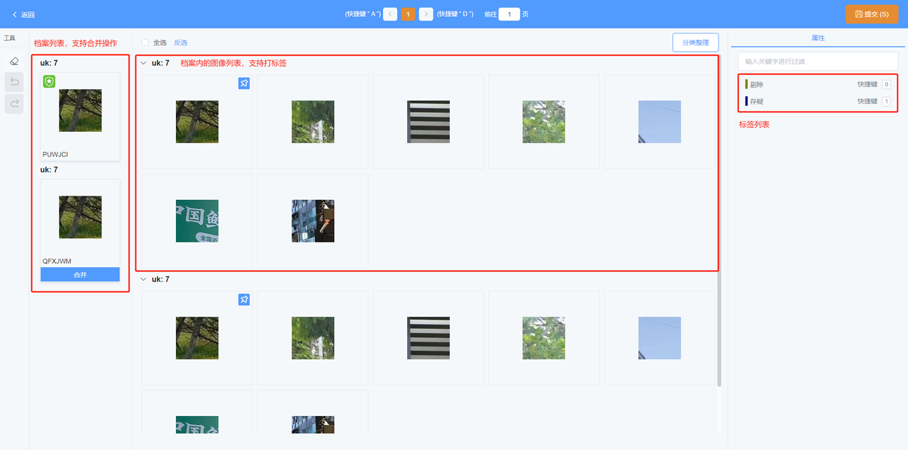

在档案列表支持合并操作，在图像/文本列表支持打标签，点击提交时若没有合并档案或打标签则需要二次确认

### 工具简介

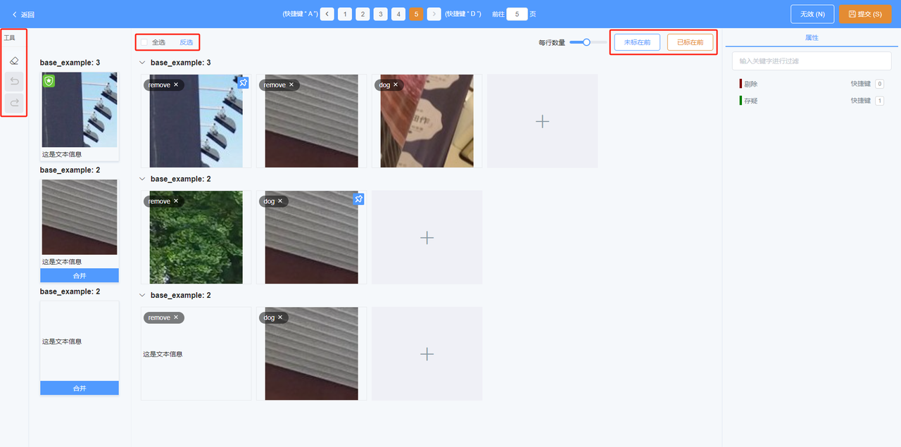

1. 左侧工具栏支持清空当前勾选的图像标签、撤销一步操作、恢复一步操作

2. 支持对图像进行全选、对已选的图像进行反选

3. 每行数量：支持通过滑动条调整每行展示的图像数量

4. 未标在前：支持将图像按照无标签在前、有标签在后的顺序展示（有标签的图像按标签顺序排列）

5. 已标在前：支持将图像按照有标签在前、无标签在后的顺序展示（有标签的图像按标签顺序排列）

### 鼠标拖框多选

用鼠标按照矩形拖框，在鼠标拖框区域中的图像都会被选中

### shift键多选

先选中一张图像按住shift键，再选中另一张图像，这两张图像之间的图像都会被选中

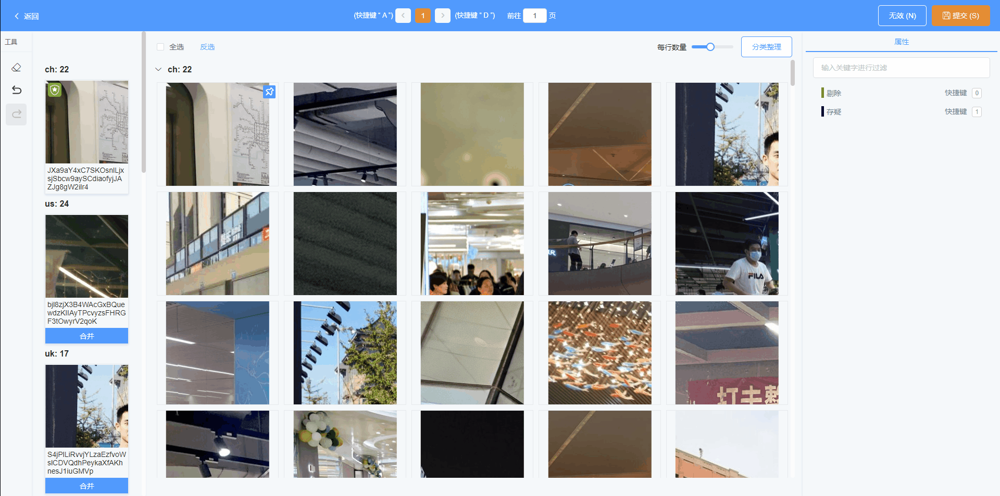

## 图像档案清洗

图像档案清洗是指在同一个档案内，标出与基准图像不同（或与基准描述不符）的图像。

### 设置基准图像

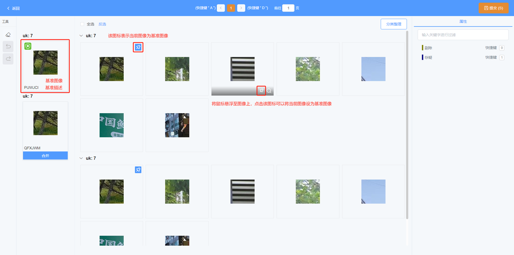

操作示例：

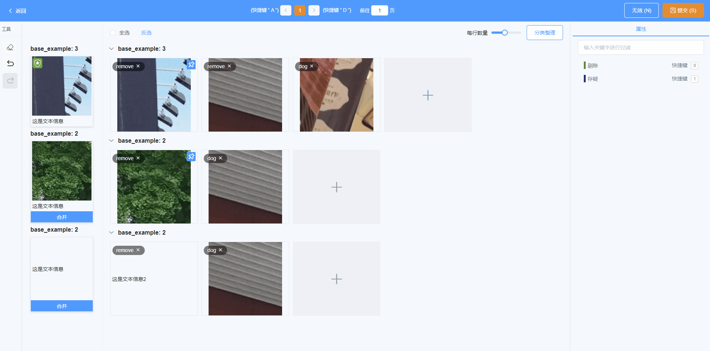

### 给图像打标签

单击选中要标的图像（支持多选），单击标签列表中的标签

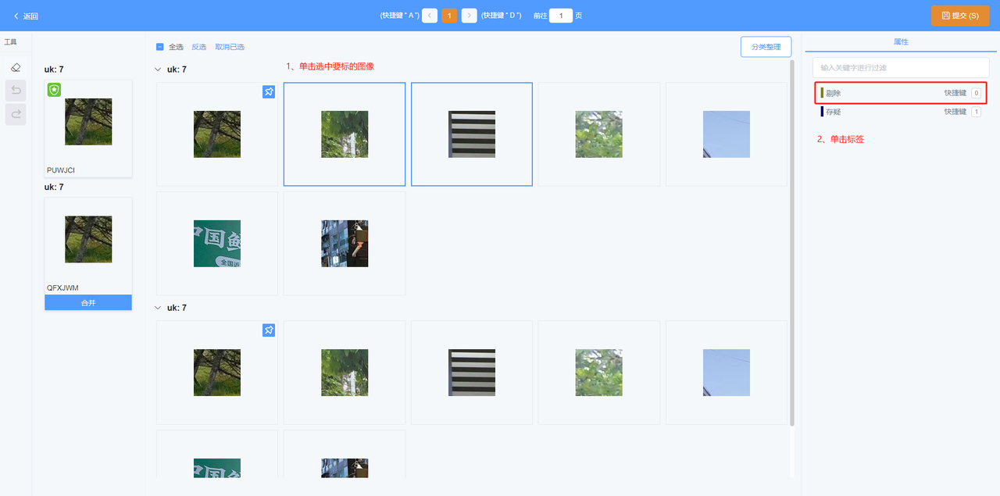

可以看到图像上会展示已经打上的标签

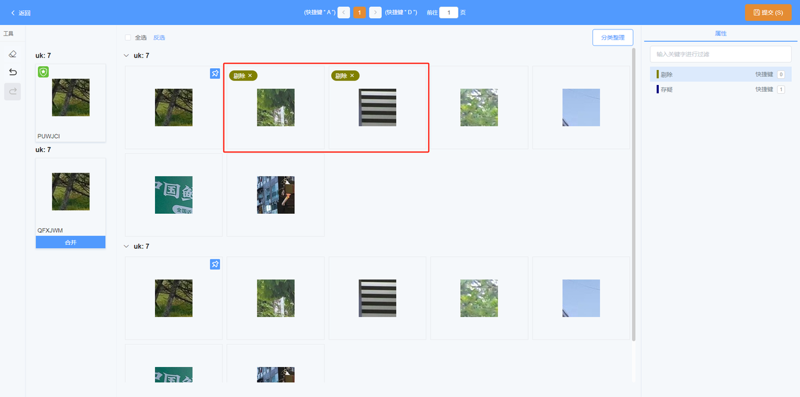

### 查看原始大图

对图像内容无法确定时，鼠标悬浮至该图像上，可以点击放大镜的图标或双击支持查看大图

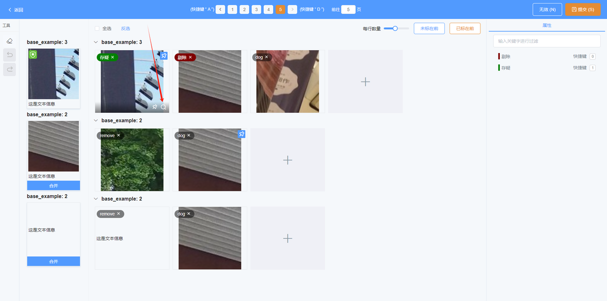

如果导入的图像包含bbox，则会在原始大图上标识出框出小图所在的位置。支持切换上下张查看，关闭时最后一张图片会展示在可视区域的最底部

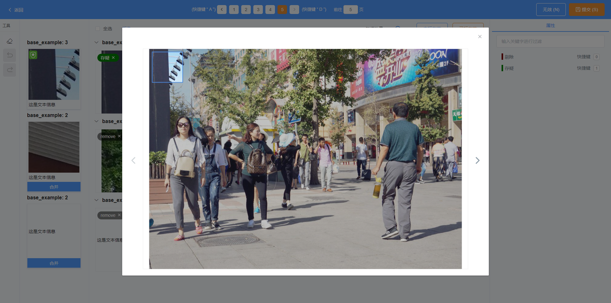

## 图像档案合并

档案合并是指将与基准档案内容一致的档案合并至基准档案。

点击合并按钮，可以将当前档案合并至基准档案

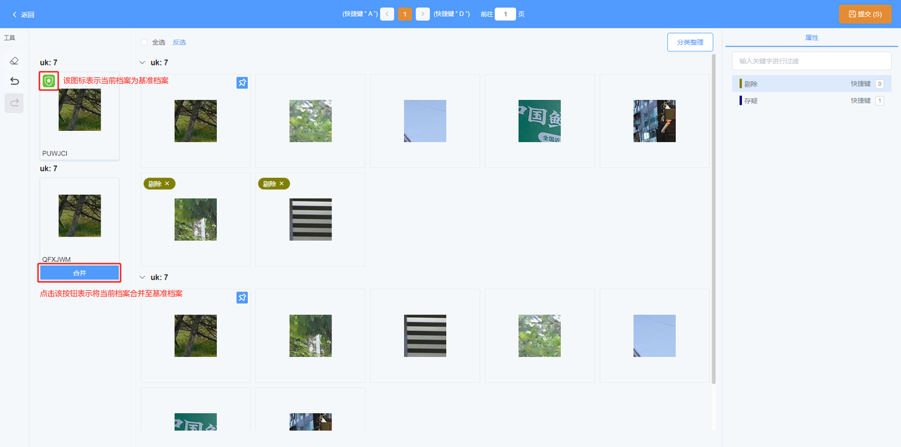

合并后可以看到当前档案右上角展示已合并的标识，点击取消合并的按钮也可以取消当前档案已合并的状态

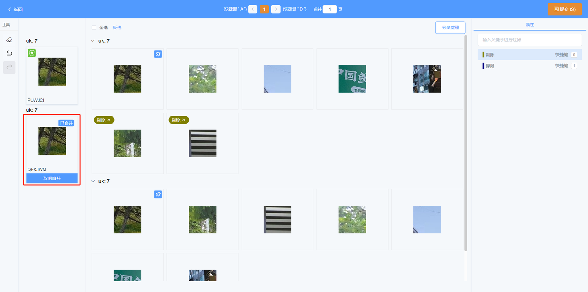

## 图文对档案清洗

图文对档案清洗是指标注文字描述对于图片的正确性，将文字标为正确/错误。也可以将当前档案标为无效

### 查看封面大图

双击目录封面，可以查看原始大图

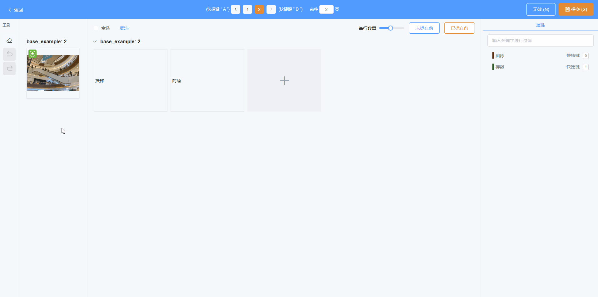

### 给文本打标签

* 对于不带标注的文本，可以单击文本所在框后点击右侧标签列表中的标签；

* 对于带标注的文本，可以点击×去除原有标签

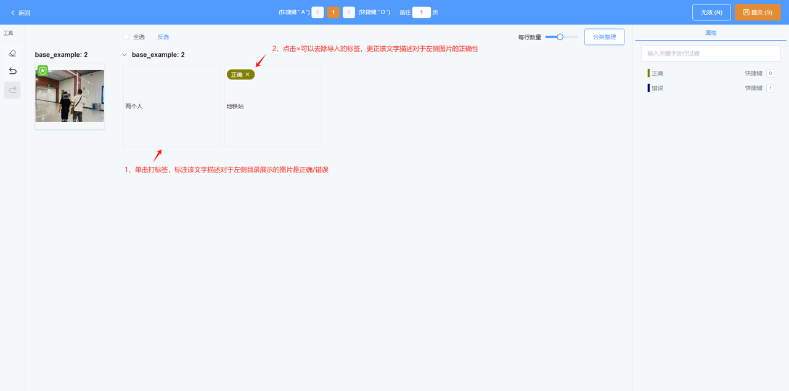

### 新增自定义文本

点击加号可以添加自定义文本，支持打标签

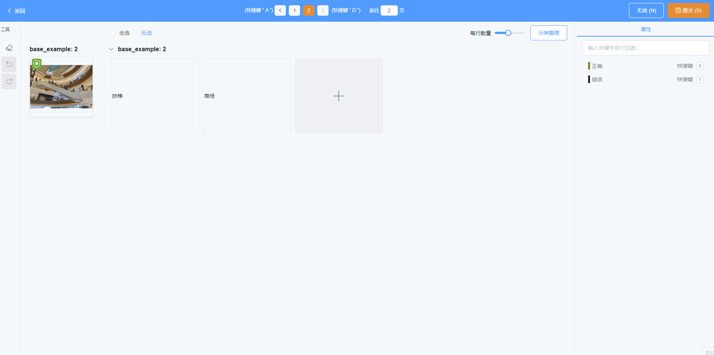

### 将档案标为无效

点击右上角的无效按钮，可以将当前档案标为无效

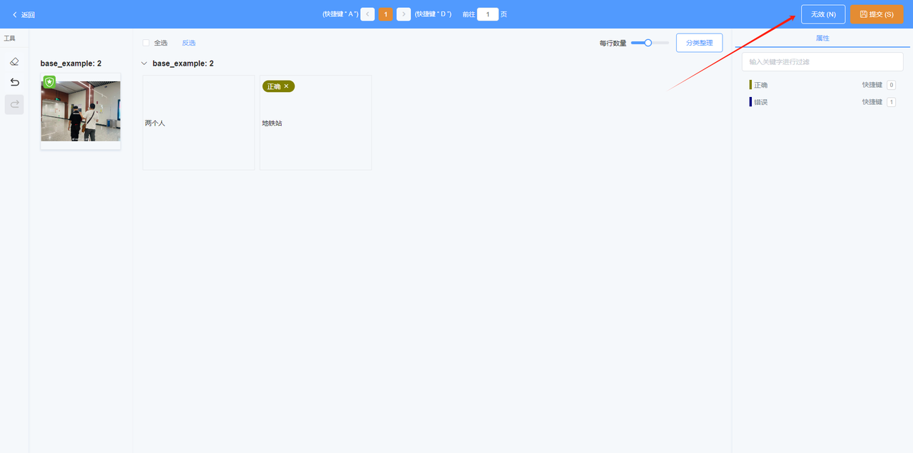

标为无效后不支持再对文本打标签，点击取消无效的按钮可以取消当前状态

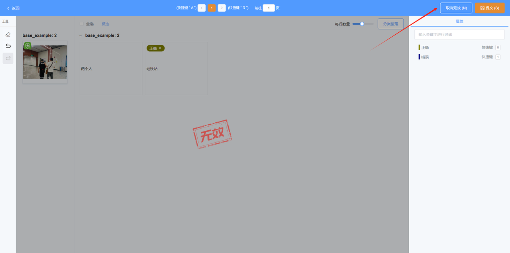

