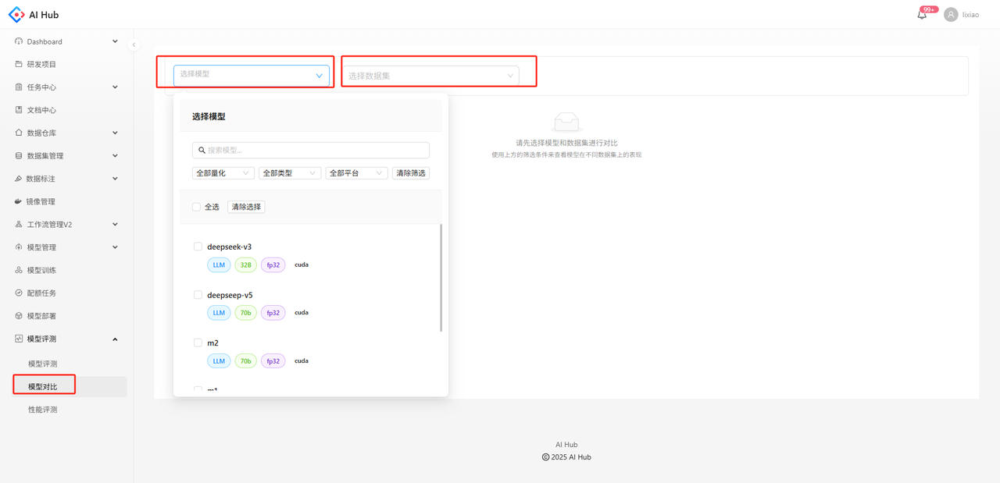

## 简介

为了便于拓展更多评估类型与定制化指标，AIhub将可视化展示与底层评估逻辑解耦。模型评测负责评测数据的存储以及可视化展示，推理和计算不限制运行方式，建议在工作流平台运行。

## 创建评测任务

请通过接口创建评测任务，接口参考【评测平台】-【创建评测任务】。

评测结果只需要提供下面3个文件，并满足格式要求即可上传到评测平台：

**prediction** 原始推理结果文件（JSONL 格式）

```json
{
    "prompt": [
        {
            "role": "HUMAN",
            "prompt": "Question: What is the capital of France?\nA. London\nB. Berlin\nC. Paris\nD. Madrid\nAnswer:"
        }
    ],
    "prediction": "C. Paris\n\nThe capital of France is Paris. The other options listed are capitals of different countries: London is the capital of the United Kingdom, Berlin is the capital of Germany, and Madrid is the capital of Spain.",
    "references": "C"
}
```

**row-level metric** 逐行打分后的推理结果文件（JSONL 格式）每一行的 Schema 如下：

```json
{
    "prompt": [
        {
            "role": "HUMAN",
            "prompt": "Question: What is the capital of France?\nA. London\nB. Berlin\nC. Paris\nD. Madrid\nAnswer:"
        }
    ],
    "origin_prediction": "C. Paris\n\nThe capital of France is Paris. The other options listed are capitals of different countries: London is the capital of the United Kingdom, Berlin is the capital of Germany, and Madrid is the capital of Spain.",
    "predictions": "C",
    "references": "C",
    "score": 1
}
```

**Report** 包含 metric 和可视化报告文件（JSON 格式）

```json
{
  "eval_config": {
    "model_name": "m1",
    "dataset_name": "gpqa",
    "temperature": 0.7,
    "max_tokens": 1200
  },
  "metrics": {
    "metrics": {
        "accuracy": 0.95,
        "em": 0.95,
    },
    "categories": {
        "person": {
            "accuracy": 0.95,
            "em": 0.95,
        },
        "dog": {
            "accuracy": 0.95,
            "em": 0.95,
        }
    }
  }
}
```

## 查看评测内容

可以在模型评测查看评测列表和评测内容的统计结果


点击评测名称，可以查看评测的详细内容


## 模型对比

在【模型对比】中选择需要对比的模型和数据集，系统会生成模型\*数据集的对比表，展示模型在不同数据集下的评测数据对比，对于有acc或accuracy的评测数据，会自动计算平均分。




