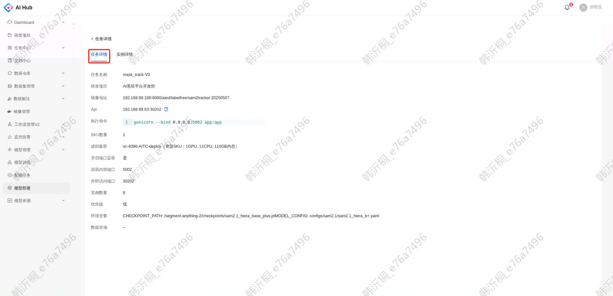

# 快速开始

点击创建任务，创建后该任务状态为`未部署`，点击启动按钮

在启动成功后任务状态会变为`运行中`，系统会分配一个API以供调用，只有任务状态为`运行中`时API可用

# 任务管理

## 任务列表

1. 任务状态

   * 所有状态：未部署、排队中、部署中、运行中、运行失败、已停止、已杀死

   * 排队中：当检测到gpu资源不足时，任务状态会转为排队中

   * 已停止：用户手动停止后任务的状态

   * 已杀死：其他任务强制启动时导致该任务被杀死

   * 状态转换图

   

2. 操作

    * 启动：未部署、已停止、已杀死的任务

    * 停止：除了未部署、已停止、已杀死的任务，其余状态下都可以停止任务

    * 评测：运行中的任务

    * 置顶（管理员权限）：排队中的任务

    * 强制启动（管理员权限）：已置顶的任务

## 创建任务

点击创建任务的按钮，跳转至创建页面

填写用于部署模型的基本信息

参数说明

* 任务名称：部署任务的名称

* 研发项目：任务所属的项目，可以从左侧菜单的 \[研发项目] 模块查看，若需添加请飞书联系李晓;

* 镜像地址：用于部署的镜像地址，仅支持AITC镜像仓库（192.168.99.199:8080）

* 虚拟集群列表：按GPU资源分组的虚拟集群，每个虚拟集群有指定数量的机器，仅可见本人有权限的虚拟集群，如需配置个人账户的虚拟集群权限，请飞书联系李晓；

* SKU数量：每个节点分配的资源数量。单个节点消耗的资源数等于：SKU数量\*虚拟集群SKU资源

* 开启端口监听：

  * 是：将容器内部的制定端口映射到外部，可在外部访问

  * 否：不映射容器端口

* 容器内部端口：用于端口监听的容器内部端口

* 外部访问端口：用于端口监听的外部访问端口

* 实例数量：部署节点（Node）的数量（目前仅支持单机多副本部署，不支持多机部署）

* 描述：选填

* 环境变量：

  * 配置环境变量后，环境变量会打到pod中

  * 系统提供预定义的环境变量用于特殊配置

    * SHM\_SIZE：大模型如需要多卡部署，通常需要配置Share Memory，部署任务可通过SHM\_SIZE配置，value需填写数字+单位，如60G

* 数据存储：可访问的外部存储，勾选后可在pod内访问，路径字段为在pod内访问的路径，如需添加存储，请飞书联系李晓;

## 复制任务

对某个任务点击复制，跳转至复制页面

所有设置项默认填充为当前任务的配置，除了任务类型和项目名称外都支持修改

# 任务排队

## 排队状态

在左侧导航栏的下方可以看到实时的排队状态

## 任务置顶（管理员权限）

当任务状态属于`排队中`时，支持置顶的操作。但是在排队队列中，只允许一个任务处于置顶状态。因此若已有任务被置顶，无法再置顶其他任务

## 强制启动（管理员权限）

对于队列中已经被置顶的任务，支持强制启动的操作。强制启动会根据该任务的资源需求杀死运行中的任务直至满足该任务可以运行为止，因此需要谨慎操作。若有顾虑建议自己手动停止不重要的任务。如果任务所需的资源数量是当前系统无法满足的，则会弹出提示无法强制启动

# 任务详情

点击任务名称，跳转至该任务的详情页。通过上部的导航可以切换查看任务详情和实例详情

## 任务详情

## 实例详情

* 支持查看每个实例所部署的节点名称、显卡类型和占用显卡数量

* 支持下载和查看日志信息

