## 目标框标注

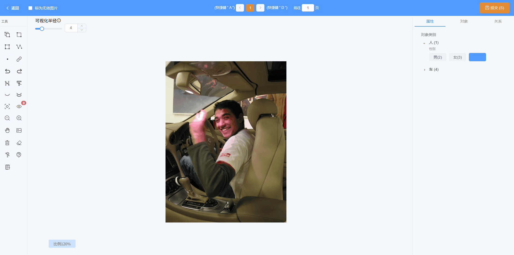

对于目标框，支持更多交互设置如下：

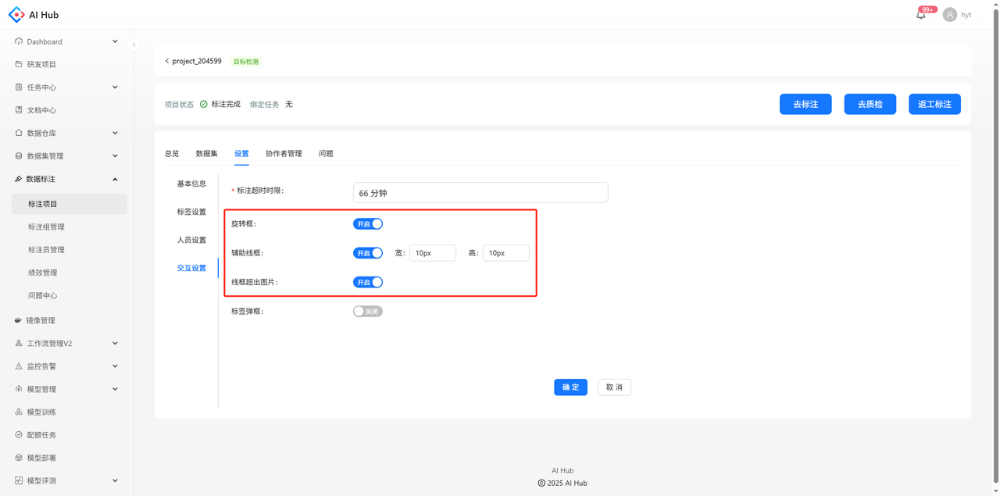

1. 旋转框

    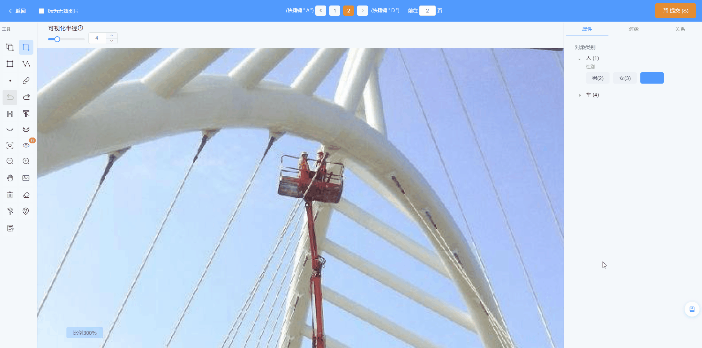

2. 辅助线框（支持设置宽高尺寸）

    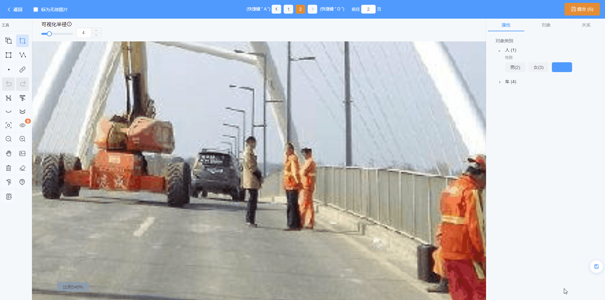

3. 线框超出图片

    

      

        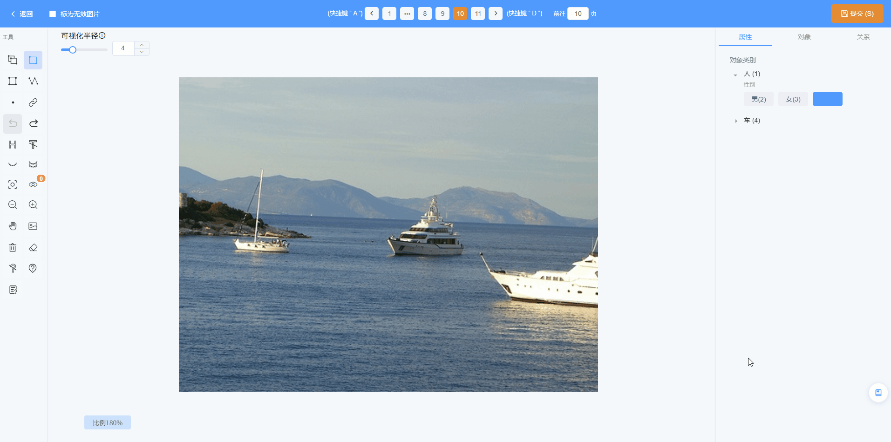
        
不允许线框超出图片

      

      

        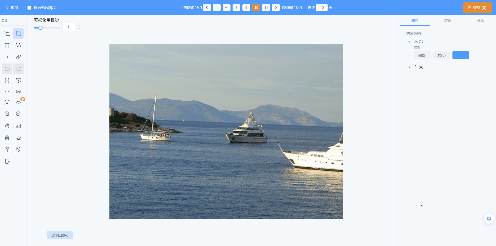
        
允许线框超出图片

      

    

## 点标注

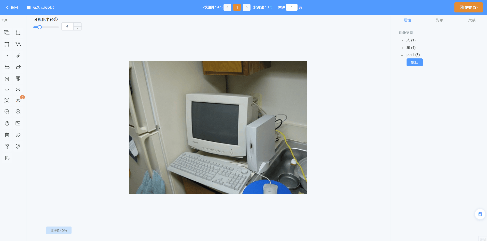

## 线标注

在绘制模式下，左键新增点，右键结束绘制；在选中某折线时，左键在该折线上新增点，右键某点可以删除该点

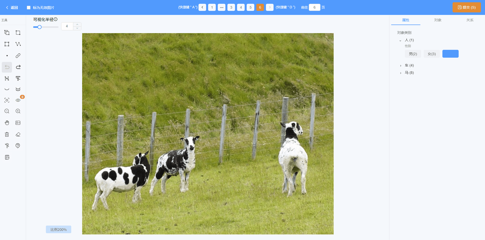

## 关系标注

在目标检测项目的标注界面，选择工具栏中的无限链接，即可开始依次点击需要建立关联关系的两个目标框，支持给关系打标签

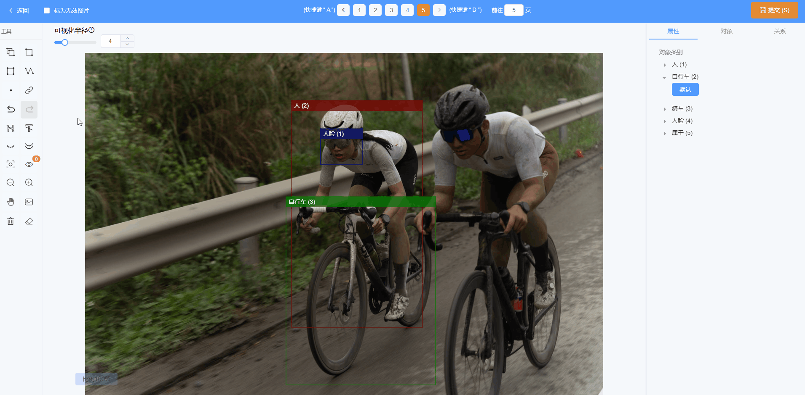

在右侧的关系栏，可以看到所有的关联关系，对关系同样支持选中、显示/隐藏、删除

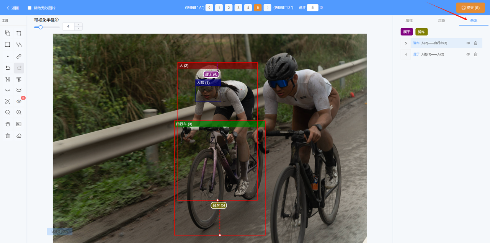

## 多模态标注

在项目详情-设置-交互设置界面，打开`标签弹框`的开关并保存，即切换到多模态标注模式；关闭该开关，可回到原标注模式。若需要将多模态标注时的描述设置为必填项，打开`描述内容必填`并保存开关即可

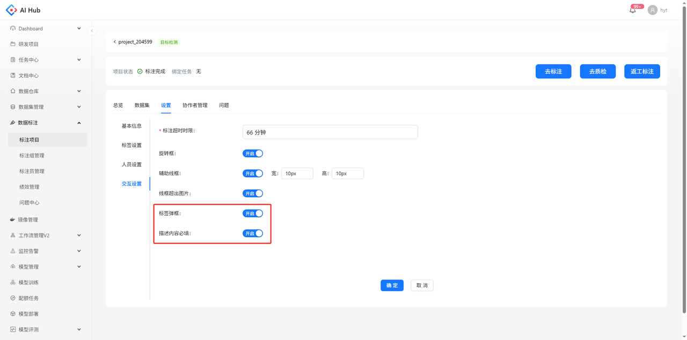

切换到多模态标注模式后，标注目标框、点、线、关系后，都会自动弹出多模态标注弹框，填写多模态参数，点击确认即可

若需要编辑多模态参数，点、线、关系标注与目标框稍有不同

* 目标框：可使用左键选中目标框，再点击右键，唤出编辑弹窗，编辑弹窗与新增标注的弹窗一致

* 点、线、关系：仅支持在右侧列表点击编辑图标，唤出编辑弹窗（目标框也支持该操作）

  

    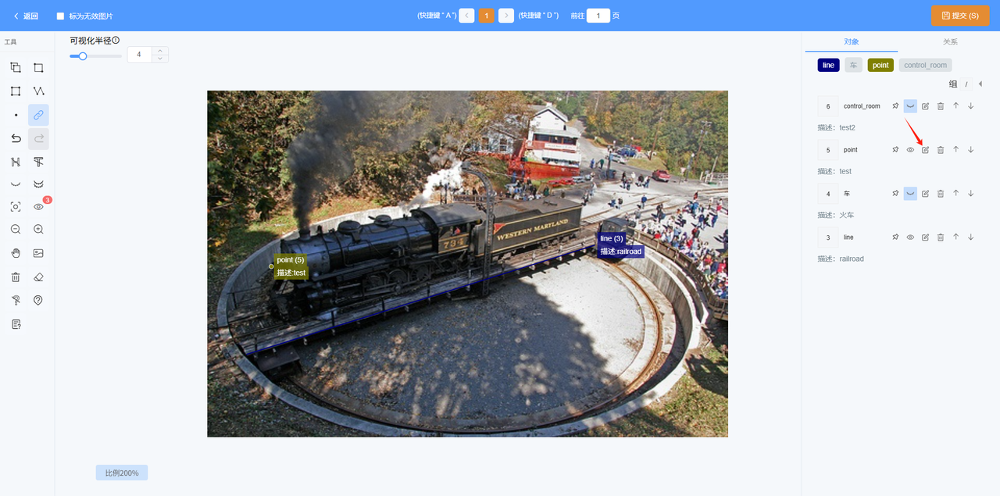
    
对象列表

  

  

    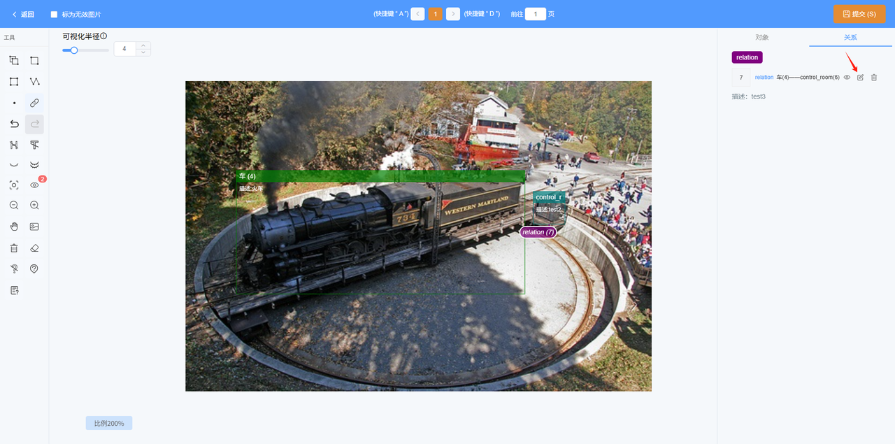
    
关系列表

  

## 对象列表

1. 支持按照标签对对象进行隐藏/显示

2. 支持通过上移/下移更改对象之间图层的顺序

    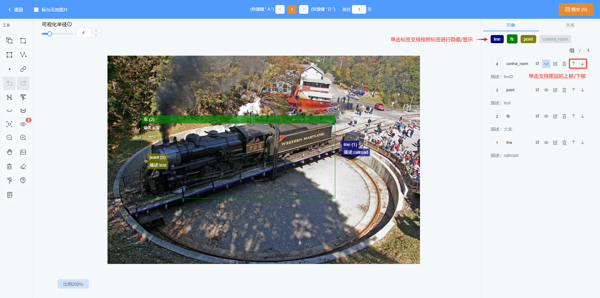

3. 支持将对象固定/取消固定

    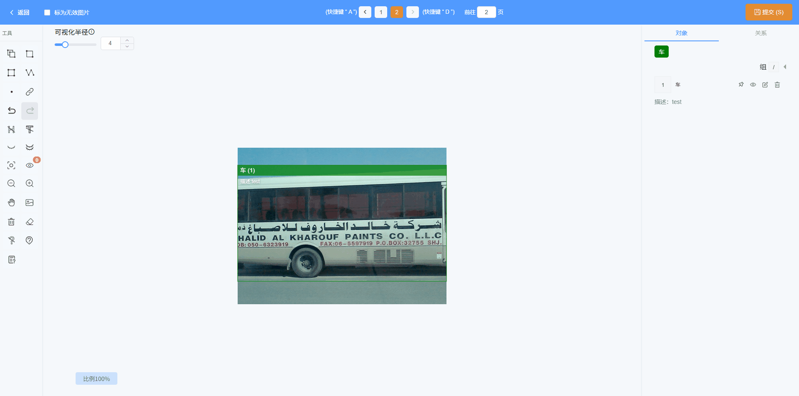

