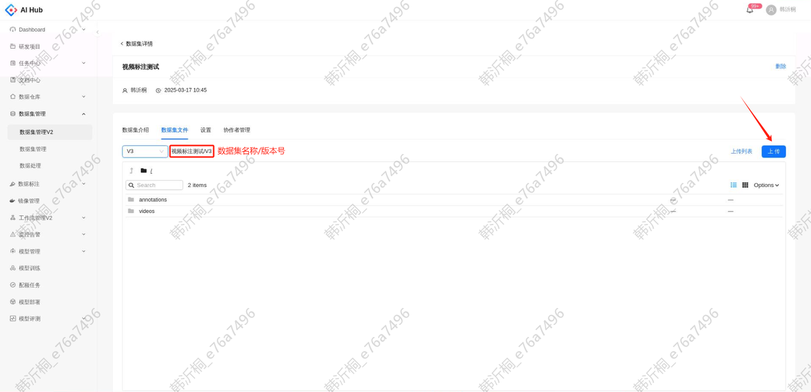

## 1. 数据集准备

将本地或服务器路径上的数据集上传至平台，更多详细操作请参考[ 数据集管理](./数据集管理.md)

（1）在【数据集管理V2】创建新的数据集或使用已创建的数据集

（2）在详情页的【数据集文件】上传数据生成新版本，成功后记下要用的数据集名称及版本号

## 2. 标注文档准备

* 文档中心：支持以Markdown格式创建新文档，更多功能说明请参考[ 文档中心](./文档中心.md)

* 飞书：在标注管理知识库创建新的标注文档或将已有的标注文档移动至知识库，新添加文档后需要等待几分钟同步至文档中心。更多操作及注意事项请参考[ 标注文档](./数据标注任务.md#annotation-document)

## 3. 发起标注任务

请准备好数据集和标注文档再发起标注任务，更多参数说明请参考[ 数据标注任务](./数据标注任务.md)

## 4. 查看标注情况

开始标注后，在任务详情点击标注项目。若标注项目为空，请联系标注同事绑定相应的标注项目

跳转至标注项目的详情页，可以查看当前的标注进度

在数据集模块可以查看图片标注的具体情况，筛选条件的详细说明请参考[ 数据集可视化](./数据集可视化.md)

## 5. 验收标注任务

标注完成后，在任务详情页点击验收按钮

填写本次任务的验收结果及数据应用情况

## 6. 下载已标数据

数据验收无误后，点击标注项目的导出图标

选择需要的数据集格式，点击确定按钮，会生成一条导出记录

导出成功后，可以看到导出数据集的名称及版本号

使用客户端工具将标完的数据集下载到指定路径。具体使用方法请参考[ 数据集下载](./数据集管理.md#download-dataset)

## 7. 关闭标注任务

标注数据验收无误后，点击确认按钮

