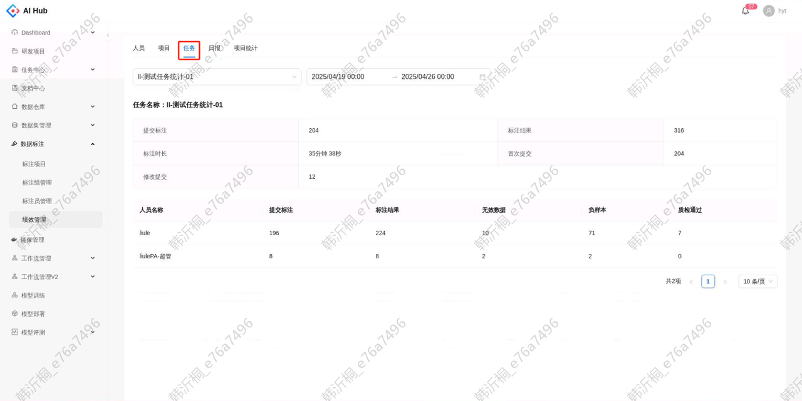

## 指标介绍

### 人员

支持筛选单个标注员，按照小时级查询该标注员在已选时间段内各个项目下的统计数据

| **指标名称** | **指标说明**                                                                                                                                                                                     |
| -------- | -------------------------------------------------------------------------------------------------------------------------------------------------------------------------------------------- |
| 提交标注     | 提交标注的图片/视频数量，包含正常标注、返工标注、修改历史后提交。若在同一时间段内多次返工或修改，筛选该时间段得到的统计结果只会被记作1。**已释放的数据也会包含在内**。例如：在8-9点正常标注了100张图片；在9-10点返工了8-9点标注的40张图片，此外没做其他标注。在查询8-9点时，提交标注为100；在查询9-10点时，提交标注为40；在查询8-10点时，提交标注为100； |
| 标注结果     | 标注结果数量，**包含无效数据和负样本**。在目标检测项目中包含目标框、点、线、关系；在分类项目中按照标签计数。例如：在8-9点正常标注了50张图片100个标签，在9-10点将这50张图片全部做修改后变为120个标签。在查询8-9点时，标注结果为100；在查询9-10点时，标注结果为120；在查询8-10点时，标注结果为120；                            |
| 标注时长     | 有效标注时长，不包含离开标注页面的时间。离开标注页面的情况包括电脑锁屏、切换标签页、关闭标签页、点击返回按钮、切换到历史页停留。以下两种特殊情况不会计入有效标注时长：                                                                                                          |
| 首次提交     | 对未标注数据的标注提交次数。在数据被释放后，第一次提交标注也算作首次提交。                                                                                                                                                        |
| 修改提交     | 修改提交次数，包含返工标注、修改历史。例如：在8-9点先修改了50张历史图片，但其中有20张图片被质检退回，于是将这20张图片进行返工标注。在查询8-9点时，修改提交为70；                                                                                                      |
| 无效数据     | 因镜头遮挡或图片破损等情况而无法正常标注，因此标为无效的图片/视频数量。例如：在8-9点正常标注了50张图片，其中有2张无效图片。在9-10点将8-9点标注的一张无效图片改为正常图片，其余标注的图片中没有无效图片。在查询8-9点时，无效数据为2；在查询9-10点时，无效数据为0；在查询8-10点时，无效数据为1；                                |
| 负样本      | 不存在目标类别，因此提交后没有标注信息的图片/视频数量。例如：在8-9点正常标注了50张图片，其中有2个负样本。在9-10点将8-9点标注的一张负样本改为正常图片，其余标注的图片中没有负样本。在查询8-9点时，负样本为2；在查询9-10点时，负样本为0；在查询8-10点时，负样本为1；                                              |

### 项目

支持筛选单个标注项目，查看该项目的数据总览及每个标注员的工作量

特别注意：项目总览统计的标注结果数量包含无效数据和负样本，标注员的标注结果数量不包含无效数据和负样本

#### 项目总览

注明：所有指标含义和人员统计维度的指标含义相同

| **指标名称** | **指标说明**                                                                                                              |
| -------- | --------------------------------------------------------------------------------------------------------------------- |
| 提交标注     | 该项目在所选时间段内所有标注员`提交标注`数量的总和 |
| 标注结果     | 该项目在所选时间段内所有标注员`标注结果`数量的总和 |
| 标注时长     | 该项目在所选时间段内所有标注员`标注时长`的总和   |
| 首次提交     | 该项目在所选时间段内所有标注员`首次提交`数量的总和 |
| 修改提交     | 该项目在所选时间段内所有标注员`修改提交`数量的总和 |

#### 标注员工作量

| **指标名称** | **指标说明**                                                                                                                                                                |
| -------- | ----------------------------------------------------------------------------------------------------------------------------------------------------------------------- |
| 标注任务     | **最新一次提交**标注的图片/视频数量，**不包含已释放的数据**。例如：在8-9点正常标注了100张图片；在9-10点返工了8-9点标注的40张图片，此外没做其他标注。在查询8-9点时，标注任务为60；在查询9-10点时，标注任务为40；在查询8-10点时，标注任务为100；                                    |
| 标注结果     | **最新一次提交**的标注结果数量，**不包含无效数据和负样本**。在目标检测项目中包含目标框、点、线、关系；在分类项目中按照标签计数。例如：在8-9点正常标注了50张图片100个标签，在9-10点将这50张图片全部做修改后变为120个标签。在查询8-9点时，标注结果为0；在查询9-10点时，标注结果为120；在查询8-10点时，标注结果为120； |
| 无效数据     | **最新一次提交**标为无效的图片/视频数量。例如：在8-9点正常标注了50张图片，其中有2张无效图片。在9-10点将8-9点标注的一张无效图片改为正常图片，其余标注的图片中没有无效图片。在查询8-9点时，无效数据为1；在查询9-10点时，无效数据为0；在查询8-10点时，无效数据为1；                            |
| 负样本      | **最新一次提交**为负样本的图片/视频数量。例如：在8-9点正常标注了50张图片，其中有2个负样本。在9-10点将8-9点标注的一张负样本改为正常图片，其余标注的图片中没有负样本。在查询8-9点时，负样本为1；在查询9-10点时，负样本为0；在查询8-10点时，负样本为1；                                  |
| 质检通过     | **最新一次质检**通过的图片/视频数量例如：在8-9点质检了50张图片，其中质检通过了40张。在9-10点将8-9点质检通过的10张图片改为质检退回，此外没有做其他质检操作。在查询8-9点时，质检通过为30；在查询9-10点时，质检通过为0；在查询8-10点时，质检通过为30；                                |

### 任务

支持筛选单个标注任务，查看该任务的数据总览及每个标注员的工作量。所有指标含义和项目统计维度的指标含义相同，只是对任务下所有标注项目的统计指标进行了合并

### 日报

支持查看每天在标项目的数据统计，除`总工时`外的五个指标和项目维度的统计指标含义相同，每天0点统计前一天的数据。总工时代表项目下所有参与者的工时总和，包含除标注外的查看数据集、质检等用时。总工时在少数情况下有可能小于标注时长，因为总工时是较粗颗粒度的统计，例如若在短时间内频繁切换不同的项目标签页会导致小部分工时丢失

### 项目统计

支持查看单个项目下标注员在单个图片/视频的标注耗时散点分布图

批量标注时，单张图片的标注耗时为总耗时除以图片数量

