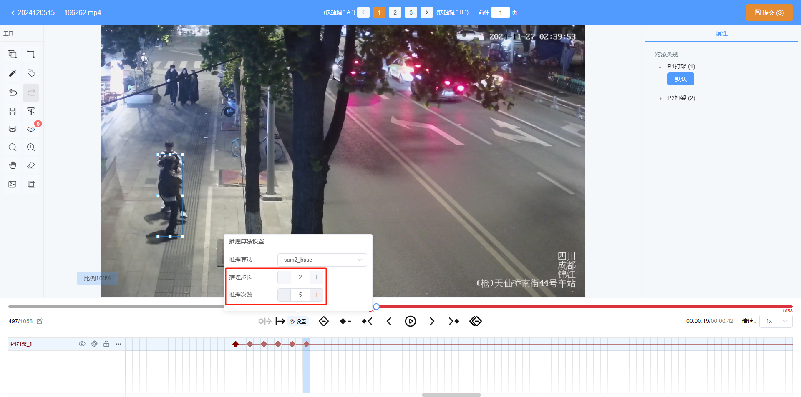

## 自动推理功能

选中轨迹时可以使用，未选中轨迹时无法使用该功能

* 框推理：选中目标包含mask时依然会根据目标的外接框进行推理

* mask推理：选中目标不存在mask时无法使用

### 推理步长

推理步长是作用于所有种类推理的公用参数，代表每次向后推理的间隔帧数

### 从当前帧向后推理指定次数

举例：推理步长为2、推理次数为5时，代表向后推理5次，每次以2帧为单位进行推理

* 框推理：快捷键为`T`

* mask推理：快捷键为`Y`

### 从开始帧推理到当前帧

* 开始帧：当前第一个关键帧

* 结束帧：当前所在帧（若当前帧为最后一个关键帧，则无法推理）

#### 框推理

快捷键为`]`
<video controls width="100%" height="auto">
    <source src="files/【框推理】从开始帧推理到当前帧.mp4" type="video/mp4">
    【框推理】从开始帧推理到当前帧.mp4
</video>

#### mask推理

快捷键为 `Shift+G`，开始帧不包含mask时无法推理
<video controls width="100%" height="auto">
    <source src="files/【mask推理】从开始帧推理到当前帧.mp4" type="video/mp4">
    【mask推理】从开始帧推理到当前帧.mp4
</video>

### 从当前帧推理到结束帧

* 开始帧：当前所在帧（若当前帧为最后一个关键帧，则无法推理）

* 结束帧：当前轨迹最后一个关键帧

#### 框推理

快捷键为`[`，开始帧不是关键帧时无法推理
<video controls width="100%" height="auto">
    <source src="files/【框推理】从当前帧推理到结束帧.mp4" type="video/mp4">
    【框推理】从当前帧推理到结束帧.mp4
</video>

#### mask推理

快捷键为 `Shift+F`，开始帧不包含mask时无法推理
<video controls width="100%" height="auto">
    <source src="files/【mask推理】从当前帧推理到结束帧.mp4" type="video/mp4">
    【mask推理】从当前帧推理到结束帧.mp4
</video>

### 从当前帧推理到指定帧

* 开始帧：当前所在帧

* 结束帧：手动输入的目标帧号

#### 框推理

快捷键为`Shift+T`
<video controls width="100%" height="auto">
    <source src="files/【框推理】从当前帧推理到指定帧.mp4" type="video/mp4">
    【框推理】从当前帧推理到指定帧.mp4
</video>

#### mask推理

快捷键为`Shift+Y`
<video controls width="100%" height="auto">
    <source src="files/【mask推理】从当前帧推理到指定帧.mp4" type="video/mp4">
    【mask推理】从当前帧推理到指定帧.mp4
</video>

## 打标签功能

支持直接对视频打标签，可以更改属性

## 查看预标注

数据集是AE Video格式时，支持快速定位预标注的首尾帧，显示或隐藏标注框

