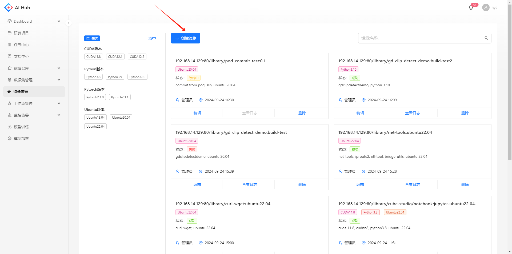

## 背景
随着Docker容器的广泛应用，镜像的管理问题也日益凸显，成为影响开发效率和运维稳定性的关键因素。在此背景下，镜像管理应运而生，旨在解决传统镜像存储与管理中存在的诸多挑战。

在引入镜像管理前，在镜像仓库中管理Docker镜像存在以下局限性：

1. 缺乏构建过程记录：传统方式下，镜像仓库仅存储镜像本身，而不包含其构建过程。这导致在镜像出现问题时，开发人员难以追溯问题的根源，增加了排查和修复的难度。

2. 难以复现镜像状态：一旦镜像损坏或需要回滚到某个特定版本，由于缺乏构建过程的详细记录，复现镜像状态变得异常困难，甚至可能导致数据丢失或服务中断。

3. 技术门槛高：对于不熟悉Docker技术的用户来说，手动构建和管理镜像是一项复杂且易出错的任务。这不仅增加了学习成本，还可能导致管理混乱和效率低下。

为了克服上述挑战，镜像管理应运而生。镜像管理不仅提供了基于Dockerfile的镜像构建功能，还实现了构建过程的存档和记录，从而极大地提升了镜像管理的效率和可靠性。具体来说，镜像管理的必要性体现在以下几个方面：

1. 提高问题排查效率：通过存档每个镜像的构建过程，镜像管理使得开发人员能够轻松追溯问题根源，快速定位并解决镜像中的潜在问题。

2. 简化镜像复现过程：在需要回滚或复现特定镜像状态时，镜像管理提供了详细的构建记录，使得复现过程变得简单且可靠，有效降低了数据丢失和服务中断的风险。

3. 降低技术门槛：镜像管理提供了在线动态保存容器为镜像的功能，使得不熟悉Docker技术的用户也能够轻松管理和使用镜像，从而降低了技术门槛，提高了整体的开发和运维效率。

## 镜像列表

点击导航栏的镜像管理模块，可以看到当前的镜像列表。左侧可以通过不同类别的标签筛选镜像，点击镜像卡片可以查看镜像的详细信息。

## 创建镜像

点击创建镜像的按钮，跳转至创建镜像的页面。

选择一种创建方式，填写相应的参数后点击创建按钮，可以在镜像的列表页看到一条新创建的记录

**公用参数说明**

1. 镜像名称：填写镜像仓库后的绝对路径即可，Harbor镜像的格式为/project\_name/.../xxx:Tags

2. 可见范围：支持选择私有或公开

3. 镜像标签：支持多选不同类型的标签，以便于在镜像列表中从更多维度标识该镜像的属性

4. 描述：非必填

下面会分别介绍6种不同的创建方式及其参数

### 基于dockerfile（git）
操作演示：[基于git创建镜像.mp4](files/基于git创建镜像.mp4)

创建方式选择“基于dockerfile”，dockerfile来源选择“git”，支持基于git中的dockfile文件构建镜像并push到指定仓库的绝对路径下

**参数说明**

1. git地址：在浏览器复制git项目页的完整地址即可

2. token名称

在用户设置的Access Tokens模块，设置token名称、过期日期，必须勾选read\_api的权限，最后点击生成token

3. token

在生成后务必复制token进行保存，否则刷新页面后将无法再看到

同时，支持将生效的token进行回收

4. branch/tag：填写git项目所需的分支或tag号，例如master

5. dockerfile路径：填写需要用于构建docker镜像的dockerfile路径，例如demo1/Dockerfile

6. 构建目录：构建目录默认为根目录，若dockerfile中的命令是从根目录读取文件则不需要填写此项，否则需要填写读取文件的绝对路径

  

    
    
    
从根目录读取，不需要填写构建目录

  

  

    
    
    
从非根目录读取，构建目录需要填写demo1

  

填写完所有信息后点击创建按钮，可以在镜像列表看到新创建的镜像

构建成功后可以在Harbor的指定路径下看到新镜像，如下所示：

### 基于dockerfile（在线编辑）

创建方式选择“基于dockerfile”，dockerfile来源选择“在线编辑”，支持基于在线填写的dockerfile内容构建镜像并push到指定仓库的绝对路径下

填写完所有信息后点击创建按钮，可以在镜像列表看到新创建的镜像

构建成功后可以在Harbor的指定路径下看到新镜像，如下所示：

### 基于dockerfile（本地上传）

创建方式选择“基于dockerfile”，dockerfile来源选择“本地上传”，支持基于上传的dockerfile文件构建镜像并push到指定仓库的绝对路径下

填写完所有信息后点击创建按钮，可以在镜像列表看到新创建的镜像

构建成功后可以在Harbor的指定路径下看到新镜像，如下所示：

### 基于已有镜像

创建方式选择“基于已有镜像”，可以将镜像仓库中已存在的镜像添加到平台的镜像列表中

根据Harbor中镜像的项目、路径、Tags，拼接成镜像的绝对路径：/aihub/demo\_api:0.1

将镜像的绝对路径填写到镜像名称字段中镜像仓库地址的后面

填写完信息后点击创建，可以在镜像列表页看到创建成功的镜像记录。由于没有构建镜像的过程，因此无法查看日志

### 基于容器（模型训练任务）

操作演示：[保存镜像为容器.mp4](files/保存镜像为容器.mp4)

创建方式选择“基于容器”，容器来源选择“模型训练任务”，支持将训练任务的容器保存为镜像并push到指定仓库的绝对路径下。

* 训练任务：只支持选择自己创建的运行中任务，若没有可以先去模型训练模块创建任务

* POD名称：在选择训练任务后，可以选择该任务下的一个POD

填写完所有信息后点击创建按钮，可以在镜像列表看到新创建的镜像

构建成功后可以在Harbor的指定路径下看到新镜像，如下所示：

### 基于容器（自定义）

创建方式选择“基于容器”，容器来源选择“自定义”，支持将k8s上正在运行的容器保存为镜像并push到指定仓库的绝对路径下。

通过k8s命令查找正在运行中的POD名称、命名空间及容器名称

填写完所有信息后点击创建按钮，可以在镜像列表看到新创建的镜像

构建成功后可以在Harbor的指定路径下看到新镜像，如下所示：

## 查看镜像详情

点击镜像卡片，跳转至该镜像的详情页

在详情页可以看到创建镜像时填写的所有信息。创建成功后，可以看到该镜像的更多信息：包括docker镜像的唯一标识digest、dockerfile内容、镜像大小等等

## 查看日志

对于新构建的镜像，点击查看日志的按钮

可以在弹窗中查看打印的日志信息，支持刷新、下载到本地

## 编辑镜像

点击镜像的编辑按钮

支持修改镜像的标签、可见范围和描述

