问题中心主要用于记录和管理标注中遇到的问题，沉淀共性问题。后续标注人员遇到相似问题时，可直接获取已总结的解决方案，避免重复沟通，从而显著提升标注工作效率，确保标注工作的规范性与一致性。下面将详细介绍问题中心的核心功能和具体使用方法。

## 新建问题

点击左侧的提问图标，在图中点击后填写问题的基本信息，点击确定

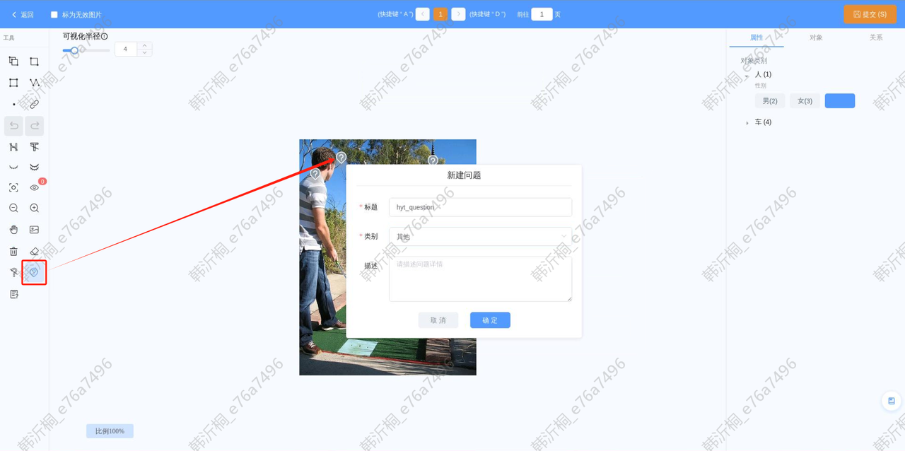

新建成功后，会在问题标识旁边展示问题详情

若在数据集看到某张图片的标注有问题，点击该图片

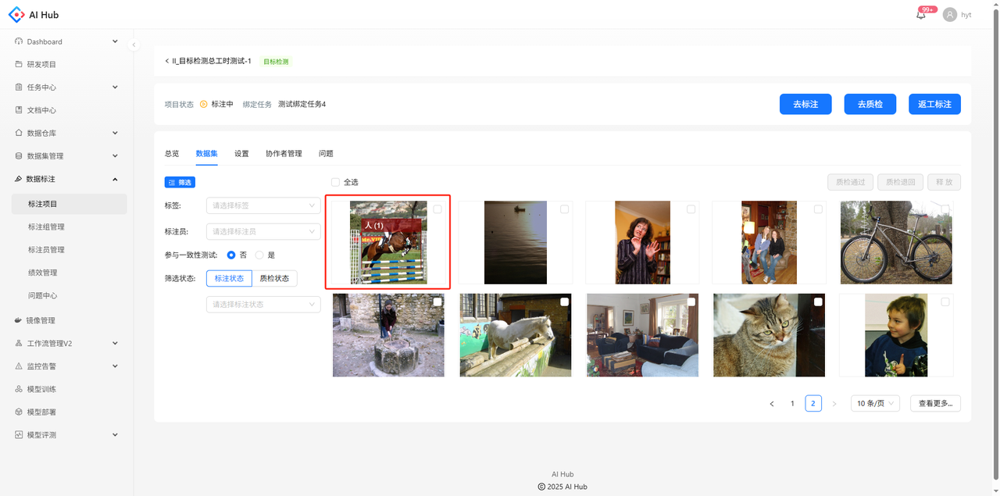

在详情页点击查看详情的按钮，会跳转至标注页面

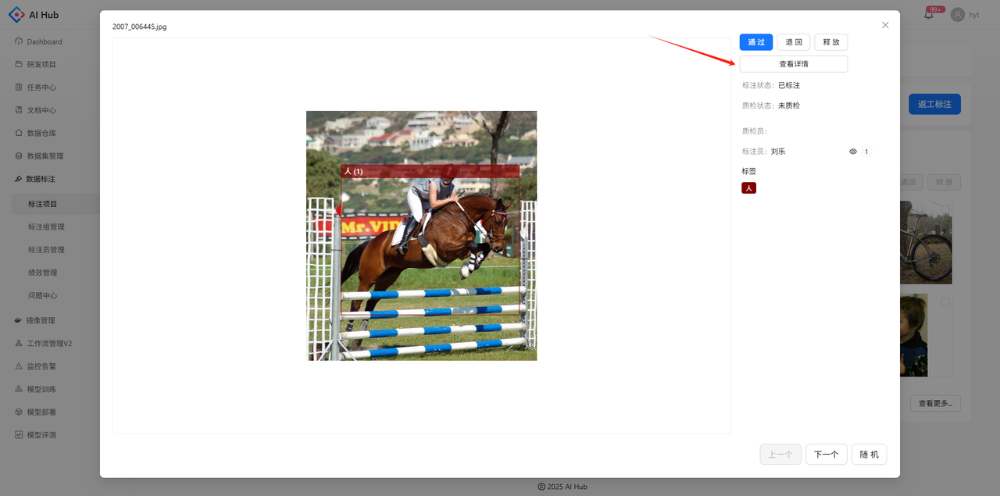

同样可以拖点提问

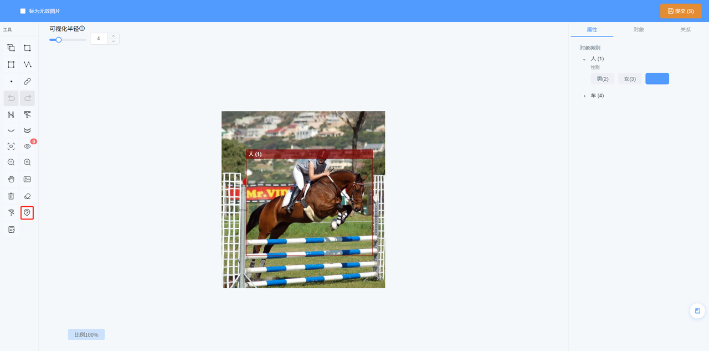

### 编辑问题

点击问题详情右上角的编辑按钮，会弹出问题的基本信息填写框

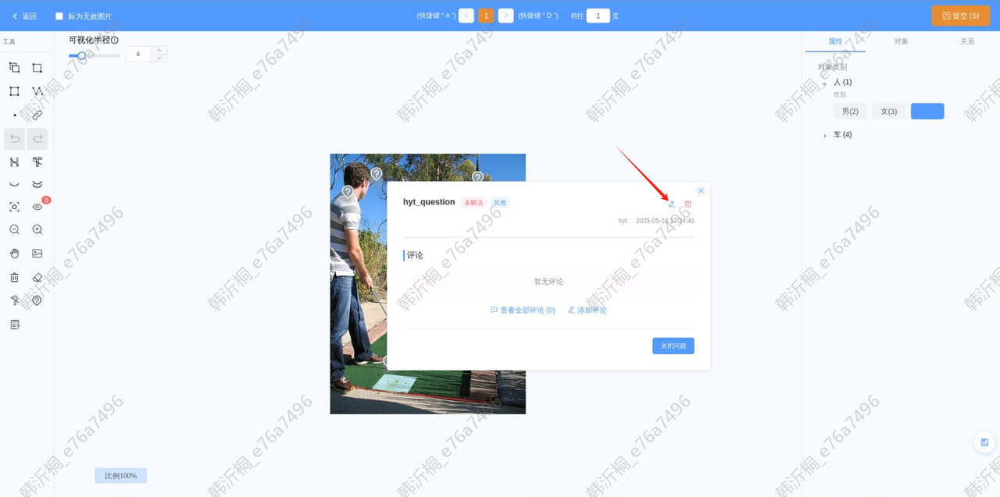

支持编辑问题的所有字段，点击确定后修改成功

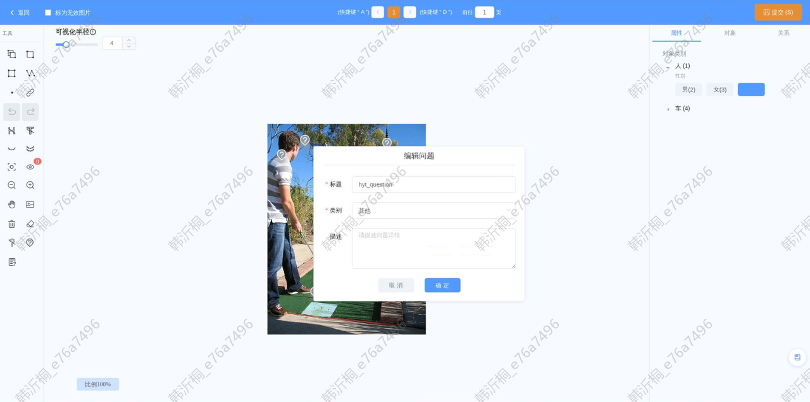

### 删除问题

点击问题详情右上角的删除按钮，可以删除问题

### 评论问题

点击问题详情下添加评论的按钮，右侧会弹出评论区

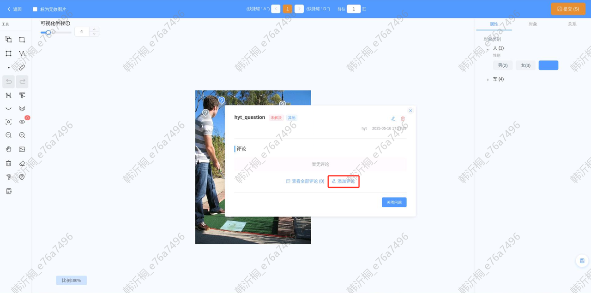

支持在输入框填写文字、粘贴图片

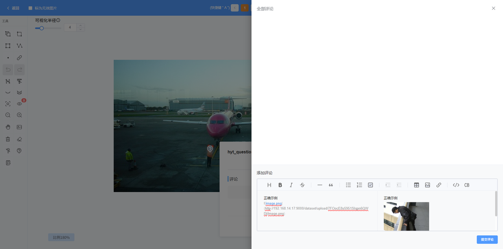

点击提交评论，可以在评论区看到最新的评论内容

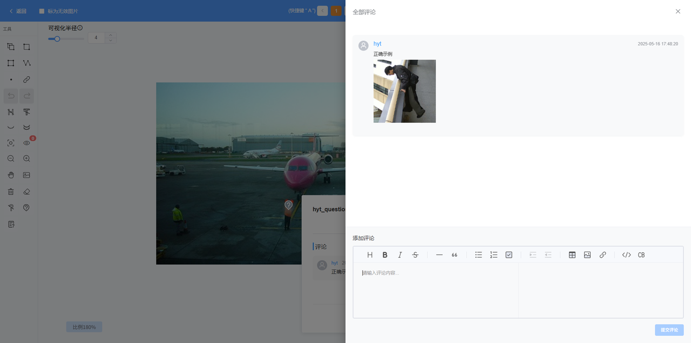

### 打开/关闭问题

对于状态为未解决的问题可以点击关闭按钮，代表问题已解决

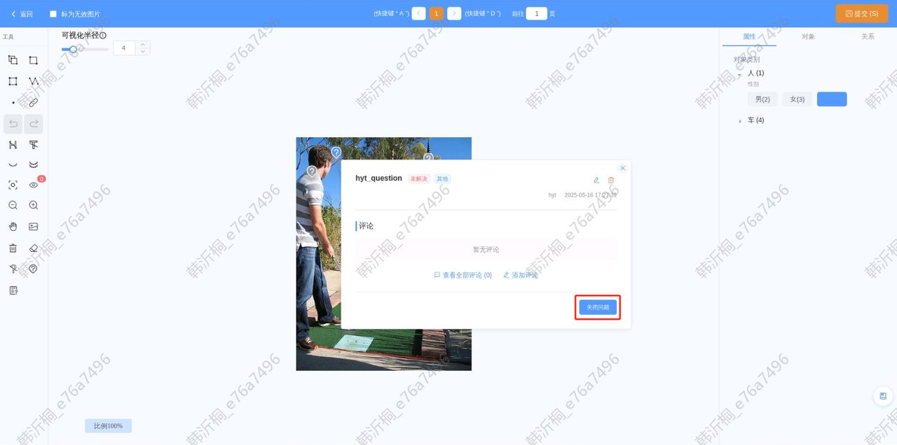

对于状态为已解决的问题也可以点击重新开启，问题状态会变为未解决

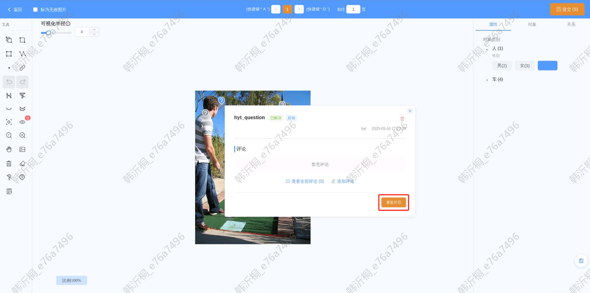

### 隐藏/显示问题

点击左侧工具栏的隐藏/显示问题的图标，可以一次性隐藏图中所有的问题标识，以便做标注等其他操作

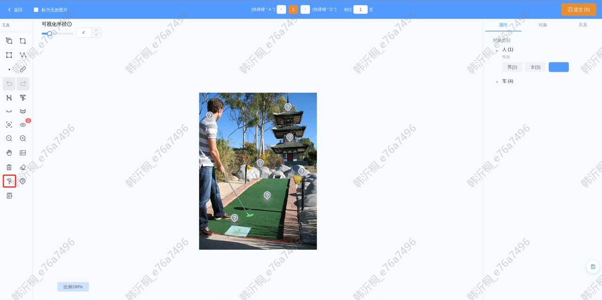

## 查看问题

### 查看单个问题详情

选中图中单个问题的标识，可以查看该问题的基本信息和第一条评论

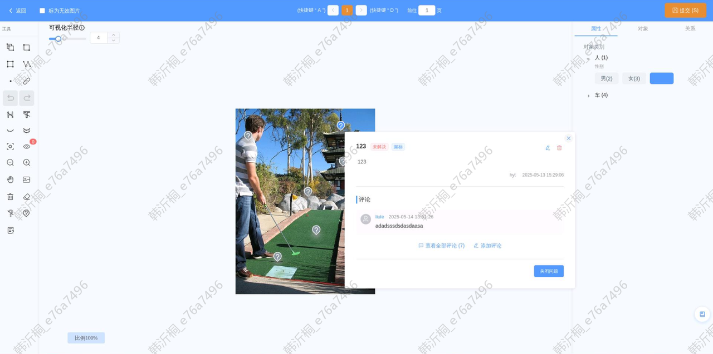

点击查看全部评论按钮

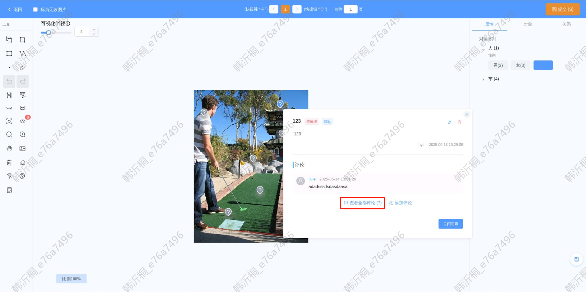

可以看到该问题所有的评论记录

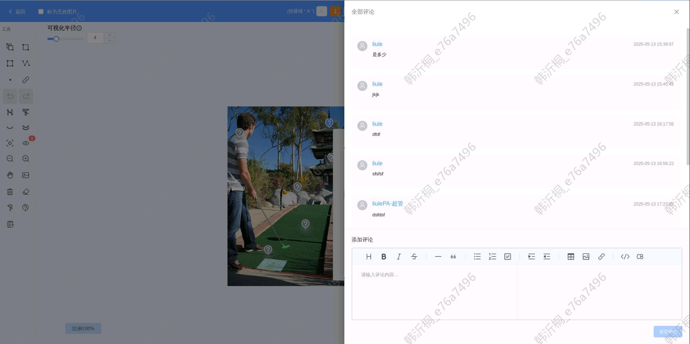

### 查看图片的所有问题

点击左侧工具栏的`问题列表`按钮，右侧会弹出当前图片的问题列表，可以根据问题状态进行筛选

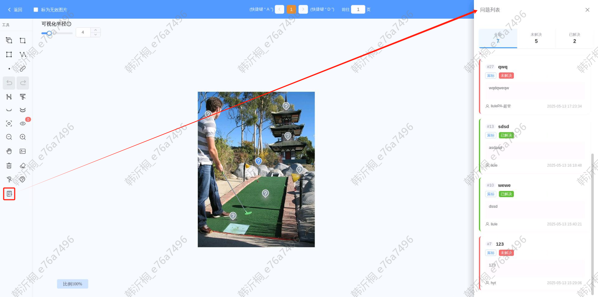

点击单个问题卡片，图中对应的问题标识会高亮并展示问题详情

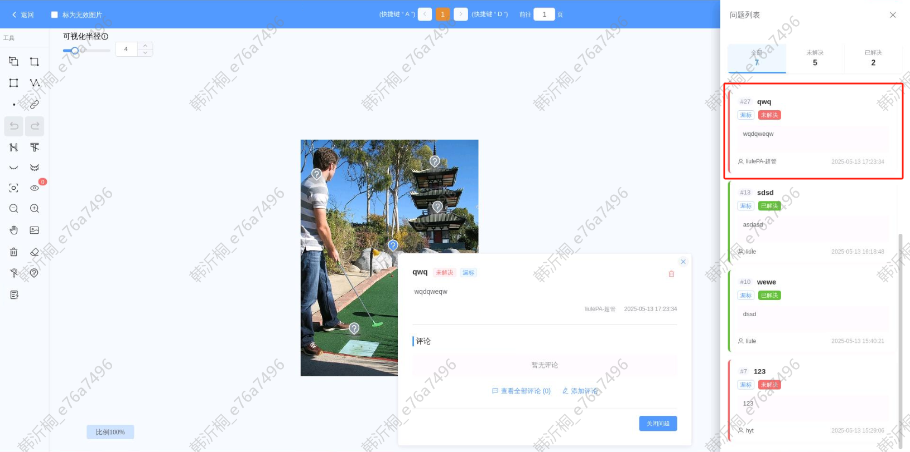

### 查看项目的所有问题

在项目详情页的问题tab，可以看到该项目所提出的所有问题

点击问题标题，会跳转到该问题所在的标注页

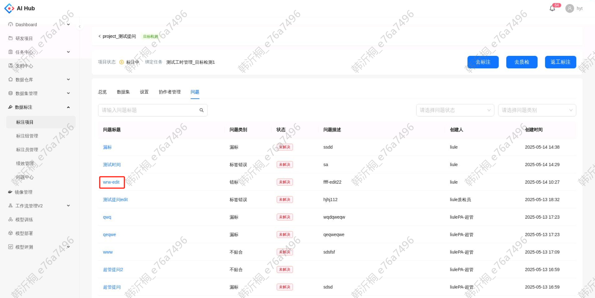

该问题自动选中高亮，展示问题详情。**若该图片是当前用户标注的图片，可以直接修改后提交**

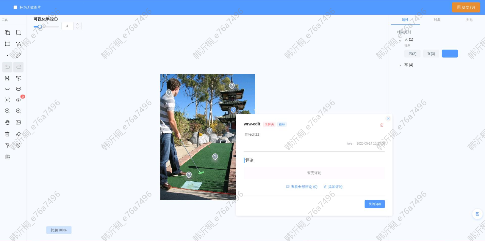

### 查看任务的所有问题

在问题中心的导航栏，可以看到所有问题。支持按照标注任务、标注项目、问题状态、问题类别等进行筛选

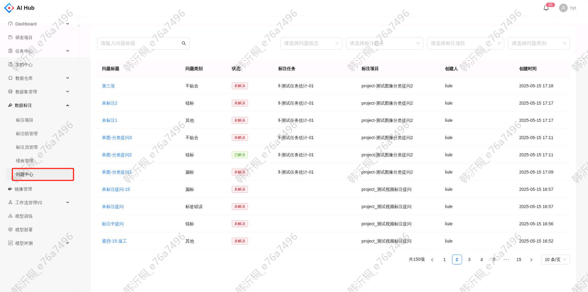

## 权限说明

| 操作          | 权限   |
| ------------- | ----- |
| 新建问题          | 所有人   |
| 评论问题          | 所有人   |
| 编辑问题信息或移动问题位置 | 仅限创建人 |
| 打开/关闭问题       |   1. 创建人 2. 包含算法或标注管理员角色的用户    |
| 删除问题          |   1. 创建人 2. 包含算法或标注管理员角色的用户    |
